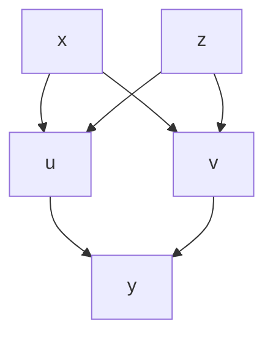

# 8. 다변수 연쇄 법칙 (The Multivariate Chain Rule)

> **"모든 길은 하나로 통한다: 편미분의 합(Sum)"**

딥러닝의 역전파(Backpropagation) 알고리즘은 **연쇄 법칙(Chain Rule)** 그 자체입니다.
변수가 하나일 때는 단순히 곱하기만 하면 되었지만, 변수가 여러 개일 때는 **경로(Path)** 개념이 추가됩니다.

---

## 1️⃣ 단변수 vs 다변수 연쇄 법칙

### 단변수 (Single-variable)

- $x \to u \to y$
- 길이 하나뿐이므로 그냥 곱하면 됩니다.
  $$ \frac{\partial y}{\partial x} = \frac{\partial y}{\partial u} \cdot \frac{\partial u}{\partial x} $$
- 사실상 전미분 $\frac{dy}{dx}$과 같습니다.

### 다변수 (Multivariate) - 갈림길이 있는 경우

- $x, z$가 $u$에 영향을 주고, $u$가 $y$에 영향을 주는 경우 ($x, z \to g(u) \to f(y)$)
- 여전히 경로는 단순합니다.
  $$ \frac{\partial y}{\partial x} = \frac{\partial y}{\partial u} \cdot \frac{\partial u}{\partial x} $$
  $$ \frac{\partial y}{\partial z} = \frac{\partial y}{\partial u} \cdot \frac{\partial u}{\partial z} $$

---

## 2️⃣ 다변수 함수가 여러 경로로 영향을 줄 때 (중요!)

가장 흔하고 중요한 케이스입니다. $y$가 $u, v$ 두 변수에 의존하고, $u, v$는 다시 $x, z$에 의존하는 경우를 봅시다.
($y = f(u, v)$, $u = g_1(x, z)$, $v = g_2(x, z)$)

### 다이어그램 (Dependency Graph)

### 규칙: "모든 경로의 기여도를 더한다"

$x$가 $y$에 미치는 영향을 계산하려면, $x$에서 시작해서 $y$로 가는 **모든 경로**를 찾아서 더해야 합니다.

1. **경로 1 ($x \to u \to y$)**: $\frac{\partial y}{\partial u} \frac{\partial u}{\partial x}$
2. **경로 2 ($x \to v \to y$)**: $\frac{\partial y}{\partial v} \frac{\partial v}{\partial x}$

**최종 편미분**:
$$ \frac{\partial y}{\partial x} = \left( \frac{\partial y}{\partial u} \frac{\partial u}{\partial x} \right) + \left( \frac{\partial y}{\partial v} \frac{\partial v}{\partial x} \right) $$

마찬가지로 $\frac{\partial y}{\partial z}$는:
$$ \frac{\partial y}{\partial z} = \left( \frac{\partial y}{\partial u} \frac{\partial u}{\partial z} \right) + \left( \frac{\partial y}{\partial v} \frac{\partial v}{\partial z} \right) $$

---

## 3️⃣ 일반화 공식 (Generalization)

$y$가 $m$개의 중간 변수 $u_1, u_2, ..., u_m$에 의존하고, 각 $u_j$가 입력 변수 $x_i$에 의존한다면:

$$ \frac{\partial y}{\partial x*i} = \sum*{j=1}^{m} \frac{\partial y}{\partial u_j} \frac{\partial u_j}{\partial x_i} $$

- **의미**: $x_i$가 $y$에 영향을 줄 수 있는 **모든 경로($u_j$들)를 통해서** 전달된 변화량을 다 합친 것이 전체 변화율입니다.
- 이것이 복잡한 신경망에서 입력이 출력에 미치는 영향을 계산하는 정확한 방법입니다.

---

## 🎯 팁: 다이어그램 그리기

복잡한 편미분 문제를 만났을 때는 수식부터 쓰지 말고 **변수 의존 관계도(다이어그램)**를 먼저 그리세요.

1. 목표 변수($y$)에서 출발해 변수($x$)까지 거꾸로 가는 모든 길을 찾습니다.
2. 각 길의 미분값을 곱합니다.
3. 그 길들을 모두 **더합니다**.

다음 영상에서는 이 법칙을 이용한 연습 문제를 풀어보겠습니다.
