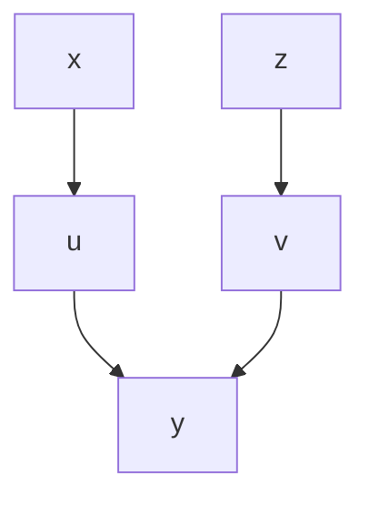
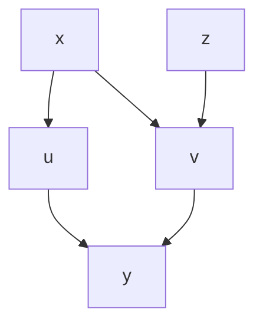
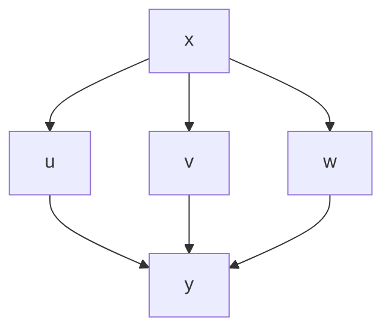

# 9. 연쇄 법칙 연습 문제 (Chain Rule Exercises)

> **"관계도로 풀어보는 다변수 연쇄 법칙"**

복잡해 보이는 편미분 문제도 **변수 의존 관계도(Dependency Graph)**만 잘 그리면 쉽게 풀 수 있습니다.
다음 3가지 케이스를 통해 연습해 봅시다. (목표: $y$의 모든 편미분 구하기)

---

## 📝 문제 1: 독립적인 경로

- **관계**: $y = f(u, v)$
  - $u = g(x)$ ($u$는 $x$에만 의존)
  - $v = h(z)$ ($v$는 $z$에만 의존)

### 관계도

### 풀이

1. **$\frac{\partial y}{\partial x}$**: $x$에서 $y$로 가는 길은 하나뿐입니다 ($x \to u \to y$).
   $$ \frac{\partial y}{\partial x} = \frac{\partial y}{\partial u} \frac{\partial u}{\partial x} $$

2. **$\frac{\partial y}{\partial z}$**: $z$에서 $y$로 가는 길도 하나뿐입니다 ($z \to v \to y$).
   $$ \frac{\partial y}{\partial z} = \frac{\partial y}{\partial v} \frac{\partial v}{\partial z} $$

---

## 📝 문제 2: 겹치는 경로 (Partial Overlap)

- **관계**: $y = f(u, v)$
  - $u = g(x)$ ($u$는 $x$에만 의존)
  - $v = h(x, z)$ ($v$는 **$x$와 $z$ 모두**에 의존)

### 관계도

### 풀이

1. **$\frac{\partial y}{\partial z}$**: $z$에서 출발하는 길은 하나입니다 ($z \to v \to y$).
   $$ \frac{\partial y}{\partial z} = \frac{\partial y}{\partial v} \frac{\partial v}{\partial z} $$

2. **$\frac{\partial y}{\partial x}$ (중요!)**: $x$에서 출발하는 길은 **두 갈래**입니다.
   - 경로 A: $x \to u \to y$
   - 경로 B: $x \to v \to y$
   - **두 경로를 더해야 합니다.**
     $$ \frac{\partial y}{\partial x} = \left( \frac{\partial y}{\partial u} \frac{\partial u}{\partial x} \right) + \left( \frac{\partial y}{\partial v} \frac{\partial v}{\partial x} \right) $$

---

## 📝 문제 3: 전미분 케이스 (모든 길이 한 곳에서 시작)

- **관계**: $y = f(u, v, w)$
  - $u = g(x)$
  - $v = h(x)$
  - $w = j(x)$
  - ($u, v, w$ 모두 $x$ 하나에 의존)

### 관계도

### 풀이

- **$\frac{\partial y}{\partial x}$**: $x$에서 시작하는 **3개의 경로**를 모두 더합니다.
  1. $x \to u \to y$
  2. $x \to v \to y$
  3. $x \to w \to y$

$$ \frac{\partial y}{\partial x} = \left( \frac{\partial y}{\partial u} \frac{\partial u}{\partial x} \right) + \left( \frac{\partial y}{\partial v} \frac{\partial v}{\partial x} \right) + \left( \frac{\partial y}{\partial w} \frac{\partial w}{\partial x} \right) $$

> **참고**: 이 경우 $y$는 결과적으로 $x$만의 함수이므로, 편미분 $\frac{\partial y}{\partial x}$는 전미분 $\frac{dy}{dx}$와 같습니다.

---

## 🎯 결론

- **독립 경로**: 해당 경로만 곱하면 됩니다.
- **다중 경로**: 시작점($x$)에서 도착점($y$)으로 가는 **모든 경로의 미분값을 더합니다**.
- 이것이 복잡한 딥러닝 모델에서 **Gradient가 여러 갈래로 흐르다가 합쳐지는(Add)** 원리입니다.

다음 영상에서는 드디어 **경사(Gradients)**와 **경사 하강법(Gradient Descent)**, 그리고 **편미분**이 어떻게 연결되는지 실제 코드로 확인해 보겠습니다.
