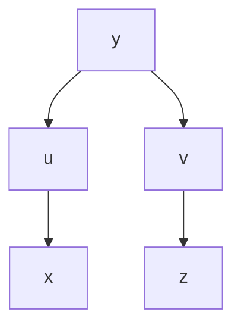
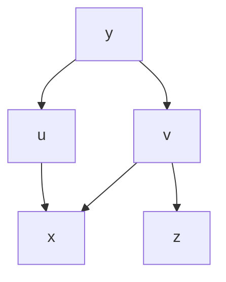
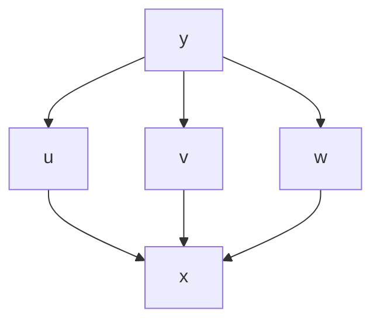

# You Asked:

이 강의에서 여러분이 이미 전미분 연쇄 법칙 적용에 익숙하신 걸로 생각할게요
이전 머신 러닝 기초 과정에서 '연쇄 법칙' 영상에서 배웠습니다
이제 이 연쇄 법칙을 다변수 함수의 편미분에 확장할 겁니다
이처럼 중첩 단변수 함수가 있을 때 u는 x에 대한 함수고,
y는 u에 대한 함수입니다
이 경우, 전미분에 사용할 연쇄 법칙은 이렇게 되겠죠
dy/du, du/dx라는 도함수를 구해 전미분을 계산할 수 있고
이 중첩함수의 전미분은 dy/du를 계산하고
그다음 du/dx를 따로 계산하여 dy/du에서 du/dx를 나누면
du가 없어지고 dy/dx만 남게 됩니다
이걸 통해 머신 러닝에서 수백 또는 수천 개로 된 아주 긴 함수 연속을 가능하게 합니다
하지만 가장 안쪽에 있는 투입 변수와 결과값을 통해서
전미분을 구할 수 있습니다
이와 같은 단변수 함수에서 편미분은 같습니다
자주 사용하진 않겠지만, 계산한다면 같을 겁니다
이 경우, dy/dx 전미분은 델와이/델엑스 편미분과 같다는 거죠
다른 투입 변수가 없기 때문입니다
단변수 함수 안에 또 단변수 함수인 겁니다
편미분을 하면, 델유/델엑스는 du/dx와
같습니다
델와이/델유는 dy/du와 같고 결국 같은 값이 나옵니다
흔한 경우는 아니죠
이런 경우에 편미분 사용은 흔하지 않죠 지금까지 편미분을 배우면서 봤듯
편미분은 다변수 함수에 자주 사용됩니다
그런 경우 연쇄 법칙은 더 흥미로워지고요
예를 들어, x와 z 투입 변수를 갖는 함수 g를 기반으로 하는 변수 u가 있다고 해볼게요
이게 다변수 함수죠
다변수 함수 g의 결과값인 u는 f라는 다른 함수에 들어가서
y라는 결과값을 가질게요 그럼 함수 g는 함수 f 안에 있고 이걸 도표로 그릴 수
있습니다
변수의 흐름을 도표로 그릴 수 있는 거죠
u 값을 구하기 위해 두 변수 x와 z가 모두 필요합니다 그 다음 y는 u 하나에만
의존하죠
여기 다변수 관계네요
u를 기반으로 하는 다변수 관계죠
여러분은 수많은 도표를 통해 계산할 거고
이는 어떤 상황에서든 편미분 이해를 쉽게 해줍니다
결국 편미분 계산도 쉬워지는 거죠
그래서 저는 이렇게 서로 연결된 다변수 함수를 쪼개는 걸 추천합니다
이렇게 하면 편미분 계산이 훨씬 쉬워지니까요
예를 들어, 델와이/델엑스를 구한다고 해볼게요
그러기 위해 여기 델유/델엑스 편미분을 계산하고
여기 델와이/델유 편미분을 구하고 두 개의 편미분을
서로 곱해줍니다
델유는 없어지고 델와이/델엑스만 남게 되죠
그렇게 델와이/델엑스를 구할 수 있습니다
델와이/델제트를 구하려면, 똑같이 델유/델제트를 구하고
이미 델와이/델유를 구했기에 이제 이 둘을 곱하면 분자의 델유와
분모의 델유가 없어지고 델와이/델제트를
구할 수 있죠
이제, 여러 다변수 함수가 있으면, 연쇄 법칙은 매우 재밌습니다
예를 들어, u랑 v 변수의 함수인 변수 y가 있다고 하고
u는 다변수 함수 g에 기반한다고 합시다 g 함수는 x와 z 변수를 가지고, v는 x와 z 변수를
가지면,
이전 슬라이드와 같이 이 변수 관계도를 만드는 게
가장 쉬운 겁니다
y부터 시작하면, y는 u랑 v 변수를 가지고 있죠
그리고 u는 x와 z 변수를 가집니다
그리고 v 또한 x와 z 변수를 가지고 있네요
이렇게 관계도를 만들고 나면 편미분 계산은 꽤
쉽습니다
예를 들어, 델와이/델엑스를 계산하려면, 우리는 델와이/델엑스를 구하기 위해
관계도를 보면 됩니다
두 부분을 봐야 합니다
여기랑 여기 부분 두 개 모두를 지나야 x에 접근할 수 있죠
두 부분 없이 편미분은 완성되지 않습니다
즉, 둘을 다 따르지 않으면 y가 x에 대해 어떻게 영향을 받는지 알 수 없는 거죠
그러기 위해 서로 다른 두 개의 부분을 합하면 됩니다
델와이/델엑스를 구하기 위해 델와이/델엑스의 필요한 부분을 각각 구합니다
So here is the U leg. 여기는 u 부분이죠
델와이/델유 곱하기 델유/델엑스는 이 부분의 값을 제공하고, 여기 이 부분은
델와이/델브이 곱하기 델브이/델엑스로 됩니다
이 두 부분을 서로 더하면 델와이/델엑스에 대한 전체 편미분 값이 나옵니다
델와이/델제트도 같죠
So we have two legs that we need to trace down. 즉, 알아내야 할 두 길이 있습니다
그리고 서로 다른 두 개의 부분을 더하면 하나는 u 부분을, 다른 하나는
v 부분을 나타냅니다
앞에 두 슬라이드의 예시를 일반화하면, 우리는 이 개념의 완벽한 일반화를
구할 수 있습니다
m까지 많은 여러 개의 u 변수를 가진 함수의 결과값이 y라고 해볼게요
그중 하나의 변수를 uj라고 하면 j는 인덱스가 되어
m까지의 숫자 중 하나인 거죠
1이 될 수 있고
2가 될 수도 있고
m까지 수 중 어떤 것이든 될 수 있습니다
어떤 u를 가지든 그것은 수많은 투입 변수의 함수입니다
그리고 n개까지 x를 가질 수 있습니다 x1,x2 그리고 xn까지 말이죠
그리고 i가 1부터 n까지의 범위를 갖는다고 할 때
델와이/델엑스1의 완벽한 편미분은
여기 이 공식으로 표현됩니다 델와이/델엑스i는
모든 각각의 길을 더하여
다 더하면 여기서 우리는 각 길을 볼 수 있습니다
이건 어떤 수든 될 수 있습니다 그리고 그 수는 um에서 m이라는 수까지
한정됩니다
이제 이걸 전부 다 더하면 여러분은 전체 편미분을 구할 수 있습니다
이 공식이나 다른 어떤 것도 외울 필요 없습니다
이건 이해해야 하는 부분이고 우리가 지난 슬라이드에서 배운 내용이
필요한 전부일 것입니다
전체 일반화가 궁금하실까 봐 해봤습니다 꽤 재밌죠?
다음에 연쇄 법칙을 이해하셨는지 테스트하기 위해 문제를 몇 개 드리겠습니다

# Gemini Responded:

  - 다변수 함수의 미분은 머신러닝의 핵심 알고리즘인 역전파(Backpropagation)를 이해하는 필수적인 수학적 도구다
  - 복잡한 변수 관계를 '계산 그래프(Computation Graph)'로 시각화하면 미분 경로를 직관적으로 파악하고 계산할 수 있다
  - 연쇄 법칙의 핵심은 '연결된 경로는 곱하고, 분기된 경로는 더한다'는 원칙을 적용하는 것이다

# 다변수 함수 연쇄 법칙 완벽 가이드 머신러닝을 위한 수학적 기초

## 1\. 서론 복잡계의 나비효과를 계산하다

우리가 사는 세상, 그리고 우리가 다루는 데이터는 결코 하나의 원인과 하나의 결과로만 이루어져 있지 않다. 하나의 결과($y$)를 만들기 위해 수많은 중간 과정($u, v, \dots$)이 존재하고, 그 중간 과정들은 다시 여러 기초 변수($x, z, \dots$)들의 영향을 받는다.

기존의 단변수 미분이 "x가 변할 때 y는 얼마나 변하는가?"라는 단순한 질문에 답했다면, \*\*다변수 함수의 연쇄 법칙(Multivariable Chain Rule)\*\*은 거미줄처럼 얽히고설킨 복잡한 시스템 내에서 "특정 입력 변수의 미세한 변화가 최종 결과물에 어떤 파동을 일으키는가?"를 규명하는 강력한 도구다.

이 핸드북은 단순한 수식 암기를 넘어, 복잡한 함수 구조를 시각화하고 이를 통해 체계적으로 미분값을 도출해내는 '사고의 프레임워크'를 제공하기 위해 작성되었다. 특히 수천, 수만 개의 매개변수가 얽혀 있는 인공지능(AI)과 머신러닝 모델의 학습 원리를 이해하고자 하는 이들에게 이 가이드는 필수적인 나침반이 될 것이다.

-----

## 2\. 개념의 확장 단변수에서 다변수로

### 2.1 단변수 연쇄 법칙의 회고

우리가 익히 알고 있는 단변수 함수의 연쇄 법칙은 직관적이다. 함수가 $y = f(u)$이고 $u = g(x)$일 때, $x$가 $y$에 미치는 영향은 $x$가 $u$에 미치는 영향과 $u$가 $y$에 미치는 영향을 곱한 것과 같다.

$$\frac{dy}{dx} = \frac{dy}{du} \cdot \frac{du}{dx}$$

이것은 도미노와 같다. 첫 번째 도미노($x$)가 두 번째 도미노($u$)를 쓰러뜨리는 힘, 그리고 두 번째가 마지막($y$)을 쓰러뜨리는 힘이 연쇄적으로 전달되는 것이다.

### 2.2 다변수 환경에서의 변화

하지만 현실은 도미노가 한 줄로만 서 있지 않다. 하나의 입력이 여러 갈래로 나뉘어 영향을 주기도 하고(Fan-out), 여러 입력이 하나의 결과로 모이기도 한다(Fan-in).

다변수 함수, 예를 들어 $y = f(u, v)$이고 $u = g(x, z)$, $v = h(x, z)$인 상황을 가정해보자. 여기서 $x$가 변할 때 $y$는 어떻게 변할까? $x$의 영향력은 $u$를 거쳐서 가는 길과, $v$를 거쳐서 가는 길, 두 가지 경로를 통해 $y$에 도달한다. 이때 우리는 **편미분(Partial Derivative)** 개념을 도입하여 각 경로의 기여도를 계산하고 합산해야 한다.

-----

## 3\. 구조화 전략 계산 그래프(Computation Graph)

복잡한 다변수 함수의 미분을 실수 없이 수행하기 위한 가장 좋은 방법은 수식을 바로 전개하는 것이 아니라, **변수 간의 의존 관계를 도표(Diagram)로 그리는 것**이다. 이를 머신러닝 분야에서는 '계산 그래프'라고 부른다.

### 3.1 계산 그래프 작성법

1.  **노드(Node) 배치**: 최종 출력 변수($y$)를 맨 위에, 중간 매개 변수($u, v$)를 중간에, 입력 변수($x, z$)를 맨 아래에 배치한다.
2.  **엣지(Edge) 연결**: 변수가 다른 변수의 함수가 될 때 선으로 연결한다. (예: $x$가 $u$에 영향을 주면 $x \rightarrow u$)
3.  **경로 추적(Path Tracing)**: 입력 변수에서 출력 변수까지 갈 수 있는 모든 경로를 찾는다.

### 3.2 경로의 의미

그래프에서 선(Edge) 하나는 '편미분' 하나를 의미한다. 경로를 따라가는 것은 이 편미분 값들을 곱하는 과정이며, 서로 다른 경로들은 최종적으로 더해져야 한다.

| 구분 | 구조적 특징 | 수학적 연산 | 비유 |
| :--- | :--- | :--- | :--- |
| **직렬 연결** | $x \rightarrow u \rightarrow y$ | 곱셈 ($\times$) | 수도관을 직렬로 연결 (중간에 막히면 끝) |
| **병렬 연결** | $x \rightarrow u \rightarrow y$ <br> $x \rightarrow v \rightarrow y$ | 덧셈 ($+$) | 강물이 두 갈래로 갈라졌다가 다시 합류함 |

-----

## 4\. 실전 사용법 다변수 연쇄 법칙 적용 프로토콜

다변수 함수의 미분을 구하는 과정은 다음의 엄격한 프로토콜을 따를 때 가장 정확하다.

### Step 1: 의존성 지도(Dependency Map) 그리기

가장 먼저 변수들이 서로 어떻게 연결되어 있는지 파악한다.

  * 함수 $g$: 입력 $x, z \rightarrow$ 출력 $u$
  * 함수 $h$: 입력 $x, z \rightarrow$ 출력 $v$
  * 함수 $f$: 입력 $u, v \rightarrow$ 출력 $y$

### Step 2: 목표 설정

구하고자 하는 미분값이 무엇인지 명확히 한다. 예를 들어 $\frac{\partial y}{\partial x}$를 구한다고 가정하자.

### Step 3: 경로 탐색 (Pathfinding)

시작점($x$)에서 도착점($y$)으로 가는 모든 루트를 찾는다.

  * **루트 1**: $x \rightarrow u \rightarrow y$
  * **루트 2**: $x \rightarrow v \rightarrow y$

### Step 4: 경로별 미분 계산 (Multiply along paths)

각 경로에 있는 편미분들을 연쇄 법칙에 따라 곱한다.

  * **루트 1의 기여도**: $\frac{\partial y}{\partial u} \cdot \frac{\partial u}{\partial x}$
  * **루트 2의 기여도**: $\frac{\partial y}{\partial v} \cdot \frac{\partial v}{\partial x}$

### Step 5: 총합 계산 (Add across paths)

각 경로의 기여도를 모두 더한다. 이것이 '전미분(Total Derivative)'의 개념을 편미분에 적용한 결과다.

$$\frac{\partial y}{\partial x} = \left( \frac{\partial y}{\partial u} \cdot \frac{\partial u}{\partial x} \right) + \left( \frac{\partial y}{\partial v} \cdot \frac{\partial v}{\partial x} \right)$$

> **전문가의 팁**: 변수가 $z$에 대해 편미분을 할 때도 동일한 로직을 적용한다. $z$에서 출발하여 $y$로 가는 모든 경로를 찾고, 곱하고, 더하면 된다.

-----

## 5\. 심화 분석 일반화와 머신러닝

### 5.1 일반화 공식 ($\sum$의 마법)

변수가 2\~3개가 아니라 $m$개의 중간 변수($u_1, u_2, \dots, u_m$)와 $n$개의 입력 변수($x_1, \dots, x_n$)가 있다면 어떻게 될까? 원리는 변하지 않는다. 모든 가능한 경로를 더한다는 것을 수학적 기호인 시그마($\sum$)를 사용하여 표현하면 된다.

어떤 입력 변수 $x_i$에 대한 출력 $y$의 변화율은 다음과 같다.

$$\frac{\partial y}{\partial x_i} = \sum_{j=1}^{m} \frac{\partial y}{\partial u_j} \frac{\partial u_j}{\partial x_i}$$

이 식은 복잡해 보이지만, \*\*"중간에 거쳐 가는 정거장($u_j$)이 몇 개든 상관없이, $x_i$에서 출발해 $y$로 가는 모든 길($j=1$부터 $m$까지)의 영향력을 합산하라"\*\*는 뜻이다.

### 5.2 머신러닝에서의 응용: 역전파(Backpropagation)

이 다변수 연쇄 법칙이 현대 기술의 정점인 딥러닝을 가능하게 했다. 딥러닝 모델은 수많은 층(Layer)으로 이루어진 거대한 합성함수다.

  * **입력($x$)**: 데이터
  * **중간 변수($u, v \dots$)**: 각 뉴런의 활성화 값
  * **출력($y$)**: 손실 함수(Loss Function)의 값

우리는 모델의 에러($y$)를 줄이기 위해 입력 가중치($x$)를 어떻게 조절해야 할지 알아야 한다. 이때 $\frac{\partial y}{\partial x}$를 구해야 하는데, 모델이 너무 깊고 복잡하기 때문에 직접 구하기 어렵다. 따라서 출력층에서부터 입력층 방향으로 연쇄 법칙을 거꾸로 적용해 나간다. 이것이 바로 **역전파**다.

역전파 알고리즘은 본질적으로 우리가 배운 \*\*"경로별 곱셈과 경로 간 덧셈"\*\*을 수만 번 반복하는 과정에 불과하다.

### 5.3 야코비 행렬(Jacobian Matrix)로의 확장

이 모든 과정을 선형대수학의 언어로 표현하면 행렬 곱셈이 된다. 입력 벡터 $\mathbf{x}$와 출력 벡터 $\mathbf{u}$ 사이의 모든 편미분 관계를 모아놓은 행렬을 **야코비 행렬**이라 한다.
연쇄 법칙은 결국 야코비 행렬들의 곱셈($J_f \cdot J_g$)으로 우아하게 표현될 수 있다. 이는 컴퓨터가 대규모 병렬 연산을 통해 고속으로 학습할 수 있는 기반이 된다.

-----

## 6\. 자주 범하는 실수와 해결책

학습자들이 다변수 연쇄 법칙을 적용할 때 흔히 겪는 혼란과 그 해결책을 정리한다.

### 실수 1: 경로 누락

  * **증상**: $x$가 $u$에도 영향을 주고 $v$에도 영향을 주는데, $u$를 통한 경로만 계산하고 끝낸다.
  * **해결책**: 계산 그래프를 그릴 때, 입력 변수 $x$에서 나가는 화살표가 몇 개인지 먼저 세어본다. 화살표가 2개라면, 최종 식에도 항이 2개(또는 그 이상)의 덩어리로 더해져야 한다.

### 실수 2: 변수 위계의 혼동

  * **증상**: $x$를 $u$로 미분하려고 시도한다 ($\frac{\partial x}{\partial u}$).
  * **해결책**: 흐름은 항상 '입력 $\rightarrow$ 중간 $\rightarrow$ 출력'이다. 분모에는 원인(입력)이, 분자에는 결과(출력)가 와야 한다. 의존성 도표의 화살표 방향을 거스르는 미분은 역함수 미분이 아닌 이상 성립하지 않는다.

### 실수 3: 기호의 남용

  * **증상**: 전미분($d$)과 편미분($\partial$)을 혼용한다.
  * **해결책**: 다변수 함수에서 특정 변수 하나에 대해서만 미분할 때는 반드시 편미분 기호($\partial$, round d)를 사용해야 한다. 단, 최종적으로 변수가 하나만 남는 상황(모든 중간 변수가 결국 하나의 $t$에 의존하는 경우 등)에서는 전미분($d$) 표기가 등장할 수 있음을 유의한다.

-----

## 7\. 결론 연결의 미학

다변수 함수의 연쇄 법칙은 단순한 미분 공식을 넘어, 시스템의 **상호 연결성**을 이해하는 틀이다. 하나의 변수가 나비의 날갯짓처럼 시작되어, 복잡한 중간 과정(함수의 사슬)을 거쳐 최종 결과에 태풍과 같은 영향을 미치는 과정을 추적하는 기술이다.

머신러닝 엔지니어, 데이터 사이언티스트, 혹은 물리학도 등 복잡계를 다루는 모든 이들에게 이 법칙은 '원인 분석'의 가장 강력한 무기다. 수식이 복잡해 보일 때는 항상 종이를 꺼내 \*\*변수들 사이의 지도(Graph)\*\*를 그려라. 길은 그 안에 있다.

### 당신을 위한 다음 단계 (Next Step)

이제 이론을 이해했으니 직접 손으로 그려볼 차례다. $y = u^2 + v^2$ 이고, $u = x+z$, $v = xz$ 인 경우에 대해, $\frac{\partial y}{\partial x}$를 계산 그래프를 그려 직접 구해보겠는가? 원한다면 정답과 풀이 과정을 단계별로 제시해 줄 수 있다.

---

# You Asked:

이 영상은 다변수 함수에 적용된 연쇄 법칙을 이해하셨는지 테스트하기 위해 3개의 문제가
나옵니다
3개의 연습 문제 모두 y의 모든 편미분을 구하는 겁니다 그리고 이처럼 특정 문제가
있습니다
읽어드릴 필요는 없을 테니
영상을 여기서 멈추고 y의 모든 편미분을 문제마다 구해보세요
1번 문제에서는 결과값이 y인 함수입니다
u랑 v 투입 변수를 갖고 있네요
u랑 v는 단변수 함수고, u는 x라는 투입 변수를 가진
함수 g의 결과값이고, v는 z라는 투입 변수를 가진 함수 h의
결과값입니다
여기에 관계도 표시부터 해봅시다 그리고 이건 모든 함수와 변수의 관계를
알기 쉽게 설명해 줍니다
y는 u와 v의 함수입니다
u는 x의 함수고, v는 z의 함수입니다
그다음 편미분은 맞는 함수와 묶는 것이 중요합니다
델와이/델엑스를 구하고 싶다면, 여기를 봐야 하고
중간 편미분인 델와이/델유를 구해야 합니다
우리는 델와이/델유를 설정했고
옆에 델유/델엑스를 설정했습니다 델유는 없어지고 델와이/델엑스만 갖게 됩니다
그다음 델와이/델제트에서 중간 편미분이 v라는 것만 빼면 비슷한 방식으로
델와이/델브이와 델브이/델엑스를 구한 다음, 서로 곱해주면
델브이는 없어지고 델와이/델제트만 남게 됩니다
2번 문제에서 u와 v의 함수인 변수 y가 있습니다
u는 단변수 함수 g에 의존하지만, 이번에 v는 여러 개의 변수에 의존합니다
x와 z입니다
관계도는 이렇게 됩니다
y는 u와 v의 함수입니다
u는 x에 대한 함수이고, v는 x와 z에 대한 함수입니다
여기서 가장 구하기 쉬운 편미분은 델와이/델제트입니다 델와이/델제트는 여기
한 부분만 보기 때문이죠
델와이/델제트를 구하기 위해 v가 있는 중간 편미분이 필요합니다
그래서 델와이/델브이 곱하기 델브이/델제트를 하면 델브이는 없어지고
델와이/델제트만
남게 됩니다
좋아요 이제 델와이/델엑스를
구해봅시다
독립된 부분으로 서로 더해야 하는 두 부분이 있습니다
하나는 델유를 포함하고, 다른 하나는 델브이를 포함합니다
그러나 두 쪽 다, 중간 편미분인 델유를 없애고 두 개를 더하면
편미분 델와이/델엑스를 구할 수 있습니다
3번 문제는 좀 더 복잡해 보이지만 관계도를 보면
꽤 간단합니다
여기는 y가 3가지 변수를 가진 다변수 함수 f에 의존합니다
u, v, w 모두 투입 변수입니다 그래서 이러한 관계도를 그릴 수 있죠
y는 u, v, w 변수에 의존하고, u,v,w는 x에 의존합니다
g, h, j라는 다른 함수 3개가 있고 이건 u, v, w를 계산합니다
세 개의 변수 모두 같은 투입 변수 x에 의존합니다 그래서 관계도를 보면 x는
u, v, w에 각각 따로 적용됩니다
이런 경우, 3개의 길에서 각각 나온 편미분을 더해야 합니다
서로 분리된 3개의 편미분으로 즉, 3개의 길을 지나는 다른 3개의 부분이 있는 거고
이를 다 더하면 전체 편미분 델와이/델엑스를 구할 수 있습니다
추가하여, 여기서 x 외에 다른 투입 변수가 없기에 사실 이건 전미분입니다
y 결과값은 사실 x 외에 어떤 변수에도 의존하지 않습니다 그래서 델와이/델엑스 편미분은
전미분 dy/dx와 같습니다
좋습니다
축하합니다
이제 모든 핵심 편미분 이론을 배웠으니 코드 데모로 돌아가서
경사 값이 의존하는 편미분을 통해 경사 하강법에 대해
완벽히 이해해봅시다

# Gemini Responded:

  - 복잡한 다변수 함수의 미분은 변수 간의 의존 관계를 시각화하는 계산 그래프(Computation Graph)를 그리는 것에서 시작한다
  - 연쇄 법칙의 핵심 원리는 연결된 경로의 미분값은 곱하고 분기된 경로의 미분값은 더하여 총 변화량을 구하는 것이다
  - 이 수학적 원리는 머신러닝의 경사 하강법과 역전파 알고리즘을 지탱하는 핵심 논리이며 코드로 구현된다

# 다변수 함수 연쇄 법칙 실전 문제 풀이와 머신러닝 응용 가이드

## 1\. 서론 이론을 넘어 실전으로

이전 단계에서 우리는 다변수 함수의 연쇄 법칙(Chain Rule)에 대한 이론적 기초를 다졌다. 하지만 수학과 머신러닝의 세계에서 이론을 아는 것과 이를 실제 복잡한 함수에 적용하여 계산해내는 것은 별개의 문제다.

머신러닝 모델, 특히 딥러닝 네트워크는 수천, 수만 개의 노드가 얽힌 거대한 다변수 함수다. 이 핸드북은 영상에서 제시된 3가지 핵심 유형의 연습 문제를 심층 분석하여, 복잡하게 얽힌 변수들의 관계 속에서 길을 잃지 않고 정확한 미분값(Gradient)을 도출해내는 실전 가이드다.

단순히 정답을 구하는 것을 넘어, \*\*'의존 관계도(Dependency Diagram)'\*\*를 통해 문제의 구조를 파악하고, 이를 통해 어떤 상황에서도 적용 가능한 일반화된 해법을 제시한다. 이는 향후 경사 하강법(Gradient Descent)을 코드로 구현할 때 필수적인 사고 과정이 될 것이다.

-----

## 2\. 핵심 전략 의존 관계도와 경로 추적

문제를 풀기 전, 다변수 미분을 정복하기 위한 가장 강력한 무기인 '의존 관계도' 작성법과 미분 규칙을 재확인한다.

### 2.1 시각화의 힘 의존 관계도 (Dependency Diagram)

복잡한 수식을 머릿속으로만 계산하려 하면 오류가 발생하기 쉽다. 변수들이 어떤 흐름으로 연결되어 있는지 도식화해야 한다.

  * **상위 노드**: 결과값 ($y$)
  * **중간 노드**: 매개 변수 ($u, v, w$)
  * **하위 노드**: 투입 변수 ($x, z$)

### 2.2 경로 추적의 2대 원칙

그려진 관계도에서 미분을 구하는 규칙은 매우 단순하면서도 강력하다.

| 구분 | 규칙 설명 | 수학적 연산 |
| :--- | :--- | :--- |
| **단일 경로 (직렬)** | 출발지에서 목적지까지 이어지는 하나의 선을 따라갈 때 | **곱셈 ($\times$)** |
| **다중 경로 (병렬)** | 출발지에서 갈라져서 서로 다른 길을 통해 목적지로 모일 때 | **덧셈 ($+$)** |

-----

## 3\. 실전 케이스 분석 단계별 해법

영상에서 제시된 3가지 문제는 다변수 미분에서 마주칠 수 있는 대표적인 패턴들을 모두 담고 있다. 각 케이스를 상세히 분석한다.

### CASE 1: 독립적 경로 (Independent Paths)

첫 번째 상황은 변수들이 서로 독립적인 경로를 가지는 가장 기초적인 형태다.

#### 3.1 구조 분석

  * **함수 정의**: $y = f(u, v)$
  * **변수 관계**:
      * $u = g(x)$ ($u$는 오직 $x$에만 의존)
      * $v = h(z)$ ($v$는 오직 $z$에만 의존)
  * **특이 사항**: $x$와 $z$는 서로 다른 트리를 구성하며 섞이지 않는다.

#### 3.2 의존 관계도



#### 3.3 해법 및 해석

이 경우 $x$가 변할 때 $v$는 전혀 영향을 받지 않으며, $z$가 변할 때 $u$는 전혀 영향을 받지 않는다. 따라서 계산이 매우 깔끔하게 분리된다.

  * **$\frac{\partial y}{\partial x}$ 구하기**:
    $x$에서 $y$로 가는 길은 오직 $u$를 거치는 길 하나뿐이다.
    $$\frac{\partial y}{\partial x} = \frac{\partial y}{\partial u} \cdot \frac{\partial u}{\partial x}$$

  * **$\frac{\partial y}{\partial z}$ 구하기**:
    $z$에서 $y$로 가는 길은 오직 $v$를 거치는 길 하나뿐이다.
    $$\frac{\partial y}{\partial z} = \frac{\partial y}{\partial v} \cdot \frac{\partial v}{\partial z}$$

> **인사이트**: 머신러닝에서 특정 가중치(weight)가 특정 뉴런에만 연결되어 있고 다른 경로와 공유되지 않는 상황과 유사하다. 이 경우 해당 가중치의 업데이트는 다른 경로의 영향을 받지 않는다.

-----

### CASE 2: 복합 의존성과 분기 (Branching Paths)

두 번째 상황은 하나의 입력 변수가 여러 중간 변수에 영향을 미치는 '팬 아웃(Fan-out)' 구조다. 가장 흔하게 실수하는 유형이다.

#### 3.4 구조 분석

  * **함수 정의**: $y = f(u, v)$
  * **변수 관계**:
      * $u = g(x)$ ($u$는 $x$에 의존)
      * $v = h(x, z)$ ($v$는 $x$와 $z$ 모두에 의존)
  * **특이 사항**: 입력 변수 $x$는 $u$와 $v$ 양쪽 모두에 영향을 준다.

#### 3.5 의존 관계도



#### 3.6 해법 및 해석

여기서 핵심은 $x$에 대한 미분이다. $x$의 변화는 두 갈래로 나뉘어 $y$에 전달되므로, 두 경로의 영향력을 합산해야 한다.

  * **$\frac{\partial y}{\partial z}$ 구하기 (단일 경로)**:
    $z$는 오직 $v$를 통해서만 $y$에 도달한다.
    $$\frac{\partial y}{\partial z} = \frac{\partial y}{\partial v} \cdot \frac{\partial v}{\partial z}$$

  * **$\frac{\partial y}{\partial x}$ 구하기 (이중 경로 - 주의\!)**:
    $x$에서 출발하여 $y$에 도달하는 경로는 두 개다.

    1.  $x \rightarrow u \rightarrow y$ 경로: $\frac{\partial y}{\partial u} \cdot \frac{\du}{\dx}$ (여기서 $u$는 일변수 함수이므로 $d$ 사용 가능하나 편미분 기호로 통일해도 무방)
    2.  $x \rightarrow v \rightarrow y$ 경로: $\frac{\partial y}{\partial v} \cdot \frac{\partial v}{\partial x}$

    최종 결과는 두 경로의 합이다.
    $$\frac{\partial y}{\partial x} = \left( \frac{\partial y}{\partial u} \cdot \frac{\partial u}{\partial x} \right) + \left( \frac{\partial y}{\partial v} \cdot \frac{\partial v}{\partial x} \right)$$

> **인사이트**: 이는 신경망에서 입력 데이터 하나가 여러 은닉층 뉴런에 동시에 전달되는 상황(Fully Connected Layer)을 묘사한다. $x$의 작은 변화는 네트워크 전반에 퍼져나가므로, 역전파 시 이 모든 경로의 기울기를 합산(Accumulate)해야 한다.

-----

### CASE 3: 전미분과 다중 경로 (Total Derivative)

세 번째 상황은 겉보기엔 복잡해 보이지만, 입력 변수가 하나($x$)로 통일된 형태다.

#### 3.7 구조 분석

  * **함수 정의**: $y = f(u, v, w)$
  * **변수 관계**:
      * $u = g(x)$
      * $v = h(x)$
      * $w = j(x)$
  * **특이 사항**: 모든 중간 변수가 단 하나의 근원 $x$로부터 파생된다.

#### 3.8 의존 관계도



#### 3.9 해법 및 해석

입력 변수가 $x$ 하나뿐이므로, $x$가 변할 때 $y$가 변하는 비율은 '편미분'이라기보다 '전미분(Total Derivative)'의 개념이 된다. $x$는 세 가지 경로를 통해 $y$를 타격한다.

  * **$\frac{dy}{dx}$ 구하기 (삼중 경로)**:
    $x$에서 $y$로 가는 세 가지 길(Road)을 모두 찾아 더한다.

    1.  $u$ 경로: $\frac{\partial y}{\partial u} \cdot \frac{du}{dx}$
    2.  $v$ 경로: $\frac{\partial y}{\partial v} \cdot \frac{dv}{dx}$
    3.  $w$ 경로: $\frac{\partial y}{\partial w} \cdot \frac{dw}{dx}$

    $$\frac{dy}{dx} = \left( \frac{\partial y}{\partial u}\frac{du}{dx} \right) + \left( \frac{\partial y}{\partial v}\frac{dv}{dx} \right) + \left( \frac{\partial y}{\partial w}\frac{dw}{dx} \right)$$

> **전문가 노트**: 엄밀히 말하면 여기서 $y$는 $x$만의 함수이므로 $\frac{dy}{dx}$ 표기가 적절하지만, 다변수 미분의 맥락에서는 $\frac{\partial y}{\partial x}$로 표기해도 계산 과정은 동일하다.

-----

## 4\. 심화 학습 머신러닝으로의 연결

우리가 지금까지 푼 이 연습 문제들은 단순한 수학 퀴즈가 아니다. 이것은 \*\*경사 하강법(Gradient Descent)\*\*의 작동 원리를 수동으로 시뮬레이션한 것이다.

### 4.1 경사 하강법과 연쇄 법칙

머신러닝의 목표는 손실 함수(Loss Function, $y$)를 최소화하는 것이다. 이를 위해 가중치(Weight, $x, z$)를 조절해야 한다.

  * 우리가 구한 $\frac{\partial y}{\partial x}$는 \*\*"가중치 $x$를 아주 조금 움직였을 때, 에러($y$)가 얼마나 줄어들거나 늘어나는가?"\*\*를 알려주는 나침반이다.
  * 컴퓨터는 이 미분값을 사용하여 $x$를 업데이트한다: $x_{new} = x_{old} - \text{learning rate} \cdot \frac{\partial y}{\partial x}$

### 4.2 코드로 구현되는 수학

이론적으로 배운 이 연쇄 법칙은 텐서플로우(TensorFlow)나 파이토치(PyTorch) 같은 프레임워크 내부에서 '자동 미분(Automatic Differentiation)'이라는 이름으로 구현되어 있다.

  * **Forward Pass (순전파)**: $x$ 값을 넣어 $u, v$를 거쳐 $y$를 계산하는 과정.
  * **Backward Pass (역전파)**: $y$에서 시작하여 거꾸로 경로를 따라 내려오며 우리가 손으로 푼 곱셈과 덧셈을 수행하여 $\frac{\partial y}{\partial x}$를 구하는 과정.

-----

## 5\. 결론 및 요약

이 핸드북을 통해 우리는 다변수 함수의 복잡한 미분 문제를 해결하는 체계적인 방법을 익혔다.

1.  **그려라**: 아무리 복잡한 함수도 의존 관계도(그래프) 앞에서는 단순한 선들의 집합이 된다.
2.  **곱하라**: 연결된 인과 관계(엣지)를 따라 미분값들을 곱한다.
3.  **더하라**: 같은 원인에서 시작되어 갈라졌던 영향력들이 다시 모일 때는 그 값들을 더한다.

이 세 가지 규칙만 기억한다면, 변수가 수십만 개인 최신 AI 모델의 학습 원리도 두려울 것이 없다. 이제 여러분은 수학적 준비 운동을 마쳤다. 다음 단계는 이 수학적 논리를 프로그래밍 언어로 번역하는 것이다.

### 사용자를 위한 다음 단계 (Next Step)

이제 이론적인 미분 계산법을 완벽히 이해하셨습니다. **"이 연쇄 법칙을 파이썬 코드로 직접 구현하여, 간단한 경사 하강법 시뮬레이션을 돌려보는 예제 코드를 작성해 드릴까요?"** 이를 통해 수학 공식이 실제 데이터 사이언스 프로젝트에서 어떻게 작동하는지 눈으로 확인할 수 있습니다.

---

# You Asked:

이번 영상에는 가장 간단한 기계 학습 모델을 소개할게요
데이터 포인트에 한 포인트씩 맞추는 회귀선입니다
이 모델이 최대한 간단하게 편미분을 도출해서 머신러닝 기울기를
계산하도록 도와줄 겁니다
이제부터 배웠던 기초 지식들을 활용해 볼 수 있겠네요
바로 살펴봅시다
머신 러닝 기초 시리즈에서 배웠던 4단계 머신 러닝 반복문을 기억해 봅시다
순방향 패스를 선형 회귀 모델에서 사용하려면
입력값으로 x, 모델 매개변수로 m, 회귀선의 기울기인 b와
회귀선의 y축 등이 필요하죠
그리고 x와 m을 곱하고 b를 더하면 순방향 패스의 결과값인 y^이 나옵니다
만들려는 머신러닝 모델을 통해 배운 내용으로 계산한
결과에 대한 예상값이죠
2단계에서는 y^ 값, 즉 현재 모델이 만든 예상 출력값을
true인 y 값과 비교해 얼마나 차이가 나는지 계산해서
이 시점에서 오류가 얼마나 심한지 확인합니다
이걸 cost라 부르고 3단계에서는
cost로 편미분과 연쇄 법칙을 사용해 cost의 기울기를
모델 매개변수와 b를 놓고 계산해 봅니다
그리고 4단계에서는 m과 b를 조정해 cost를 감소시키죠
3단계를 보면 지금까지는 phyTorch 라이브러리의
자동 미분에 의존하고 있었고 특히 편미분 계산할 때
뒤에서 도움을 받았죠
그동안 편미분에 대해 차근차근 배웠으니 오늘 모델 매개변수를
기울기와 cost의 편미분을 손수 계산해 보겠습니다
다음 영상 몇 개 정도는 여기에 집중할 겁니다
그리고 4단계에서는 cost의 기울기를 낮춰 보겠습니다
지난번까지 3단계에서 자동 미분 기능에 의존했지만
이제 기울기를 손으로 계산해서 도출할 수 있습니다
gradient는 보통 이런 모양입니다
어떤 모델 매개변수든, 사용하는 선형 회귀 모델을 보면
매개변수가 m과 b 밖에 없어서 둘 다 각각 p로 불러와도 됩니다
여기에 cost와 매개변수의 곡선 그래프 예시가 있습니다
어느 시점에서나 모델 매개변수의 데이터를 기준으로
gradient, 즉 모델 매개변수를 두고 cost의 기울기를 계산하는 겁니다
And we in step four, based on that gradient that we calculated in step three, we descend the gradient. 그리고 4단계에서는 3단계에서 계산했던 기울기를 기준으로 경사를 하강합니다
이 경우에 모델 매개변수와 cost의 관계가
positive
인데 매개변수를 약간 아래로 조정하면
그러니까 경사를 하강시키면 cost도 줄어들죠
그리고 이 네 가지 단계를
필요한 만큼 반복하고 3단계에서 각 지점 gradient를 계산하고
4단계에서는 cost가 낮은 쪽으로 방향을 한 단계 바꿔
cost의 기울기가 모델 매개변수처럼 0이거나 0에 가깝도록 만드는 거죠
그리고 대부분의 상황에서는 이렇게
특정 모델 매개변수의 전역 최소값이 나옵니다
자, 머신러닝 과정에 대해 간단히 복습해 봤고
지금은 이 3단계에 집중해 보겠습니다
편미분을 사용해 gradient를 계산해서 효과적으로 경사를
하강시키도록 하려면
Hands-on code demo로 넘어가서 숫자를 사용할 겁니다
이건 제 'single_point_regression_gradient' 노트북이죠
강의 시리즈를 순서대로 잘 따라오고 있었다면
지금까지 배우던 '4-calculus-ii.ipynb' 노트북의
'Partial Derivatives of a Cylinder's Volume'까지 끝냈겠죠
이제 'Gradients of cost w.r.t. Model Parameters'를 시작합시다
그리고 이 강의에는 다른 standalone 노트북 링크만 있습니다
'Single Point Regression Gradient' 노트북 페이지로 가거나
영상을 순서대로 보지 않으셨다면 GitHub에서 Machine Learning
Foundation 시리즈의 repository로 가는 게 가장 쉽습니다
'gethelp.com/jonkrohn/MLFoundations' 노트북 디렉토리에도
'Single Point Regression Gradient' 노트북을 사용할 수 있고
노트북을 열면 GitHub에서 노트북의 모든 출력값이
고정돼 있습니다
이제 노트북에서 모든 강의 내용의
실행 코드를 볼 수 있습니다, 전부 작성해서 실행했죠
하지만 CoLab에서 수업 내용을 따라 해보는 걸 추천해요
이 'Open In CoLab' 버튼을 누르면 됩니다
그러면 노트북에서 코드를 실행해 볼 수 있습니다
항상 말하듯이 코드를 작성하기 전 Edit에서
모든 출력값을 삭제하는 걸 추천합니다
그러면 고정 버전에 있던 출력값이 전부 출력 불가능해지고
직접 코드를 작성해서 실행해야 합니다
이 안에서 quadratic cost의 gradient를 계산해 보겠습니다
아직 이 강의에서 사용해 본 적 없는 cost 함수지만
조금만 있다가 전부 설명하겠습니다
quadratic cost의 gradient를 straight-line regression
모델의 매개변수를 기준으로 계산해 봅시다
모델이 단 하나의 데이터 포인트만 사용하게 해서 편미분을
최대한 간단하게 유지합니다
그러면
여기서 필요한 키 라이브러리는 phyTorch 라이브러리겠죠
로딩해두고 phyTorch 노트북에서 regression에 사용한 데이터와
linear Algebra 2 노트북의 Moore-Penrose Pseudoinverse의
데이터를 똑같이 사용합니다
자세하게 설명하진 않겠지만 인위적이라는 것만 알려드릴게요
=제가 만든 데이터입니다
0부터 7까지 8개의 입력값이 있고 각 숫자는 알츠하이머를 치료하는
약의 용량을 밀리미터로 설정한 겁니다
그리고 결과값은
알츠하이머 치료약 용량에 따라 건망증이 심화됐는지 나타내죠
꾸며낸 데이터 포인트를 보면, 치료약의 용량이 올라갈수록
환자들이 더 잘 기억한다는 걸 확인할 수 있습니다
좋습니다
컴퓨터 그래프를 정의하는데 기울어진 선을 만들면 돼서
간단합니다
'y = mx + b'라 입력하면 y의 결과값이 mx + b에 따라 결정되죠
컴퓨터 그래프를 정의했습니다
모델 매개변수인 m, b를 '랜덤하게 선택한' 0에 가까운 정보값으로
'Regression in PyTorch' 노트북에서 했던 것처럼 초기화합니다
다시 개요를 설명하진 않을게요
예시 코드를 실제로 작성할 때 난수 발생기로 0에 가까운 정보값을
대입해서 모델 매개변수를 만들면 됩니다
이 경우에 특정 모델 매개변수를 지정해서 여러분이
노트북 실행했을 때처럼 작업할 수 있도록 똑같은 숫자를
사용합니다
그렇지만 여러분이 원하는 값을 사용해도 되는데
저랑 노트북을 한 번 만들어보고 나서 하는 게 좋을 겁니다
0에 가까운 정보값만 사용한다면 여러분의 모델이 데이터에 맞춰 선을 만들 거예요
아까 말했듯이 편미분을 손으로 도출해 볼 텐데
gradient를 계산하려면 편미분을 최대한 간단하게 만들어야겠죠
그러려면 8개의 데이터 포인트에 'single instance i'를 사용해
노트북을 전진시켜 봅시다
아시다시피 원하는 instance로 수정해도 됩니다
전 마지막을 선택할게요
데이터 포인트 중 8번째겠죠 파이썬이 zero index이니까요
i가 8번째, 마지막 데이터 포인트입니다
이제 8번째 데이터 포인트를 x의 벡터에서 가져오겠습니다
여기 xs라는 입력값 벡터가 있고 ys라는 출력값 벡터가 있습니다
여기서 8번째, 즉 마지막 x값과 y값을 가져옵니다
x는 scalar tensor가 7이고 y는 scalar tensor가 -1.37입니다
그럼 이제부터 4단계 머신 러닝 과정을 시작할게요
슬라이드로 돌아가 과정을 다시 확인합시다
1단계는 forward pass로 입력값과 모델 매개변수를 그래프로 넣어서
y^의 예상값을 계산합니다
이 부분이 1단계겠죠
scalar tensor x를 regression 모델로 플로우시켜서 예상값인 y^을
모델 학습 전에 생성합니다
좀 제멋대로 예상값을 만들고 있네요
'Regression in PyTorch' 같은 노트북을 만들 때
그래프를 보고 선이 얼마나 데이터 포인트에서 떨어져 있는지 확인할 수 있었죠
그래프를 다시 만들지 않을 겁니다
이미 많이 해 봤으니까요
중요한 건 데이터 포인트에서 가져오던 이전의 y^값
그러니까 데이터 포인트의 예상값이죠 모델 매개변수와 랜덤으로 초기화되는
이 값이 6.4로 나오는데 예시인 -1.4와는
다릅니다
그러면 2단계에서 예상값인 y^값을 true인 y값과 비교해
cost를 정확히 수량화할 수 있도록 계산합니다
이 단계에서 해결하고
지난번 'Regression in PyTorch' 노트북에서 평균제곱오차를 사용했죠
데이터 버튼이 많을 때는 평균값을 사용하는 게 편리합니다
평균제곱오차 기능으로 quadratic cost의 평균을 내서
데이터 포인트 전에 사용하는 겁니다
데이터 포인트가 한 개면 평균을 낼 필요가 없죠
quadratic cost를 그대로 쓰면 됩니다
quadratic cost는 이 함수로 정의합니다
'C = (y^ - y)^2'라 적습니다 y값의 순서가 바뀌어도
상관없습니다
계산하면 똑같이 나옵니다
예상값 y^값에서 true y값을 빼고 나서 제곱하기 때문이죠
평균제곱오차와 관련해서도 얘기한 적이 있었죠
하지만 제곱하는 이유 두 가지를 빨리 상기시켜 드릴게요
첫 번째는 cost가 언제나 양수여야 하고
두 번째는 y^값과 y값의 차이가 클수록 cost가
기하급수적으로 늘어납니다
이 제곱 때문이죠
그러면
이제
quadratic cost를 기억해 두고 파이썬 코드에 뭐가 암호화돼 있을까요?
'squared_error(my_yhat, my y):return (my_yhat, my y)**2'
간단하네요
제곱 오차 함수를 사용해 진짜 y^값인 6.4
진짜 y값인 -1.4를 제곱 오차 메서드안에 넣으면
cost가 60으로 나옵니다
자
지난 수업까지 모든 예시에 머신 러닝 반복문을 써서
계산할 때 자동 미분 기능으로 모델 매개변수의 cost를
계산했습니다
예를 들어 PyTorch에서는 cost 객체에 backward 메서드를 만들면 쉽겠죠
여기에 cost의 편미분을 m을 기준으로 만듭니다
이제 m이 (del C / del m)인 것도 알았죠 이 편미분은 약 109로 나오네요
모델의 y축인 b를 기준으로 만드는 cost C의 편미분은
(del C / del b)라 불리고 15.5 정도가 나오네요
자동 미분 어프로치는 편리합니다
gradients를 빠르고 쉽게 계산해 주는데
어떤 방식으로 계산하는지 보여주지 않습니다
어떤 식으로 gradients를 계산하는지 안 알려주죠
다음 영상에서 (del C / del m)과 (del C / del b)를 손으로 계산해
도출해 보겠습니다 그래야 자동 미분 기능에 의지하기 않고 혼자서도 계산할 수 있겠죠
이걸로 편미분 계산식이 머신 러닝을 작동하도록 만드는지
어떻게 gradients를 계산하는지도 봅시다

# Gemini Responded:

  - 단일 데이터 포인트 선형 회귀는 복잡한 머신러닝 미분 계산의 원리를 파악하는 가장 직관적인 학습 모델이다
  - 자동 미분(Auto-diff) 기능 뒤에 숨겨진 연쇄 법칙과 편미분의 실제 작동 과정을 수학적으로 분해하여 이해한다
  - 4단계 머신러닝 루프(순전파, 비용 계산, 역전파, 가중치 갱신)를 통해 비용 함수를 최소화하는 과정을 체계화한다

# 선형 회귀 경사 하강법 수학적 원리 완벽 가이드

## 1\. 서론 블랙박스를 여는 열쇠

머신러닝과 딥러닝 프레임워크인 파이토치(PyTorch)나 텐서플로우(TensorFlow)는 마법과도 같은 '자동 미분(Automatic Differentiation)' 기능을 제공한다. 우리는 단지 `.backward()`라는 명령어 한 줄로 복잡한 모델의 기울기(Gradient)를 계산해왔다. 하지만 진정한 데이터 사이언티스트로 거듭나기 위해서는 이 마법의 뚜껑을 열고 내부 엔진이 어떻게 돌아가는지 이해해야 한다.

이 핸드북은 가장 기초적인 **'단일 데이터 포인트 선형 회귀(Single Point Linear Regression)'** 모델을 통해, 컴퓨터가 어떻게 비용 함수(Cost Function)의 최저점을 찾아가는지 그 수학적 여정을 상세히 다룬다. 수많은 데이터가 얽힌 복잡한 모델이 아니라, 단 하나의 점을 지나는 직선을 통해 편미분과 연쇄 법칙의 정수를 파악하는 것이 이 가이드의 목표다.

-----

## 2\. 모델의 구조와 정의

이 핸드북에서 다루는 모델은 머신러닝의 'Hello World'와 같은 단순 선형 회귀 모델이다. 하지만 그 단순함 속에 모든 핵심 원리가 담겨 있다.

### 2.1 수식적 정의

우리가 구축할 모델은 중학교 수학에서 배우는 일차 함수와 동일하다. 하지만 머신러닝의 관점에서 각 변수는 특별한 의미를 갖는다.

$$\hat{y} = mx + b$$

| 변수 | 명칭 | 역할 및 의미 |
| :--- | :--- | :--- |
| $x$ | 입력값 (Input) | 모델에 주입되는 데이터 (예: 약물 투여량) |
| $m$ | 가중치 (Weight) | 입력값이 결과에 미치는 영향력 (직선의 기울기) |
| $b$ | 편향 (Bias) | 입력이 0일 때의 기본값 (y절편) |
| $\hat{y}$ | 예측값 (Prediction) | 모델이 현재의 $m, b$를 통해 추정한 결과 |
| $y$ | 실제값 (Ground Truth) | 실제 정답 데이터 |

### 2.2 2차 비용 함수 (Quadratic Cost Function)

모델의 성능을 평가하기 위해 우리는 예측값($\hat{y}$)과 실제값($y$)의 차이를 수치화해야 한다. 이를 위해 **제곱 오차(Squared Error)** 방식을 사용한다.

$$C = (\hat{y} - y)^2$$

데이터가 여러 개라면 평균 제곱 오차(MSE)를 사용하겠지만, 단일 데이터 포인트에서는 단순 제곱 오차만으로 충분하다. 제곱을 하는 이유는 두 가지다.

1.  오차가 양수인지 음수인지 상관없이 항상 \*\*양수(Positive)\*\*의 값을 갖게 하여 오차의 크기만을 비교하기 위함이다.
2.  오차가 클수록 패널티를 기하급수적으로 부여하여, 모델이 큰 실수를 더 빨리 수정하게 만들기 위함이다.

-----

## 3\. 머신러닝의 4단계 프로세스 심층 분석

머신러닝 학습은 다음의 4단계가 무한히 반복되는 과정이다. 이 흐름을 이해하는 것이 수동 미분 계산의 전제 조건이다.

### Step 1: 순전파 (Forward Pass)

입력 데이터 $x$를 모델에 통과시켜 예측값 $\hat{y}$를 얻는 과정이다. 초기에는 $m$과 $b$가 무작위 값(Random Initialized)으로 설정되어 있으므로, 예측값은 엉터리일 확률이 높다.

  * **연산**: $x$와 $m$을 곱하고 $b$를 더한다.
  * **예시**: 알츠하이머 약물 투여량($x=7$)을 넣었을 때, 모델은 건망증 수치($\hat{y}$)를 예측한다.

### Step 2: 비용 계산 (Cost Calculation)

현재 모델이 얼마나 틀렸는지를 계산한다. 예측값 $\hat{y}$와 실제값 $y$를 비교한다.

  * **연산**: $C = (\hat{y} - y)^2$
  * **목표**: 이 비용 $C$를 0에 가깝게 만드는 것이 학습의 최종 목표다.

### Step 3: 역전파 (Backward Pass & Gradient Calculation)

**이 핸드북의 핵심 파트다.** 비용 $C$를 줄이기 위해 $m$과 $b$를 어느 방향으로, 얼만큼 수정해야 할지 결정한다. 이를 위해 편미분을 사용한다.

  * **핵심 질문**: "$m$을 아주 조금 바꿨을 때, 비용 $C$는 얼마나 변하는가?" ($\frac{\partial C}{\partial m}$)
  * **도구**: 연쇄 법칙(Chain Rule)을 사용하여 계산한다. 파이토치의 자동 미분이 수행하는 작업을 우리가 손으로 직접 수행하게 된다.

### Step 4: 경사 하강 (Gradient Descent)

계산된 기울기(Gradient)를 바탕으로 매개변수를 업데이트한다.

  * **원리**: 기울기가 양수라면 값을 줄이고, 음수라면 값을 늘려서 비용 함수의 곡선을 타고 내려간다.

-----

## 4\. 실전 가이드 수동 미분을 위한 준비

파이토치의 도움 없이 직접 기울기를 계산하기 위한 준비 과정이다. 코드와 수학을 매핑하여 이해한다.

### 4.1 데이터 설정 (시나리오)

우리는 '알츠하이머 치료제 투여량에 따른 건망증 지표'라는 가상의 데이터를 사용한다.

  * **입력($x$)**: 0부터 7까지의 약물 투여량
  * **출력($y$)**: 투여량에 따른 기억력 변화 (음수일수록 기억력 호전)

본 예제에서는 미분의 복잡도를 최소화하기 위해 **마지막 8번째 데이터 포인트 하나**만을 사용한다.

  * $x = 7$ (약물 용량)
  * $y = -1.37$ (실제 건망증 수치)

### 4.2 수동 미분의 논리적 흐름 (Chain Rule Setup)

우리가 구해야 할 값은 $\frac{\partial C}{\partial m}$과 $\frac{\partial C}{\partial b}$다. 이를 구하기 위해 연쇄 법칙을 설계한다.

1.  **비용과 예측의 관계**: 비용 $C$는 예측값 $\hat{y}$에 의존한다. ($\frac{\partial C}{\partial \hat{y}}$)
2.  **예측과 파라미터의 관계**: 예측값 $\hat{y}$는 $m$과 $b$에 의존한다. ($\frac{\partial \hat{y}}{\partial m}$, $\frac{\partial \hat{y}}{\partial b}$)

따라서 우리는 다음과 같은 연결 고리를 통해 최종 기울기를 구하게 된다.

$$\frac{\partial C}{\partial m} = \frac{\partial C}{\partial \hat{y}} \cdot \frac{\partial \hat{y}}{\partial m}$$
$$\frac{\partial C}{\partial b} = \frac{\partial C}{\partial \hat{y}} \cdot \frac{\partial \hat{y}}{\partial b}$$

이 공식이 바로 자동 미분 엔진 내부에서 돌아가는 알고리즘의 정체다.

### 4.3 코드 구현 준비 (Python & PyTorch)

실제 계산에 앞서 파이썬 환경을 세팅한다.

```python
import torch

# 데이터 포인트 설정 (마지막 데이터)
x = torch.tensor(7.0)
y = torch.tensor(-1.37)

# 가중치 초기화 (랜덤값 혹은 특정 값 고정)
# requires_grad=True는 파이토치에게 추적을 명령하는 것이지만, 
# 우리는 수동 계산과 비교하기 위해 사용한다.
m = torch.tensor(0.9, requires_grad=True) 
b = torch.tensor(0.1, requires_grad=True)

# 1. 순전파
y_hat = m*x + b 

# 2. 비용 계산 (제곱 오차)
def squared_error(y_hat, y):
    return (y_hat - y)**2

cost = squared_error(y_hat, y)
```

-----

## 5\. 심화 분석 자동 미분 vs 수동 미분

### 5.1 자동 미분의 편리함과 함정

파이토치에서 `cost.backward()`를 실행하면, 내부적으로 계산 그래프(Computational Graph)를 역순으로 탐색하며 미분값을 채워 넣는다.

  * **결과 확인**: `m.grad`, `b.grad`를 호출하여 확인 가능.
  * **한계**: 숫자로 된 결과만 보여줄 뿐, '왜' 그 값이 나왔는지, $m$이 $b$보다 비용에 더 큰 영향을 미치는지 직관적으로 알기 어렵다.

### 5.2 수동 계산의 의의

다음 단계에서 수행할 수동 계산은 모델의 민감도를 이해하는 데 필수적이다.

  * 예를 들어, $\frac{\partial C}{\partial m}$의 값이 $\frac{\partial C}{\partial b}$보다 월등히 크다면, 이는 모델이 $b$(편향)보다 $m$(기울기)의 변화에 훨씬 민감하게 반응한다는 뜻이다.
  * 이를 통해 학습률(Learning Rate)을 조정하거나, 모델 구조를 개선하는 통찰력을 얻을 수 있다.

-----

## 6\. 결론 및 다음 단계

이 핸드북을 통해 우리는 단일 데이터 포인트를 이용한 선형 회귀 모델의 구조와, 이를 최적화하기 위한 4단계 프로세스, 그리고 그 기저에 깔린 수학적 설계를 확인했다. 이제 우리는 '블랙박스'였던 `.backward()` 함수를 직접 손으로 풀어헤칠 준비를 마쳤다.

다음 과정에서는 실제 수치를 대입하여 편미분을 수행하고, 도출된 기울기 값이 파이토치의 자동 계산 결과와 일치하는지 검증하는 과정을 거칠 것이다. 이는 단순한 수학 풀이가 아니라, 인공지능이 학습하는 사고 과정을 인간의 언어로 번역하는 과정이다.

### 당신을 위한 다음 단계 (Next Step)

이제 준비된 수식 설계를 바탕으로 **"편미분 공식을 실제로 전개하여 $m$과 $b$의 기울기 값을 직접 손으로 계산해보고, 파이썬 코드 결과와 비교해 드릴까요?"** 이를 통해 이론이 실제로 어떻게 증명되는지 명확히 확인할 수 있습니다.

---

# You Asked:

이번 영상에는 가장 간단한 기계 학습 모델을 소개할게요
데이터 포인트에 한 포인트씩 맞추는 회귀선입니다
이 모델이 최대한 간단하게 편미분을 도출해서 머신러닝 기울기를
계산하도록 도와줄 겁니다
이제부터 배웠던 기초 지식들을 활용해 볼 수 있겠네요
바로 살펴봅시다
머신 러닝 기초 시리즈에서 배웠던 4단계 머신 러닝 반복문을 기억해 봅시다
순방향 패스를 선형 회귀 모델에서 사용하려면
입력값으로 x, 모델 매개변수로 m, 회귀선의 기울기인 b와
회귀선의 y축 등이 필요하죠
그리고 x와 m을 곱하고 b를 더하면 순방향 패스의 결과값인 y^이 나옵니다
만들려는 머신러닝 모델을 통해 배운 내용으로 계산한
결과에 대한 예상값이죠
2단계에서는 y^ 값, 즉 현재 모델이 만든 예상 출력값을
true인 y 값과 비교해 얼마나 차이가 나는지 계산해서
이 시점에서 오류가 얼마나 심한지 확인합니다
이걸 cost라 부르고 3단계에서는
cost로 편미분과 연쇄 법칙을 사용해 cost의 기울기를
모델 매개변수와 b를 놓고 계산해 봅니다
그리고 4단계에서는 m과 b를 조정해 cost를 감소시키죠
3단계를 보면 지금까지는 phyTorch 라이브러리의
자동 미분에 의존하고 있었고 특히 편미분 계산할 때
뒤에서 도움을 받았죠
그동안 편미분에 대해 차근차근 배웠으니 오늘 모델 매개변수를
기울기와 cost의 편미분을 손수 계산해 보겠습니다
다음 영상 몇 개 정도는 여기에 집중할 겁니다
그리고 4단계에서는 cost의 기울기를 낮춰 보겠습니다
지난번까지 3단계에서 자동 미분 기능에 의존했지만
이제 기울기를 손으로 계산해서 도출할 수 있습니다
gradient는 보통 이런 모양입니다
어떤 모델 매개변수든, 사용하는 선형 회귀 모델을 보면
매개변수가 m과 b 밖에 없어서 둘 다 각각 p로 불러와도 됩니다
여기에 cost와 매개변수의 곡선 그래프 예시가 있습니다
어느 시점에서나 모델 매개변수의 데이터를 기준으로
gradient, 즉 모델 매개변수를 두고 cost의 기울기를 계산하는 겁니다
And we in step four, based on that gradient that we calculated in step three, we descend the gradient. 그리고 4단계에서는 3단계에서 계산했던 기울기를 기준으로 경사를 하강합니다
이 경우에 모델 매개변수와 cost의 관계가
positive
인데 매개변수를 약간 아래로 조정하면
그러니까 경사를 하강시키면 cost도 줄어들죠
그리고 이 네 가지 단계를
필요한 만큼 반복하고 3단계에서 각 지점 gradient를 계산하고
4단계에서는 cost가 낮은 쪽으로 방향을 한 단계 바꿔
cost의 기울기가 모델 매개변수처럼 0이거나 0에 가깝도록 만드는 거죠
그리고 대부분의 상황에서는 이렇게
특정 모델 매개변수의 전역 최소값이 나옵니다
자, 머신러닝 과정에 대해 간단히 복습해 봤고
지금은 이 3단계에 집중해 보겠습니다
편미분을 사용해 gradient를 계산해서 효과적으로 경사를
하강시키도록 하려면
Hands-on code demo로 넘어가서 숫자를 사용할 겁니다
이건 제 'single_point_regression_gradient' 노트북이죠
강의 시리즈를 순서대로 잘 따라오고 있었다면
지금까지 배우던 '4-calculus-ii.ipynb' 노트북의
'Partial Derivatives of a Cylinder's Volume'까지 끝냈겠죠
이제 'Gradients of cost w.r.t. Model Parameters'를 시작합시다
그리고 이 강의에는 다른 standalone 노트북 링크만 있습니다
'Single Point Regression Gradient' 노트북 페이지로 가거나
영상을 순서대로 보지 않으셨다면 GitHub에서 Machine Learning
Foundation 시리즈의 repository로 가는 게 가장 쉽습니다
'gethelp.com/jonkrohn/MLFoundations' 노트북 디렉토리에도
'Single Point Regression Gradient' 노트북을 사용할 수 있고
노트북을 열면 GitHub에서 노트북의 모든 출력값이
고정돼 있습니다
이제 노트북에서 모든 강의 내용의
실행 코드를 볼 수 있습니다, 전부 작성해서 실행했죠
하지만 CoLab에서 수업 내용을 따라 해보는 걸 추천해요
이 'Open In CoLab' 버튼을 누르면 됩니다
그러면 노트북에서 코드를 실행해 볼 수 있습니다
항상 말하듯이 코드를 작성하기 전 Edit에서
모든 출력값을 삭제하는 걸 추천합니다
그러면 고정 버전에 있던 출력값이 전부 출력 불가능해지고
직접 코드를 작성해서 실행해야 합니다
이 안에서 quadratic cost의 gradient를 계산해 보겠습니다
아직 이 강의에서 사용해 본 적 없는 cost 함수지만
조금만 있다가 전부 설명하겠습니다
quadratic cost의 gradient를 straight-line regression
모델의 매개변수를 기준으로 계산해 봅시다
모델이 단 하나의 데이터 포인트만 사용하게 해서 편미분을
최대한 간단하게 유지합니다
그러면
여기서 필요한 키 라이브러리는 phyTorch 라이브러리겠죠
로딩해두고 phyTorch 노트북에서 regression에 사용한 데이터와
linear Algebra 2 노트북의 Moore-Penrose Pseudoinverse의
데이터를 똑같이 사용합니다
자세하게 설명하진 않겠지만 인위적이라는 것만 알려드릴게요
=제가 만든 데이터입니다
0부터 7까지 8개의 입력값이 있고 각 숫자는 알츠하이머를 치료하는
약의 용량을 밀리미터로 설정한 겁니다
그리고 결과값은
알츠하이머 치료약 용량에 따라 건망증이 심화됐는지 나타내죠
꾸며낸 데이터 포인트를 보면, 치료약의 용량이 올라갈수록
환자들이 더 잘 기억한다는 걸 확인할 수 있습니다
좋습니다
컴퓨터 그래프를 정의하는데 기울어진 선을 만들면 돼서
간단합니다
'y = mx + b'라 입력하면 y의 결과값이 mx + b에 따라 결정되죠
컴퓨터 그래프를 정의했습니다
모델 매개변수인 m, b를 '랜덤하게 선택한' 0에 가까운 정보값으로
'Regression in PyTorch' 노트북에서 했던 것처럼 초기화합니다
다시 개요를 설명하진 않을게요
예시 코드를 실제로 작성할 때 난수 발생기로 0에 가까운 정보값을
대입해서 모델 매개변수를 만들면 됩니다
이 경우에 특정 모델 매개변수를 지정해서 여러분이
노트북 실행했을 때처럼 작업할 수 있도록 똑같은 숫자를
사용합니다
그렇지만 여러분이 원하는 값을 사용해도 되는데
저랑 노트북을 한 번 만들어보고 나서 하는 게 좋을 겁니다
0에 가까운 정보값만 사용한다면 여러분의 모델이 데이터에 맞춰 선을 만들 거예요
아까 말했듯이 편미분을 손으로 도출해 볼 텐데
gradient를 계산하려면 편미분을 최대한 간단하게 만들어야겠죠
그러려면 8개의 데이터 포인트에 'single instance i'를 사용해
노트북을 전진시켜 봅시다
아시다시피 원하는 instance로 수정해도 됩니다
전 마지막을 선택할게요
데이터 포인트 중 8번째겠죠 파이썬이 zero index이니까요
i가 8번째, 마지막 데이터 포인트입니다
이제 8번째 데이터 포인트를 x의 벡터에서 가져오겠습니다
여기 xs라는 입력값 벡터가 있고 ys라는 출력값 벡터가 있습니다
여기서 8번째, 즉 마지막 x값과 y값을 가져옵니다
x는 scalar tensor가 7이고 y는 scalar tensor가 -1.37입니다
그럼 이제부터 4단계 머신 러닝 과정을 시작할게요
슬라이드로 돌아가 과정을 다시 확인합시다
1단계는 forward pass로 입력값과 모델 매개변수를 그래프로 넣어서
y^의 예상값을 계산합니다
이 부분이 1단계겠죠
scalar tensor x를 regression 모델로 플로우시켜서 예상값인 y^을
모델 학습 전에 생성합니다
좀 제멋대로 예상값을 만들고 있네요
'Regression in PyTorch' 같은 노트북을 만들 때
그래프를 보고 선이 얼마나 데이터 포인트에서 떨어져 있는지 확인할 수 있었죠
그래프를 다시 만들지 않을 겁니다
이미 많이 해 봤으니까요
중요한 건 데이터 포인트에서 가져오던 이전의 y^값
그러니까 데이터 포인트의 예상값이죠 모델 매개변수와 랜덤으로 초기화되는
이 값이 6.4로 나오는데 예시인 -1.4와는
다릅니다
그러면 2단계에서 예상값인 y^값을 true인 y값과 비교해
cost를 정확히 수량화할 수 있도록 계산합니다
이 단계에서 해결하고
지난번 'Regression in PyTorch' 노트북에서 평균제곱오차를 사용했죠
데이터 버튼이 많을 때는 평균값을 사용하는 게 편리합니다
평균제곱오차 기능으로 quadratic cost의 평균을 내서
데이터 포인트 전에 사용하는 겁니다
데이터 포인트가 한 개면 평균을 낼 필요가 없죠
quadratic cost를 그대로 쓰면 됩니다
quadratic cost는 이 함수로 정의합니다
'C = (y^ - y)^2'라 적습니다 y값의 순서가 바뀌어도
상관없습니다
계산하면 똑같이 나옵니다
예상값 y^값에서 true y값을 빼고 나서 제곱하기 때문이죠
평균제곱오차와 관련해서도 얘기한 적이 있었죠
하지만 제곱하는 이유 두 가지를 빨리 상기시켜 드릴게요
첫 번째는 cost가 언제나 양수여야 하고
두 번째는 y^값과 y값의 차이가 클수록 cost가
기하급수적으로 늘어납니다
이 제곱 때문이죠
그러면
이제
quadratic cost를 기억해 두고 파이썬 코드에 뭐가 암호화돼 있을까요?
'squared_error(my_yhat, my y):return (my_yhat, my y)**2'
간단하네요
제곱 오차 함수를 사용해 진짜 y^값인 6.4
진짜 y값인 -1.4를 제곱 오차 메서드안에 넣으면
cost가 60으로 나옵니다
자
지난 수업까지 모든 예시에 머신 러닝 반복문을 써서
계산할 때 자동 미분 기능으로 모델 매개변수의 cost를
계산했습니다
예를 들어 PyTorch에서는 cost 객체에 backward 메서드를 만들면 쉽겠죠
여기에 cost의 편미분을 m을 기준으로 만듭니다
이제 m이 (del C / del m)인 것도 알았죠 이 편미분은 약 109로 나오네요
모델의 y축인 b를 기준으로 만드는 cost C의 편미분은
(del C / del b)라 불리고 15.5 정도가 나오네요
자동 미분 어프로치는 편리합니다
gradients를 빠르고 쉽게 계산해 주는데
어떤 방식으로 계산하는지 보여주지 않습니다
어떤 식으로 gradients를 계산하는지 안 알려주죠
다음 영상에서 (del C / del m)과 (del C / del b)를 손으로 계산해
도출해 보겠습니다 그래야 자동 미분 기능에 의지하기 않고 혼자서도 계산할 수 있겠죠
이걸로 편미분 계산식이 머신 러닝을 작동하도록 만드는지
어떻게 gradients를 계산하는지도 봅시다

# Gemini Responded:

  - 단일 데이터 포인트 선형 회귀는 복잡한 머신러닝 미분 계산의 원리를 파악하는 가장 직관적인 학습 모델이다
  - 자동 미분(Auto-diff) 기능 뒤에 숨겨진 연쇄 법칙과 편미분의 실제 작동 과정을 수학적으로 분해하여 이해한다
  - 4단계 머신러닝 루프(순전파, 비용 계산, 역전파, 가중치 갱신)를 통해 비용 함수를 최소화하는 과정을 체계화한다

# 선형 회귀 경사 하강법 수학적 원리 완벽 가이드

## 1\. 서론 블랙박스를 여는 열쇠

머신러닝과 딥러닝 프레임워크인 파이토치(PyTorch)나 텐서플로우(TensorFlow)는 마법과도 같은 '자동 미분(Automatic Differentiation)' 기능을 제공한다. 우리는 단지 `.backward()`라는 명령어 한 줄로 복잡한 모델의 기울기(Gradient)를 계산해왔다. 하지만 진정한 데이터 사이언티스트로 거듭나기 위해서는 이 마법의 뚜껑을 열고 내부 엔진이 어떻게 돌아가는지 이해해야 한다.

이 핸드북은 가장 기초적인 **'단일 데이터 포인트 선형 회귀(Single Point Linear Regression)'** 모델을 통해, 컴퓨터가 어떻게 비용 함수(Cost Function)의 최저점을 찾아가는지 그 수학적 여정을 상세히 다룬다. 수많은 데이터가 얽힌 복잡한 모델이 아니라, 단 하나의 점을 지나는 직선을 통해 편미분과 연쇄 법칙의 정수를 파악하는 것이 이 가이드의 목표다.

-----

## 2\. 모델의 구조와 정의

이 핸드북에서 다루는 모델은 머신러닝의 'Hello World'와 같은 단순 선형 회귀 모델이다. 하지만 그 단순함 속에 모든 핵심 원리가 담겨 있다.

### 2.1 수식적 정의

우리가 구축할 모델은 중학교 수학에서 배우는 일차 함수와 동일하다. 하지만 머신러닝의 관점에서 각 변수는 특별한 의미를 갖는다.

$$\hat{y} = mx + b$$

| 변수 | 명칭 | 역할 및 의미 |
| :--- | :--- | :--- |
| $x$ | 입력값 (Input) | 모델에 주입되는 데이터 (예: 약물 투여량) |
| $m$ | 가중치 (Weight) | 입력값이 결과에 미치는 영향력 (직선의 기울기) |
| $b$ | 편향 (Bias) | 입력이 0일 때의 기본값 (y절편) |
| $\hat{y}$ | 예측값 (Prediction) | 모델이 현재의 $m, b$를 통해 추정한 결과 |
| $y$ | 실제값 (Ground Truth) | 실제 정답 데이터 |

### 2.2 2차 비용 함수 (Quadratic Cost Function)

모델의 성능을 평가하기 위해 우리는 예측값($\hat{y}$)과 실제값($y$)의 차이를 수치화해야 한다. 이를 위해 **제곱 오차(Squared Error)** 방식을 사용한다.

$$C = (\hat{y} - y)^2$$

데이터가 여러 개라면 평균 제곱 오차(MSE)를 사용하겠지만, 단일 데이터 포인트에서는 단순 제곱 오차만으로 충분하다. 제곱을 하는 이유는 두 가지다.

1.  오차가 양수인지 음수인지 상관없이 항상 \*\*양수(Positive)\*\*의 값을 갖게 하여 오차의 크기만을 비교하기 위함이다.
2.  오차가 클수록 패널티를 기하급수적으로 부여하여, 모델이 큰 실수를 더 빨리 수정하게 만들기 위함이다.

-----

## 3\. 머신러닝의 4단계 프로세스 심층 분석

머신러닝 학습은 다음의 4단계가 무한히 반복되는 과정이다. 이 흐름을 이해하는 것이 수동 미분 계산의 전제 조건이다.

### Step 1: 순전파 (Forward Pass)

입력 데이터 $x$를 모델에 통과시켜 예측값 $\hat{y}$를 얻는 과정이다. 초기에는 $m$과 $b$가 무작위 값(Random Initialized)으로 설정되어 있으므로, 예측값은 엉터리일 확률이 높다.

  * **연산**: $x$와 $m$을 곱하고 $b$를 더한다.
  * **예시**: 알츠하이머 약물 투여량($x=7$)을 넣었을 때, 모델은 건망증 수치($\hat{y}$)를 예측한다.

### Step 2: 비용 계산 (Cost Calculation)

현재 모델이 얼마나 틀렸는지를 계산한다. 예측값 $\hat{y}$와 실제값 $y$를 비교한다.

  * **연산**: $C = (\hat{y} - y)^2$
  * **목표**: 이 비용 $C$를 0에 가깝게 만드는 것이 학습의 최종 목표다.

### Step 3: 역전파 (Backward Pass & Gradient Calculation)

**이 핸드북의 핵심 파트다.** 비용 $C$를 줄이기 위해 $m$과 $b$를 어느 방향으로, 얼만큼 수정해야 할지 결정한다. 이를 위해 편미분을 사용한다.

  * **핵심 질문**: "$m$을 아주 조금 바꿨을 때, 비용 $C$는 얼마나 변하는가?" ($\frac{\partial C}{\partial m}$)
  * **도구**: 연쇄 법칙(Chain Rule)을 사용하여 계산한다. 파이토치의 자동 미분이 수행하는 작업을 우리가 손으로 직접 수행하게 된다.

### Step 4: 경사 하강 (Gradient Descent)

계산된 기울기(Gradient)를 바탕으로 매개변수를 업데이트한다.

  * **원리**: 기울기가 양수라면 값을 줄이고, 음수라면 값을 늘려서 비용 함수의 곡선을 타고 내려간다.

-----

## 4\. 실전 가이드 수동 미분을 위한 준비

파이토치의 도움 없이 직접 기울기를 계산하기 위한 준비 과정이다. 코드와 수학을 매핑하여 이해한다.

### 4.1 데이터 설정 (시나리오)

우리는 '알츠하이머 치료제 투여량에 따른 건망증 지표'라는 가상의 데이터를 사용한다.

  * **입력($x$)**: 0부터 7까지의 약물 투여량
  * **출력($y$)**: 투여량에 따른 기억력 변화 (음수일수록 기억력 호전)

본 예제에서는 미분의 복잡도를 최소화하기 위해 **마지막 8번째 데이터 포인트 하나**만을 사용한다.

  * $x = 7$ (약물 용량)
  * $y = -1.37$ (실제 건망증 수치)

### 4.2 수동 미분의 논리적 흐름 (Chain Rule Setup)

우리가 구해야 할 값은 $\frac{\partial C}{\partial m}$과 $\frac{\partial C}{\partial b}$다. 이를 구하기 위해 연쇄 법칙을 설계한다.

1.  **비용과 예측의 관계**: 비용 $C$는 예측값 $\hat{y}$에 의존한다. ($\frac{\partial C}{\partial \hat{y}}$)
2.  **예측과 파라미터의 관계**: 예측값 $\hat{y}$는 $m$과 $b$에 의존한다. ($\frac{\partial \hat{y}}{\partial m}$, $\frac{\partial \hat{y}}{\partial b}$)

따라서 우리는 다음과 같은 연결 고리를 통해 최종 기울기를 구하게 된다.

$$\frac{\partial C}{\partial m} = \frac{\partial C}{\partial \hat{y}} \cdot \frac{\partial \hat{y}}{\partial m}$$
$$\frac{\partial C}{\partial b} = \frac{\partial C}{\partial \hat{y}} \cdot \frac{\partial \hat{y}}{\partial b}$$

이 공식이 바로 자동 미분 엔진 내부에서 돌아가는 알고리즘의 정체다.

### 4.3 코드 구현 준비 (Python & PyTorch)

실제 계산에 앞서 파이썬 환경을 세팅한다.

```python
import torch

# 데이터 포인트 설정 (마지막 데이터)
x = torch.tensor(7.0)
y = torch.tensor(-1.37)

# 가중치 초기화 (랜덤값 혹은 특정 값 고정)
# requires_grad=True는 파이토치에게 추적을 명령하는 것이지만, 
# 우리는 수동 계산과 비교하기 위해 사용한다.
m = torch.tensor(0.9, requires_grad=True) 
b = torch.tensor(0.1, requires_grad=True)

# 1. 순전파
y_hat = m*x + b 

# 2. 비용 계산 (제곱 오차)
def squared_error(y_hat, y):
    return (y_hat - y)**2

cost = squared_error(y_hat, y)
```

-----

## 5\. 심화 분석 자동 미분 vs 수동 미분

### 5.1 자동 미분의 편리함과 함정

파이토치에서 `cost.backward()`를 실행하면, 내부적으로 계산 그래프(Computational Graph)를 역순으로 탐색하며 미분값을 채워 넣는다.

  * **결과 확인**: `m.grad`, `b.grad`를 호출하여 확인 가능.
  * **한계**: 숫자로 된 결과만 보여줄 뿐, '왜' 그 값이 나왔는지, $m$이 $b$보다 비용에 더 큰 영향을 미치는지 직관적으로 알기 어렵다.

### 5.2 수동 계산의 의의

다음 단계에서 수행할 수동 계산은 모델의 민감도를 이해하는 데 필수적이다.

  * 예를 들어, $\frac{\partial C}{\partial m}$의 값이 $\frac{\partial C}{\partial b}$보다 월등히 크다면, 이는 모델이 $b$(편향)보다 $m$(기울기)의 변화에 훨씬 민감하게 반응한다는 뜻이다.
  * 이를 통해 학습률(Learning Rate)을 조정하거나, 모델 구조를 개선하는 통찰력을 얻을 수 있다.

-----

## 6\. 결론 및 다음 단계

이 핸드북을 통해 우리는 단일 데이터 포인트를 이용한 선형 회귀 모델의 구조와, 이를 최적화하기 위한 4단계 프로세스, 그리고 그 기저에 깔린 수학적 설계를 확인했다. 이제 우리는 '블랙박스'였던 `.backward()` 함수를 직접 손으로 풀어헤칠 준비를 마쳤다.

다음 과정에서는 실제 수치를 대입하여 편미분을 수행하고, 도출된 기울기 값이 파이토치의 자동 계산 결과와 일치하는지 검증하는 과정을 거칠 것이다. 이는 단순한 수학 풀이가 아니라, 인공지능이 학습하는 사고 과정을 인간의 언어로 번역하는 과정이다.

### 당신을 위한 다음 단계 (Next Step)

이제 준비된 수식 설계를 바탕으로 **"편미분 공식을 실제로 전개하여 $m$과 $b$의 기울기 값을 직접 손으로 계산해보고, 파이썬 코드 결과와 비교해 드릴까요?"** 이를 통해 이론이 실제로 어떻게 증명되는지 명확히 확인할 수 있습니다.

---

# You Asked:

이 강의에서는 단순 단일점 회귀 모델의 매개변수에 대한 2차 비용의 편미분을
직접 도출해 볼 것입니다
이전 수업에서 단일점 회귀 및 노트북에서
4단계 기계 학습 프로세스 중 추정치 결과를 생성하는 1단계를
실행했습니다
1단계에서, 간단한 변수인 m과 b를 사용한 회귀 모델에
단일 점 x를 전달해서 yhat 추정값을 받는 거죠
2단계에서 그 추정치를 실제 값 y와 비교하여 비용, 특히 2차 비용을 계산합니다
그리고 3단계에서 자동 미분을 사용하여 m과 b에 대한 비용의 편미분을 계산했습니다
즉, 델씨/델엠과 델씨/델비로 된
매우 구체적인 B값을 얻었습니다
이제 머신 러닝 프로세스의 4단계 중
3번째인 자동 미분에 의존하는 대신,
모델 매개변수에 대한 비용의 편미분을 직접 계산할 겁니다
단일 포인트 회귀 노트북에서 사용했던 비용 함수는 단일 데이터 포인트에서
작동하는 2차 비용이었습니다
비용 함수는 다음과 같습니다
이것은 2차 비용 함수입니다
So we have our estimate of yhat 추정치 yhat을 가지고 있습니다
추정값 y에서 y인 실제 값을 빼서 제곱합니다
이것이 우리의 2차 비용입니다
미분할 건데요 편미분부터 모델 매개변수까지 모두 계산한 다음
b가 추정치 yhat를 결정합니다
그래서 많은 편미분을 연결할 겁니다
이 함수로 시작해 볼게요
이 함수도, 이 2차 비용 함수는 사실 중첩 함수 2개입니다
예를 들어, yhat 빼기 y가 u와 같다고 하면, 이 부분이
중첩 함수의 내부 함수이고, 외부 함수는 C = u 제곱입니다
좋습니다
이차 비용을 더 간단한 중첩함수로 나눠 살펴보면, 편미분 계산이
훨씬 쉬워집니다
좋습니다
먼저 내부 함수 미분부터 시작해 봅시다
So we are interested in DelU 델유/델yhat에 관심이
Del Yhat 있습니다
델유/델와이에는 전혀 관심이 없죠
Y는 우리가 훈련 데이터에서 얻은 데이터 포인트일 뿐이기 때문입니다
중요한 건 모델 매개변수 m과 b에 대한 비용의 편미분을 계산하는 겁니다
모델 매개변수에서 m과 b가 yhat을 결정하는 거니까요
이것은 나중에 다루겠지만
지금 이 방정식에서 중요한 건 편미분 델유/델yhat인
겁니다
델유/델와이 계산은 필요 없습니다
따라서 편미분 규칙에 따라 델유/델yhat을 계산하기 위해
미분하는 변수 이외의 변수인 yhat를 미분할 때
yhat은 상수로 간주됩니다
그래서 여기에 y만 있는 이 항은 상수로 취급됩니다
편미분을 취하면 이 항은 0이 됩니다
이는 오래 전에 Machine Learning Foundation 시리즈에서 다뤘던 상수 규칙에 따른
겁니다
주제 3의 미적분법1에서 변수 규칙에 대해 배웠었죠
용어 yhat은 사실 1의 거듭제곱입니다
그래서 우리가 오래 전에 배운 또 다른 도함수 법칙인 거듭제곱 법칙을 yhat에 적용하면,
yhat은 1의 거듭제곱이 되고, Yhat은 0의 거듭제곱에 1배가 됩니다
0은 1이 되고, 1 곱하기 1은 1이 되는 거죠
궁극적으로 남은 것은 1 빼기 0이니 델유/델와이가 1이라는 겁니다
간단하죠
그리고 이 슬라이드의 다른 편미분은 이쪽에서 보죠 델씨/델유를 계산할게요
이 경우, 다른 변수가 없기에 실제로는 완전 미분입니다
단변수 함수입니다
따라서 전미분 dC/dU는 편미분 델씨/델유와 같습니다
그리고 2의 거듭제곱으로 인해 제곱법칙에 따른 계산은 매우 간단하며
1의 거듭제곱으로 인해 2배가 되므로 2u가 단순화되죠
이제 2u가 있으므로 중첩 함수를 다시 가져올 수 있습니다
여기
'yhat 빼기 y'를 u로 대체합니다
이제 'yhat 빼기 y'의 2배와 동일한 델씨/델유가 있고
1인 델유/델yhat이 있으므로 이제 편미분을 함께 연결할 수 있습니다
delC, DelU and the U 델씨/델유와 델유/델yhat을
연결해
서로 곱하면 델유는 없어지고 델씨/델yhat만 남게 됩니다
이미 갖고 있는 표현으로 대체해볼게요
따라서 델씨/델유는 이것과 같습니다
여기에 넣고 1의 값인 델유/델yhat으로 곱합니다
무엇이든 1을 곱하면 그대로 남게 되죠
그래서 델씨/델yhat은 'yhat 빼기 y'의 2배로 나옵니다
퍼즐이 점점 맞춰지네요
이제 편미분이 몇 개만 더 있으면 비용에서 모델 매개변수까지 모두 연결할 수
있습니다
퍼즐의 다른 부분은 모델 매개변수와 b에 대한 yhat을 미분하는 것이므로
그래서 함수 'yhat = mx + b'를 불러올게요
여기에 두 개의 다른 편미분이 필요합니다
델yhat/델비로 시작해 봅시다
둘의 더 간단한 편미분이니까요
다시, 관심 변수가 아닌 편미분을 취합니다
이 경우, b는 상수로 취급되죠
그럼 여기 변수 m과 x가 있는 이 전체 항을 상수로 취급합니다
상수 규칙에 따라 0이 됩니다
자, 이 항은 거듭제곱 법칙에 따라 b는 사실 1의 제곱이고
one times B to the power of zero. 1 곱하기 0의 거듭제곱한 b가 됩니다
미분하면 0의 거듭제곱에 뭐가 오든 1이라 1 곱하기 1 은 1이죠
따라서 델yhat/델비는 0 + 1과 같고 간단히 1이 됩니다
좋습니다
이제 델yhat/델비가 있는데, 델yhat/델엠도 필요합니다 이 경우, x와 b를 상수로 취급합니다
m에 대한 미분을 하면, 이 항에는 상수만
있죠
따라서 상수 규칙에 따르면 이 항은 0이 됩니다
여기에 인덱스가 있습니다
b처럼 m은 1제곱이기에 m을 미분하는 동안 x를 상수로
취급합니다
거듭제곱 법칙에 따르면 m 제곱은 0 곱하기 1이 되며 결국 1이 됩니다
그런 다음 상수 다중 규칙 또는 상수 곱 규칙에 따라 x를 다시 가져올 수
있습니다
x에 1을 곱하고 0을 더해보면 x로 단순화됩니다
좋습니다 이제 델yhat/델엠과 델yhat/델비를 알았습니다
비용에서 이런 모델 매개변수까지 연결하는 데 필요한 걸 다 구했으니
방법을 살펴 봅시다
두 개의 슬라이드 전에서 델씨/델yhat가 있습니다 이 값과 같았죠
그리고 가장 최근 슬라이드에서 델yhat/델엠과 델yhat/델비가 있습니다
이제 모두 연결할 수 있습니다
예를 들어, 델씨/델엠을 구하려면, 델씨/델yhat과 델yhat/델엠을 연결합니다
델yhat이 없어지니 델씨/델엠만 남게되죠 실제 표현식을 여기에
넣어볼게요
여기 델씨/델yhat이 있습니다
델yhat/델엠으로
곱합니다
괄호 내부를 움직여서 보이는 방식을 단순화하면
델씨/델엠은 'yhat - y' 값을 2x로 곱한 것과 같습니다
좋습니다
이게 다입니다
이것은 모델 매개변수 M에 대한 비용의 편미분입니다
이제 여기서 델씨/델비를 계산하는 것은 매우 간단합니다
따라서 하나의 델씨/델yhat이 있고, 여기에 델yhat/델비를 곱하면 델yhat이 없어지고
델씨/델비만 남게 됩니다
이것은 매우 간단한 산술입니다 이제 그냥 델씨/델yhat이 있고
델yhat/델비가 1이니 1을 곱합니다
너무 간단하죠 결국 델씨/델비가 'yhat - y'의 2배인 걸 알았습니다
이제 두 개의 편미분을 얻었으므로 Jupiter 노트북으로 돌아가
실제 값을 플러그인하고 직접 해본 미분 결과가 동일한지
파이토치를 이용해 자동 미분으로 확인해보겠습니다
파이토치에서 backword 메서드를 사용해서 비용에서 역방향 방법을 사용하여
m에 대한 비용 C의 편미분을 계산할 수 있었습니다 109 정도였죠
그리고 b에 대한 편미분은 15.5가 나왔죠
이제 델씨/델비 값을 직접 끌어내봤습니다
슬라이드에서 델씨/델엠은 여기와 같고, 델씨/델비는 이것과 같았습니다
실제 값을 플러그인해
보겠습니다
Autodefensas를 사용하는 것과 같은 결과를 얻나요?
맞습니다
파이토치로 계산한 델씨/델엠이 108.78은
직접 편미분을 사용하여 정확히 같았습니다
델씨/델비는 어떤지 봅시다 여기 이 수학 실행하는 코드가 있습니다
yhat 빼기 y 곱하기 2는 15.54이 됩니다 이는 파이토치를 사용할 때와 정확히 같습니다
파이토치로 그 값을 계산합니다
그래서 이것은 처음 보면 마치 마법처럼 보일 수 있습니다
이전 강의로 돌아가서 일시 중지하고 종이에
직접 해보며 마법이 아니라는 걸 확인해보면 좋겠습니다
자동 미분과 같은 편미분에 대한 계산적 접근 방식을 사용하여
같은 방식으로 접근할 수 있습니다
여기서 마지막 주제는 비용의 실제 기울기입니다
하강 기울기라는 용어를 많이 사용했지만, 기울기가 정확히 무엇인지 아직 정의하지 못했습니다
지금 다뤄보겠습니다
우리는 이를 확고하게 정의하기 위해 필요한 배경 지식이 없었습니다
비용의 기울기는 종종 Nabla C로 발음됩니다
문자는 거꾸로 된 Delta 같으며 Nabla라고 부릅니다
이것은 각각의 개별 모델 매개변수에 대한
C의 모든 편미분의 벡터입니다
그리고 방금 언급한 것처럼 Nabla C를 상징화할 수 있습니다
때로는 모델 매개변수를 나타내는 아래 첨자 P로 이렇게 상징화됩니다
이것들은 같고 여기에서 둘 다 이 벡터 부분과 같습니다
우리 모델에 있는 각 모델 매개변수와 관련된 비용의 모든 개별 편미분 중에서
모델에 매개변수가 n개가 있으면 벡터에도 n개의
요소가 있습니다
그리고 전통적으로, 우리는 백터 열이 표현하는 전통적인 방법의 일종이 되도록
전치합니다
실제 숫자를 넣어보면, 이 노트북의 경우 매개변수가 2개입니다
y축인 b와 기울기 m이 전부죠
벡터에 있는 모든 항목입니다
우리의 Nabla C 우리의 기울기는 델씨/델비와 델씨/델엠으로 구성됩니다
저는 이걸 매개변수에 따라 알파벳 순서로 넣었습니다
그리고
이걸 파이토치 코드에서 인코딩하기 위해 델씨,
델비, 델엠으로 구성된 파이토치 tensor을 만들었습니다
그리고 벡터 열로 만들기 위해 텐서를 전치합니다
여기 기울기가 나왔습니다
이제 비용 기울기가 무엇인지 정확히 알았으므로 비용 기울기를 낮추는 것이 무엇을 의미하는지
그 어느 때보다 잘 이해할 수 있습니다
다음 동영상에서 자세히 살펴 봅시다이 강의에서는 단순 단일점 회귀 모델의 매개변수에 대한 2차 비용의 편미분을
직접 도출해 볼 것입니다
이전 수업에서 단일점 회귀 및 노트북에서
4단계 기계 학습 프로세스 중 추정치 결과를 생성하는 1단계를
실행했습니다
1단계에서, 간단한 변수인 m과 b를 사용한 회귀 모델에
단일 점 x를 전달해서 yhat 추정값을 받는 거죠
2단계에서 그 추정치를 실제 값 y와 비교하여 비용, 특히 2차 비용을 계산합니다
그리고 3단계에서 자동 미분을 사용하여 m과 b에 대한 비용의 편미분을 계산했습니다
즉, 델씨/델엠과 델씨/델비로 된
매우 구체적인 B값을 얻었습니다
이제 머신 러닝 프로세스의 4단계 중
3번째인 자동 미분에 의존하는 대신,
모델 매개변수에 대한 비용의 편미분을 직접 계산할 겁니다
단일 포인트 회귀 노트북에서 사용했던 비용 함수는 단일 데이터 포인트에서
작동하는 2차 비용이었습니다
비용 함수는 다음과 같습니다
이것은 2차 비용 함수입니다
So we have our estimate of yhat 추정치 yhat을 가지고 있습니다
추정값 y에서 y인 실제 값을 빼서 제곱합니다
이것이 우리의 2차 비용입니다
미분할 건데요 편미분부터 모델 매개변수까지 모두 계산한 다음
b가 추정치 yhat를 결정합니다
그래서 많은 편미분을 연결할 겁니다
이 함수로 시작해 볼게요
이 함수도, 이 2차 비용 함수는 사실 중첩 함수 2개입니다
예를 들어, yhat 빼기 y가 u와 같다고 하면, 이 부분이
중첩 함수의 내부 함수이고, 외부 함수는 C = u 제곱입니다
좋습니다
이차 비용을 더 간단한 중첩함수로 나눠 살펴보면, 편미분 계산이
훨씬 쉬워집니다
좋습니다
먼저 내부 함수 미분부터 시작해 봅시다
So we are interested in DelU 델유/델yhat에 관심이
Del Yhat 있습니다
델유/델와이에는 전혀 관심이 없죠
Y는 우리가 훈련 데이터에서 얻은 데이터 포인트일 뿐이기 때문입니다
중요한 건 모델 매개변수 m과 b에 대한 비용의 편미분을 계산하는 겁니다
모델 매개변수에서 m과 b가 yhat을 결정하는 거니까요
이것은 나중에 다루겠지만
지금 이 방정식에서 중요한 건 편미분 델유/델yhat인
겁니다
델유/델와이 계산은 필요 없습니다
따라서 편미분 규칙에 따라 델유/델yhat을 계산하기 위해
미분하는 변수 이외의 변수인 yhat를 미분할 때
yhat은 상수로 간주됩니다
그래서 여기에 y만 있는 이 항은 상수로 취급됩니다
편미분을 취하면 이 항은 0이 됩니다
이는 오래 전에 Machine Learning Foundation 시리즈에서 다뤘던 상수 규칙에 따른
겁니다
주제 3의 미적분법1에서 변수 규칙에 대해 배웠었죠
용어 yhat은 사실 1의 거듭제곱입니다
그래서 우리가 오래 전에 배운 또 다른 도함수 법칙인 거듭제곱 법칙을 yhat에 적용하면,
yhat은 1의 거듭제곱이 되고, Yhat은 0의 거듭제곱에 1배가 됩니다
0은 1이 되고, 1 곱하기 1은 1이 되는 거죠
궁극적으로 남은 것은 1 빼기 0이니 델유/델와이가 1이라는 겁니다
간단하죠
그리고 이 슬라이드의 다른 편미분은 이쪽에서 보죠 델씨/델유를 계산할게요
이 경우, 다른 변수가 없기에 실제로는 완전 미분입니다
단변수 함수입니다
따라서 전미분 dC/dU는 편미분 델씨/델유와 같습니다
그리고 2의 거듭제곱으로 인해 제곱법칙에 따른 계산은 매우 간단하며
1의 거듭제곱으로 인해 2배가 되므로 2u가 단순화되죠
이제 2u가 있으므로 중첩 함수를 다시 가져올 수 있습니다
여기
'yhat 빼기 y'를 u로 대체합니다
이제 'yhat 빼기 y'의 2배와 동일한 델씨/델유가 있고
1인 델유/델yhat이 있으므로 이제 편미분을 함께 연결할 수 있습니다
delC, DelU and the U 델씨/델유와 델유/델yhat을
연결해
서로 곱하면 델유는 없어지고 델씨/델yhat만 남게 됩니다
이미 갖고 있는 표현으로 대체해볼게요
따라서 델씨/델유는 이것과 같습니다
여기에 넣고 1의 값인 델유/델yhat으로 곱합니다
무엇이든 1을 곱하면 그대로 남게 되죠
그래서 델씨/델yhat은 'yhat 빼기 y'의 2배로 나옵니다
퍼즐이 점점 맞춰지네요
이제 편미분이 몇 개만 더 있으면 비용에서 모델 매개변수까지 모두 연결할 수
있습니다
퍼즐의 다른 부분은 모델 매개변수와 b에 대한 yhat을 미분하는 것이므로
그래서 함수 'yhat = mx + b'를 불러올게요
여기에 두 개의 다른 편미분이 필요합니다
델yhat/델비로 시작해 봅시다
둘의 더 간단한 편미분이니까요
다시, 관심 변수가 아닌 편미분을 취합니다
이 경우, b는 상수로 취급되죠
그럼 여기 변수 m과 x가 있는 이 전체 항을 상수로 취급합니다
상수 규칙에 따라 0이 됩니다
자, 이 항은 거듭제곱 법칙에 따라 b는 사실 1의 제곱이고
one times B to the power of zero. 1 곱하기 0의 거듭제곱한 b가 됩니다
미분하면 0의 거듭제곱에 뭐가 오든 1이라 1 곱하기 1 은 1이죠
따라서 델yhat/델비는 0 + 1과 같고 간단히 1이 됩니다
좋습니다
이제 델yhat/델비가 있는데, 델yhat/델엠도 필요합니다 이 경우, x와 b를 상수로 취급합니다
m에 대한 미분을 하면, 이 항에는 상수만
있죠
따라서 상수 규칙에 따르면 이 항은 0이 됩니다
여기에 인덱스가 있습니다
b처럼 m은 1제곱이기에 m을 미분하는 동안 x를 상수로
취급합니다
거듭제곱 법칙에 따르면 m 제곱은 0 곱하기 1이 되며 결국 1이 됩니다
그런 다음 상수 다중 규칙 또는 상수 곱 규칙에 따라 x를 다시 가져올 수
있습니다
x에 1을 곱하고 0을 더해보면 x로 단순화됩니다
좋습니다 이제 델yhat/델엠과 델yhat/델비를 알았습니다
비용에서 이런 모델 매개변수까지 연결하는 데 필요한 걸 다 구했으니
방법을 살펴 봅시다
두 개의 슬라이드 전에서 델씨/델yhat가 있습니다 이 값과 같았죠
그리고 가장 최근 슬라이드에서 델yhat/델엠과 델yhat/델비가 있습니다
이제 모두 연결할 수 있습니다
예를 들어, 델씨/델엠을 구하려면, 델씨/델yhat과 델yhat/델엠을 연결합니다
델yhat이 없어지니 델씨/델엠만 남게되죠 실제 표현식을 여기에
넣어볼게요
여기 델씨/델yhat이 있습니다
델yhat/델엠으로
곱합니다
괄호 내부를 움직여서 보이는 방식을 단순화하면
델씨/델엠은 'yhat - y' 값을 2x로 곱한 것과 같습니다
좋습니다
이게 다입니다
이것은 모델 매개변수 M에 대한 비용의 편미분입니다
이제 여기서 델씨/델비를 계산하는 것은 매우 간단합니다
따라서 하나의 델씨/델yhat이 있고, 여기에 델yhat/델비를 곱하면 델yhat이 없어지고
델씨/델비만 남게 됩니다
이것은 매우 간단한 산술입니다 이제 그냥 델씨/델yhat이 있고
델yhat/델비가 1이니 1을 곱합니다
너무 간단하죠 결국 델씨/델비가 'yhat - y'의 2배인 걸 알았습니다
이제 두 개의 편미분을 얻었으므로 Jupiter 노트북으로 돌아가
실제 값을 플러그인하고 직접 해본 미분 결과가 동일한지
파이토치를 이용해 자동 미분으로 확인해보겠습니다
파이토치에서 backword 메서드를 사용해서 비용에서 역방향 방법을 사용하여
m에 대한 비용 C의 편미분을 계산할 수 있었습니다 109 정도였죠
그리고 b에 대한 편미분은 15.5가 나왔죠
이제 델씨/델비 값을 직접 끌어내봤습니다
슬라이드에서 델씨/델엠은 여기와 같고, 델씨/델비는 이것과 같았습니다
실제 값을 플러그인해
보겠습니다
Autodefensas를 사용하는 것과 같은 결과를 얻나요?
맞습니다
파이토치로 계산한 델씨/델엠이 108.78은
직접 편미분을 사용하여 정확히 같았습니다
델씨/델비는 어떤지 봅시다 여기 이 수학 실행하는 코드가 있습니다
yhat 빼기 y 곱하기 2는 15.54이 됩니다 이는 파이토치를 사용할 때와 정확히 같습니다
파이토치로 그 값을 계산합니다
그래서 이것은 처음 보면 마치 마법처럼 보일 수 있습니다
이전 강의로 돌아가서 일시 중지하고 종이에
직접 해보며 마법이 아니라는 걸 확인해보면 좋겠습니다
자동 미분과 같은 편미분에 대한 계산적 접근 방식을 사용하여
같은 방식으로 접근할 수 있습니다
여기서 마지막 주제는 비용의 실제 기울기입니다
하강 기울기라는 용어를 많이 사용했지만, 기울기가 정확히 무엇인지 아직 정의하지 못했습니다
지금 다뤄보겠습니다
우리는 이를 확고하게 정의하기 위해 필요한 배경 지식이 없었습니다
비용의 기울기는 종종 Nabla C로 발음됩니다
문자는 거꾸로 된 Delta 같으며 Nabla라고 부릅니다
이것은 각각의 개별 모델 매개변수에 대한
C의 모든 편미분의 벡터입니다
그리고 방금 언급한 것처럼 Nabla C를 상징화할 수 있습니다
때로는 모델 매개변수를 나타내는 아래 첨자 P로 이렇게 상징화됩니다
이것들은 같고 여기에서 둘 다 이 벡터 부분과 같습니다
우리 모델에 있는 각 모델 매개변수와 관련된 비용의 모든 개별 편미분 중에서
모델에 매개변수가 n개가 있으면 벡터에도 n개의
요소가 있습니다
그리고 전통적으로, 우리는 백터 열이 표현하는 전통적인 방법의 일종이 되도록
전치합니다
실제 숫자를 넣어보면, 이 노트북의 경우 매개변수가 2개입니다
y축인 b와 기울기 m이 전부죠
벡터에 있는 모든 항목입니다
우리의 Nabla C 우리의 기울기는 델씨/델비와 델씨/델엠으로 구성됩니다
저는 이걸 매개변수에 따라 알파벳 순서로 넣었습니다
그리고
이걸 파이토치 코드에서 인코딩하기 위해 델씨,
델비, 델엠으로 구성된 파이토치 tensor을 만들었습니다
그리고 벡터 열로 만들기 위해 텐서를 전치합니다
여기 기울기가 나왔습니다
이제 비용 기울기가 무엇인지 정확히 알았으므로 비용 기울기를 낮추는 것이 무엇을 의미하는지
그 어느 때보다 잘 이해할 수 있습니다
다음 동영상에서 자세히 살펴 봅시다

# Gemini Responded:

- 자동 미분의 '블랙박스'를 열어 2차 비용 함수의 편미분을 직접 손으로 유도함으로써 머신러닝의 수학적 본질을 이해한다
- 복합 함수 미분의 핵심인 '연쇄 법칙'을 단계별로 적용하여 가중치($m$)와 편향($b$)에 대한 비용($C$)의 변화율을 정확히 계산한다
- '기울기(Gradient)'를 모든 편미분 값들을 모은 벡터($\nabla C$)로 정의하고, 이것이 모델 학습의 방향타가 됨을 명확히 한다

# 단일점 회귀 모델 2차 비용 편미분 완전 정복: 자동 미분 너머의 수학

## 1. 서론: 왜 손으로 계산해야 하는가?

지금까지 우리는 파이토치(PyTorch)와 같은 딥러닝 프레임워크가 제공하는 자동 미분(Automatic Differentiation) 기능에 의존해왔다. `.backward()`라는 코드 한 줄이면 마법처럼 계산되던 기울기(Gradient). 하지만 진정한 머신러닝 엔지니어라면 이 마법의 장막을 걷어내고, 그 뒤에서 톱니바퀴가 어떻게 맞물려 돌아가는지 이해해야 한다.

이 핸드북은 가장 단순한 모델인 **'단일 데이터 포인트 선형 회귀'**를 대상으로, 비용 함수(Cost Function)의 미분 과정을 밑바닥부터 직접 유도한다. 이 과정을 통해 여러분은 추상적인 개념이었던 '학습'이 실제로는 정교한 미적분 연산의 결과임을 깨닫게 될 것이다.

---

## 2. 기초 설정: 모델과 비용 함수

본격적인 미분에 앞서, 우리가 다룰 수술 대상을 명확히 정의하자. 우리는 입력값($x$) 하나로 결과값($y$)을 예측하는 선형 모델을 다룬다.

### 2.1 회귀 모델 (The Model)
$$\hat{y} = mx + b$$
* **$x$**: 입력 데이터 (예: 약물 투여량)
* **$m$**: 가중치 (기울기)
* **$b$**: 편향 (y절편)
* **$\hat{y}$**: 모델의 예측값

### 2.2 2차 비용 함수 (The Cost Function)
모델의 예측이 실제 정답($y$)과 얼마나 다른지 측정하기 위해 '오차 제곱'을 사용한다.
$$C = (\hat{y} - y)^2$$

우리의 목표는 이 비용 $C$를 최소화하는 $m$과 $b$를 찾는 것이다. 이를 위해 $m$과 $b$가 $C$에 미치는 영향, 즉 편미분 $\frac{\partial C}{\partial m}$과 $\frac{\partial C}{\partial b}$를 구해야 한다.


---

## 3. 편미분 유도: 연쇄 법칙의 단계적 적용

비용 함수 $C$는 모델의 매개변수 $m, b$와 직접 연결되어 있지 않다. 중간에 예측값 $\hat{y}$라는 다리가 있다. 따라서 우리는 **연쇄 법칙(Chain Rule)**을 사용하여 징검다리를 건너듯 미분을 수행해야 한다.

복잡해 보이는 식을 '중첩 함수(Nested Function)'로 분해하면 문제는 훨씬 단순해진다.
* **내부 함수**: $u = \hat{y} - y$
* **외부 함수**: $C = u^2$

### Step 1: 비용($C$)을 예측값($\hat{y}$)으로 미분하기
먼저 가장 바깥쪽 껍질부터 벗겨낸다. 비용 $C$가 예측값 $\hat{y}$의 변화에 어떻게 반응하는지 살핀다.

1.  **외부 미분 ($\frac{\partial C}{\partial u}$)**:
    $C = u^2$이므로, 미분 법칙(Power Rule)에 의해 지수 2가 앞으로 내려온다.
    $$\frac{\partial C}{\partial u} = 2u$$

2.  **내부 미분 ($\frac{\partial u}{\partial \hat{y}}$)**:
    $u = \hat{y} - y$이다. 여기서 $y$는 고정된 실제 데이터이므로 상수 취급되어 미분하면 0이 된다. $\hat{y}$은 1차항이므로 미분하면 1이 된다.
    $$\frac{\partial u}{\partial \hat{y}} = 1$$

3.  **연쇄 법칙 결합**:
    $$\frac{\partial C}{\partial \hat{y}} = \frac{\partial C}{\partial u} \cdot \frac{\partial u}{\partial \hat{y}} = 2u \cdot 1 = 2(\hat{y} - y)$$

이 중간 결과 $\frac{\partial C}{\partial \hat{y}} = 2(\hat{y} - y)$는 뒤이어 나올 모든 계산의 공통 분모가 된다.

### Step 2: 예측값($\hat{y}$)을 매개변수($m, b$)로 미분하기
이제 모델의 내부 구조 $\hat{y} = mx + b$를 미분할 차례다. 편미분의 핵심은 **'내가 미분하려는 변수 외에는 모두 상수로 취급한다'**는 것이다.

1.  **편향($b$)에 대한 미분 ($\frac{\partial \hat{y}}{\partial b}$)**:
    $m$과 $x$는 상수로 취급되어 사라진다(0). $b$는 계수가 1인 1차항이므로 미분하면 1이다.
    $$\frac{\partial \hat{y}}{\partial b} = 1$$

2.  **가중치($m$)에 대한 미분 ($\frac{\partial \hat{y}}{\partial m}$)**:
    $b$는 상수이므로 사라진다. $mx$ 항에서 $x$는 $m$의 계수(상수) 취급을 받는다. 따라서 미분하면 $x$만 남는다.
    $$\frac{\partial \hat{y}}{\partial m} = x$$

### Step 3: 최종 연결 (The Grand Finale)
이제 Step 1과 Step 2에서 구한 조각들을 연쇄 법칙으로 연결하면 최종 편미분 공식을 얻게 된다.

#### A. 편향($b$)에 대한 비용의 편미분
$$\frac{\partial C}{\partial b} = \frac{\partial C}{\partial \hat{y}} \cdot \frac{\partial \hat{y}}{\partial b}$$
위 식에 우리가 구한 값들을 대입한다.
$$\frac{\partial C}{\partial b} = 2(\hat{y} - y) \cdot 1 = 2(\hat{y} - y)$$

#### B. 가중치($m$)에 대한 비용의 편미분
$$\frac{\partial C}{\partial m} = \frac{\partial C}{\partial \hat{y}} \cdot \frac{\partial \hat{y}}{\partial m}$$
마찬가지로 값을 대입한다.
$$\frac{\partial C}{\partial m} = 2(\hat{y} - y) \cdot x = 2x(\hat{y} - y)$$

---

## 4. 검증: 인간 vs 기계

우리가 유도한 이 공식이 정말 맞을까? 이전 강의의 노트북에서 파이토치가 계산해 준 값과 비교해 보자.

| 구분 | 편미분 공식 (Manual) | 계산 결과 (예시) | 파이토치 결과 (Auto-diff) | 일치 여부 |
| :--- | :--- | :--- | :--- | :--- |
| **$\frac{\partial C}{\partial m}$** | $2x(\hat{y} - y)$ | 약 108.78 | 108.78 | **일치** |
| **$\frac{\partial C}{\partial b}$** | $2(\hat{y} - y)$ | 약 15.54 | 15.54 | **일치** |

이로써 우리는 파이토치의 `.backward()` 함수 내부에서 실제로 $2x(\hat{y} - y)$와 같은 수식이 계산되고 있음을 증명했다. 이것은 마법이 아니라 명확한 산술 연산이다.

---

## 5. 심화 개념: 기울기 벡터 (Nabla)

마지막으로, 우리가 구한 각각의 편미분 값들을 하나의 개념으로 통합해보자. 머신러닝에서 자주 듣게 되는 **'그라디언트(Gradient)'**란 정확히 무엇인가?

### 5.1 정의
그라디언트는 비용 함수 $C$를 모든 모델 매개변수에 대해 편미분한 값들을 모아놓은 **벡터**다. 이를 수학 기호로는 나블라($\nabla$)를 사용하여 $\nabla C$라고 표기한다.


### 5.2 구조
우리 모델의 매개변수는 $b$와 $m$ 두 개이므로, 그라디언트 벡터는 다음과 같이 구성된다. (통상적으로 열 벡터로 표현하기 위해 전치($^T$)시킨다)

$$\nabla C = \begin{bmatrix} \frac{\partial C}{\partial b} \\ \frac{\partial C}{\partial m} \end{bmatrix}$$

이 벡터가 가리키는 방향은 비용 $C$가 가장 가파르게 증가하는 방향이다. 따라서 우리는 이 벡터의 **반대 방향**으로 매개변수를 조금씩 이동시킴으로써 비용을 낮출 수 있다. 이것이 바로 **경사 하강법(Gradient Descent)**의 핵심 원리다.

---

## 6. 결론 및 요약

우리는 단순한 수식 유도를 넘어, 머신러닝 학습의 가장 깊은 곳을 들여다보았다.
1.  **분해**: 복잡한 비용 함수를 내부 함수와 외부 함수로 나눴다.
2.  **미분**: 각각의 요소에 대해 편미분을 수행했다.
3.  **연결**: 연쇄 법칙을 통해 입력($m, b$)과 출력($C$) 사이의 인과 관계를 수식으로 연결했다.

이제 여러분은 "컴퓨터가 학습한다"는 말이 추상적인 비유가 아니라, **"오차에 비례하여 미분값을 계산하고, 그만큼 가중치를 수정한다"**는 구체적인 수학적 명령의 집합임을 이해하게 되었다.

### 당신을 위한 다음 단계 (Next Step)
수학적 유도를 완료했으니, 이제 이를 코드로 구현해 볼 차례입니다. **"방금 유도한 공식을 파이썬 함수로 직접 구현하여, 파이토치 없이 순수 파이썬 코드로 경사 하강법을 실행하는 스크립트를 작성해 드릴까요?"** 이를 통해 수학 공식이 어떻게 실행 가능한 알고리즘으로 변환되는지 완벽하게 체득할 수 있습니다.

---

# You Asked:

ㅊ이전 시간에, 우리는 비용 기울기가 무엇인지 알아봤습니다
전 시간보다는 세부적으로 경사 하강법이 무엇인지
배워보겠습니다
지난 강의 Machine Learning Foundation에서 머신 러닝을
총 4단계로 정의할 수 있다고 했습니다
먼저, 우린 포워드 패스, 입력, 모형 매개변수가 있습니다
이걸로 예상값을 알 수 있었죠
두 번째에서 yhat으로 그 예상값을 실제 출력값과 비교했습니다
왜일까요?
값을 계산하기 위해서죠
세 번째 단계에선 비용의 부분적 편미분을 계산하고 실제로
조정했습니다
구체적으로, 세 번째 스텝은 모형 매개변수 b에 대한 비용 C의 기울기를
결정하는 작업입니다 이는 이전 영상에서 다뤘던 내용인데
편미분 규칙, 우선 규칙, 모든 모형 매개변수에 대한 기울기를 구하는
공식을 세세하게 결정했습니다
이제 간단한 회귀 분석 모델을 사용해서 일부 데이터 포인트의 기울기와 y 절편 이 두 가지를
매개변수로 활용해 그 선을 맞출 수 있습니다
이전 강의에서 편미분 계산으로 이 방법을 정확하게 배웠습니다
이제 가격의 기울기 값을 가지고 있습니다
정확하게 알고 있죠
이제 네 번째 단계에선 기울기를 하강시킬 겁니다 전에 제가 매개변수가 하나인 단변수 의미에서의
경사 하강법에 대해 설명해 드린 적이 있습니다
이건 그럴 수도 있고 아닐 수도 있지만, 매우 현실적이지 않습니다
심지어 제일 간단할 모델인 y 절편에 경사가 있는 우리의 단일 선 모델조차 매개변수
두 개를 갖고 있습니다
하강시키는 비용 곡선에 하나의 매개변수를 가지는 단변수 개념을
머신 러닝 프로세스를 반복하며 만들어 나갑니다
매개변수를 기반으로, 주어진 지점에서 기울기를 결정하고
매개변수와 비용이 양의 상관 관계를 갖는다는 판단 아래 조정합니다
매개변수를 살짝 아래로 조정하면, 비용이 내려가는 것을 볼 수 있죠
이 과정을 계속해서 반복할 겁니다
여기서 다시 양의 상관관계를 볼 수 있습니다 이 매개변수와 가격 사이의
관계죠
이 매개변수를 살짝 아래로 조정하면, 가격 역시 같이 내려가는 결과를 볼 수
있습니다
이제 우리가 원하는 값이 나올 때까지 이 과정을 반복합니다
이 지점에서, 매개변수 P에 대한 비용 기울기는 0이며,
많은 경우, 구체적인 수식과 경사 하강법을 배우게 될
Machine Learning Foundation 시리즈의 여덟 번 째 주제에서 더 자세하게 다룰 수식으로
해결할 수 있습니다
지금은 비용의 기울기 값이 0이 되는 지점이
비용이 줄어드는 곡선의 포인트인 것만 알아도 충분합니다
하지만 이 모든 건 매개변수 한 개에 대한 거고, 아주 간단한 편입니다
라인 모델은 매개변수 2개, 경사와 y 절편을 가지고 있습니다
이 두 개를 가지고 비용 기울기를 구하는 겁니다
하나의 매개변수 기울기, 또 다른 매개변수, y 절편으로 이렇게 생겼습니다
3차원 비용 곡선이 있는데요 이는 임의의 값과 여기 어딘가에 존재하는
우리가 강의 초반에 설정했던 b의 값을 기반으로 만들어진 것입니다
우리의 목표는 비용이 최소화되는 지점을 찾는 것입니다
여기 있는 그림이 뭔지 궁금하셨을 겁니다
제가 처음 쓴 책 Deep Learning Illustrated에서 사용한 마스코트인데
계속해서 이 삼엽충 마스코트를 사용 중입니다
경사 하강법의 개념을 구체적으로 만들고 싶어 저는 일러스트 작가
Óglaigh Berzins에게 이 곡선에 마스코트를 그려달라고 했습니다
시각장애인이고 선글라스를 끼고 집으로 가는 길을 찾는 중이에요
그는 등산 중이라 가방을 갖고 있어요
그는 집으로 가는 집을 찾는 중인데 집은 이 비용 협곡의 가장 낮은 곳에 있습니다
이 삼엽충은 앞을 볼 수 없지만
그는 서 있을 수 있어요
그는 무작위로 초기화되는 변수들에 의해 아무 지점에서 시작합니다
여기선 m과 b죠 그리고 지팡이로 두드려 볼 수 있습니다
그는 '이쪽으로 가면 경사가 감소할 거야'라고
생각할 수 있죠
여기 이 지점은 그 어떤 지점보다 낮은 곳입니다
삼엽충이 이곳으로 움직이면 새로운 m과 b 좌표를 가지고
그 좌표로 기울기를 구할 수 있습니다 비용이 낮아지는 쪽으로 한발 더 나아가서
4단계 머신 러닝 프로세스를 계속해서 반복하며
세 번째 단계에서 많은 차원의 공간의 기울기를 계산합니다
그리고 모형 매개변수를 조절하며 점점 낮은 곳으로 가서 결국 루프를 계속 반복합니다
비용의 최소 지점을 찾을 수 있고, 이 지점에서 우리의 모형은 데이터
포인트와 일치하게 될 겁니다
매개변수가 2개 있는 모형으로 3차원을 그릴 수 있는 일러스트 작가가
있죠
하지만 많은 머신 러닝 모델은 수백, 수천, 혹은 더 큰 딥 러닝 모델은
수백만 혹은 수십억 개의 모델 매개변수를 갖고 있습니다
우리는 단지 매개변수 2만 있고 비용은 수직 축입니다
매개변수가 3개로 늘어나면 비용 곡선의 모습을 설명하는 것이 상당히
복잡해집니다
머릿속에 잘 그려지지 않지만, 기계엔 같은 개념입니다
매개변수의 수가 두 개, 세 개, 혹은 수천, 수십억 일지라도,
비용 하강 곡선은 같은 수학적 프로세스를 가지고 있습니다
자 그럼 코드 데모로 비용 경사를
낮춰보겠습니다
Machine Learning Foundation 시리즈의 모든 과정을 잘 따라오고 계신다면,
이미 Calculus Jupiter 노트북 업 주제를 수강하셨을 것이고
모형 매개변수에 대한 비용 기울기를 학습 중입니다
최근 강의에서 단일 회귀점 기울기 노트북을 다루었고
지금은 이 배치 회귀 기울기 노트북을 보는 중입니다
여기서 이걸 여시거나, 아니면 아직 강의를 다 못 따라오셨다면
노트북을 닫으셨건 어떤 상황이건 'GitHub.com/John Crohn/HTML'로 가서
노트북 디렉터리에서 이 배치 회귀 기울기 노트북을
열 수 있습니다
Machine Learning Foundation 시리즈에 있는 모든 주피터 노트북과 마찬가지로,
이 배치 회귀 기울기의 모든 코드는 아직 어떠한 북도 실행되지 않은 상태입니다
깃허브로 가서 고정된 실행 코드를 살펴보면 됩니다
하지만 저는 Colab에서 이 노트북을 열 것을 추천합니다
그렇게 하면, 모든 코드를 실행하실 수 있게 됩니다
평소처럼, 편집 메뉴를 통해 모든 결과를 지울 겁니다
고정 뷰에서 실행했던 모든 코드를 멈추는 거죠 그리고 처음으로 스스로 설정해서
실행시키는 겁니다
좋아요
결과를 다 지웠으니 다음으로 넘어가 볼게요
이 노트북에서 트레이닝 데이터 배치의 평균 제곱 오차
기울기를 계산하기 위해 이전에 작업했던 단일 회귀 기울기 노트북의
편미분을 확장할 겁니다
이게 더 현실적인 상황입니다
단일 데이터 포인트에서 경사 하강법을 실행하지 않습니다
이는 컴퓨트와 램 리소스들을 효율적으로 사용하지 못하는 거죠
그래서 일반적으로, 데이터 집단으로 경사 하강법을 실행합니다
따라서 몇 가지 새로운 파생이 필요합니다
전에 모형 매개변수에 대한 2차 비용의 편미분을
계산했습니다
잠깐 돌아가서 평균 제곱 오차에 대한 기울기를
계산할 겁니다
잠시 후에 다뤄볼게요
그다음엔 이 노트북에서, 경사 하강법 실행을 시각화할 수 있게 됩니다
꽤 멋진 일이죠
제가 정말 재밌어하는 거예요
이제 생길 구성을 위해 파이토치와 matplotlib이 필요합니다
그리고 단일 회귀 기울기 노트북에 있던 같은 데이터를
사용할 겁니다
입력과 결과가 모두 값을 가져왔네요
입력은 알츠하이머 치료를 위한 약물 치료의 복용량이고,
이 값들은 환자들의 건망증입니다
약물 복용량이 늘면, 환자가 잊어버리는 경우는
줄어드는 겁니다
좋습니다
데이터 메모리가 있고
회귀 모델 m에 x를 곱하고 b를 더합니다 두 매개변수 기울기와 더 넓은 범위의 b를
임의로 무작위 값으로 초기화합니다
이건 지금까지 모든 예시에서 사용했던 quote unquote 임의의 값
입니다
이를 바꿔도 되세요
하지만 그대로 둘 경우, 노트북을 통해 작업한 것처럼 저와 같은 값을 가질
겁니다
첫 단계는 다시 포워드 패스입니다
전에 우리가 단일 회귀 기울기 노트북에서 했던 거죠
단일 데이터 포인트로 x만 있었지만 여기선 8개를 활용합니다
x의 벡터를 가지고 전체 벡터를 전달해서 서 Y가 되어야 할 여덟 개의
yhats 벡터를 얻습니다
두 번째 단계에선, 이 yhats를 실제 Y값과 비교하여 비용 C를 계산할 수 있습니다
얼마 전 Machine Learning Foundation 시리즈에서 배운 파이토치 노트북의 회귀 분석처럼
평균 제곱 오차를 사용할 것입니다 평균 2차 비용인데
다수의 데이터 포인트의 단일 지점 회귀 분석 예시에서 사용한 거죠
So we have a quadratic cost here. 그럼 2차 비용이 생깁니다
그리고 나머지의 합을 n으로 나누면 평균 2차 비용 값을 얻을 수 있습니다
이를 평균 제곱 오차라고 부릅니다
여기 코드에 평균 제곱 오차 코드를 정의합시다
이 과정에 오류가 없는지 스스로 확인해보세요
8개 yhat 값과 8개 y의 값을 전달해 합쳐 대략 평균 20의 평균제곱오차를 얻으면 됩니다
세 번째 단계에선 지금까지 평균 오차 비용 제곱을 활용할 때마다
파이토치 자동 미분 라이브러리를 활용해 모델 매개변수에 대한 비용 기울기를 계산했습니다
backward 메서드를 비용 C에 호출해
비용, 평균 제곱, 모델 매게변수 m에 대한 비용 기울기가 나왔네요 대략 36입니다
모형 매개변수 b에 대한 평균 제곱 오차도 계산할 수 있습니다
대략 6입니다
좋아요
단일 회귀 노트북에서처럼, 이건 다음 시간에
편도 함수 우선 원칙을 이용해 직접 값을 도출해보겠습니다이전 시간에, 우리는 비용 기울기가 무엇인지 알아봤습니다
전 시간보다는 세부적으로 경사 하강법이 무엇인지
배워보겠습니다
지난 강의 Machine Learning Foundation에서 머신 러닝을
총 4단계로 정의할 수 있다고 했습니다
먼저, 우린 포워드 패스, 입력, 모형 매개변수가 있습니다
이걸로 예상값을 알 수 있었죠
두 번째에서 yhat으로 그 예상값을 실제 출력값과 비교했습니다
왜일까요?
값을 계산하기 위해서죠
세 번째 단계에선 비용의 부분적 편미분을 계산하고 실제로
조정했습니다
구체적으로, 세 번째 스텝은 모형 매개변수 b에 대한 비용 C의 기울기를
결정하는 작업입니다 이는 이전 영상에서 다뤘던 내용인데
편미분 규칙, 우선 규칙, 모든 모형 매개변수에 대한 기울기를 구하는
공식을 세세하게 결정했습니다
이제 간단한 회귀 분석 모델을 사용해서 일부 데이터 포인트의 기울기와 y 절편 이 두 가지를
매개변수로 활용해 그 선을 맞출 수 있습니다
이전 강의에서 편미분 계산으로 이 방법을 정확하게 배웠습니다
이제 가격의 기울기 값을 가지고 있습니다
정확하게 알고 있죠
이제 네 번째 단계에선 기울기를 하강시킬 겁니다 전에 제가 매개변수가 하나인 단변수 의미에서의
경사 하강법에 대해 설명해 드린 적이 있습니다
이건 그럴 수도 있고 아닐 수도 있지만, 매우 현실적이지 않습니다
심지어 제일 간단할 모델인 y 절편에 경사가 있는 우리의 단일 선 모델조차 매개변수
두 개를 갖고 있습니다
하강시키는 비용 곡선에 하나의 매개변수를 가지는 단변수 개념을
머신 러닝 프로세스를 반복하며 만들어 나갑니다
매개변수를 기반으로, 주어진 지점에서 기울기를 결정하고
매개변수와 비용이 양의 상관 관계를 갖는다는 판단 아래 조정합니다
매개변수를 살짝 아래로 조정하면, 비용이 내려가는 것을 볼 수 있죠
이 과정을 계속해서 반복할 겁니다
여기서 다시 양의 상관관계를 볼 수 있습니다 이 매개변수와 가격 사이의
관계죠
이 매개변수를 살짝 아래로 조정하면, 가격 역시 같이 내려가는 결과를 볼 수
있습니다
이제 우리가 원하는 값이 나올 때까지 이 과정을 반복합니다
이 지점에서, 매개변수 P에 대한 비용 기울기는 0이며,
많은 경우, 구체적인 수식과 경사 하강법을 배우게 될
Machine Learning Foundation 시리즈의 여덟 번 째 주제에서 더 자세하게 다룰 수식으로
해결할 수 있습니다
지금은 비용의 기울기 값이 0이 되는 지점이
비용이 줄어드는 곡선의 포인트인 것만 알아도 충분합니다
하지만 이 모든 건 매개변수 한 개에 대한 거고, 아주 간단한 편입니다
라인 모델은 매개변수 2개, 경사와 y 절편을 가지고 있습니다
이 두 개를 가지고 비용 기울기를 구하는 겁니다
하나의 매개변수 기울기, 또 다른 매개변수, y 절편으로 이렇게 생겼습니다
3차원 비용 곡선이 있는데요 이는 임의의 값과 여기 어딘가에 존재하는
우리가 강의 초반에 설정했던 b의 값을 기반으로 만들어진 것입니다
우리의 목표는 비용이 최소화되는 지점을 찾는 것입니다
여기 있는 그림이 뭔지 궁금하셨을 겁니다
제가 처음 쓴 책 Deep Learning Illustrated에서 사용한 마스코트인데
계속해서 이 삼엽충 마스코트를 사용 중입니다
경사 하강법의 개념을 구체적으로 만들고 싶어 저는 일러스트 작가
Óglaigh Berzins에게 이 곡선에 마스코트를 그려달라고 했습니다
시각장애인이고 선글라스를 끼고 집으로 가는 길을 찾는 중이에요
그는 등산 중이라 가방을 갖고 있어요
그는 집으로 가는 집을 찾는 중인데 집은 이 비용 협곡의 가장 낮은 곳에 있습니다
이 삼엽충은 앞을 볼 수 없지만
그는 서 있을 수 있어요
그는 무작위로 초기화되는 변수들에 의해 아무 지점에서 시작합니다
여기선 m과 b죠 그리고 지팡이로 두드려 볼 수 있습니다
그는 '이쪽으로 가면 경사가 감소할 거야'라고
생각할 수 있죠
여기 이 지점은 그 어떤 지점보다 낮은 곳입니다
삼엽충이 이곳으로 움직이면 새로운 m과 b 좌표를 가지고
그 좌표로 기울기를 구할 수 있습니다 비용이 낮아지는 쪽으로 한발 더 나아가서
4단계 머신 러닝 프로세스를 계속해서 반복하며
세 번째 단계에서 많은 차원의 공간의 기울기를 계산합니다
그리고 모형 매개변수를 조절하며 점점 낮은 곳으로 가서 결국 루프를 계속 반복합니다
비용의 최소 지점을 찾을 수 있고, 이 지점에서 우리의 모형은 데이터
포인트와 일치하게 될 겁니다
매개변수가 2개 있는 모형으로 3차원을 그릴 수 있는 일러스트 작가가
있죠
하지만 많은 머신 러닝 모델은 수백, 수천, 혹은 더 큰 딥 러닝 모델은
수백만 혹은 수십억 개의 모델 매개변수를 갖고 있습니다
우리는 단지 매개변수 2만 있고 비용은 수직 축입니다
매개변수가 3개로 늘어나면 비용 곡선의 모습을 설명하는 것이 상당히
복잡해집니다
머릿속에 잘 그려지지 않지만, 기계엔 같은 개념입니다
매개변수의 수가 두 개, 세 개, 혹은 수천, 수십억 일지라도,
비용 하강 곡선은 같은 수학적 프로세스를 가지고 있습니다
자 그럼 코드 데모로 비용 경사를
낮춰보겠습니다
Machine Learning Foundation 시리즈의 모든 과정을 잘 따라오고 계신다면,
이미 Calculus Jupiter 노트북 업 주제를 수강하셨을 것이고
모형 매개변수에 대한 비용 기울기를 학습 중입니다
최근 강의에서 단일 회귀점 기울기 노트북을 다루었고
지금은 이 배치 회귀 기울기 노트북을 보는 중입니다
여기서 이걸 여시거나, 아니면 아직 강의를 다 못 따라오셨다면
노트북을 닫으셨건 어떤 상황이건 'GitHub.com/John Crohn/HTML'로 가서
노트북 디렉터리에서 이 배치 회귀 기울기 노트북을
열 수 있습니다
Machine Learning Foundation 시리즈에 있는 모든 주피터 노트북과 마찬가지로,
이 배치 회귀 기울기의 모든 코드는 아직 어떠한 북도 실행되지 않은 상태입니다
깃허브로 가서 고정된 실행 코드를 살펴보면 됩니다
하지만 저는 Colab에서 이 노트북을 열 것을 추천합니다
그렇게 하면, 모든 코드를 실행하실 수 있게 됩니다
평소처럼, 편집 메뉴를 통해 모든 결과를 지울 겁니다
고정 뷰에서 실행했던 모든 코드를 멈추는 거죠 그리고 처음으로 스스로 설정해서
실행시키는 겁니다
좋아요
결과를 다 지웠으니 다음으로 넘어가 볼게요
이 노트북에서 트레이닝 데이터 배치의 평균 제곱 오차
기울기를 계산하기 위해 이전에 작업했던 단일 회귀 기울기 노트북의
편미분을 확장할 겁니다
이게 더 현실적인 상황입니다
단일 데이터 포인트에서 경사 하강법을 실행하지 않습니다
이는 컴퓨트와 램 리소스들을 효율적으로 사용하지 못하는 거죠
그래서 일반적으로, 데이터 집단으로 경사 하강법을 실행합니다
따라서 몇 가지 새로운 파생이 필요합니다
전에 모형 매개변수에 대한 2차 비용의 편미분을
계산했습니다
잠깐 돌아가서 평균 제곱 오차에 대한 기울기를
계산할 겁니다
잠시 후에 다뤄볼게요
그다음엔 이 노트북에서, 경사 하강법 실행을 시각화할 수 있게 됩니다
꽤 멋진 일이죠
제가 정말 재밌어하는 거예요
이제 생길 구성을 위해 파이토치와 matplotlib이 필요합니다
그리고 단일 회귀 기울기 노트북에 있던 같은 데이터를
사용할 겁니다
입력과 결과가 모두 값을 가져왔네요
입력은 알츠하이머 치료를 위한 약물 치료의 복용량이고,
이 값들은 환자들의 건망증입니다
약물 복용량이 늘면, 환자가 잊어버리는 경우는
줄어드는 겁니다
좋습니다
데이터 메모리가 있고
회귀 모델 m에 x를 곱하고 b를 더합니다 두 매개변수 기울기와 더 넓은 범위의 b를
임의로 무작위 값으로 초기화합니다
이건 지금까지 모든 예시에서 사용했던 quote unquote 임의의 값
입니다
이를 바꿔도 되세요
하지만 그대로 둘 경우, 노트북을 통해 작업한 것처럼 저와 같은 값을 가질
겁니다
첫 단계는 다시 포워드 패스입니다
전에 우리가 단일 회귀 기울기 노트북에서 했던 거죠
단일 데이터 포인트로 x만 있었지만 여기선 8개를 활용합니다
x의 벡터를 가지고 전체 벡터를 전달해서 서 Y가 되어야 할 여덟 개의
yhats 벡터를 얻습니다
두 번째 단계에선, 이 yhats를 실제 Y값과 비교하여 비용 C를 계산할 수 있습니다
얼마 전 Machine Learning Foundation 시리즈에서 배운 파이토치 노트북의 회귀 분석처럼
평균 제곱 오차를 사용할 것입니다 평균 2차 비용인데
다수의 데이터 포인트의 단일 지점 회귀 분석 예시에서 사용한 거죠
So we have a quadratic cost here. 그럼 2차 비용이 생깁니다
그리고 나머지의 합을 n으로 나누면 평균 2차 비용 값을 얻을 수 있습니다
이를 평균 제곱 오차라고 부릅니다
여기 코드에 평균 제곱 오차 코드를 정의합시다
이 과정에 오류가 없는지 스스로 확인해보세요
8개 yhat 값과 8개 y의 값을 전달해 합쳐 대략 평균 20의 평균제곱오차를 얻으면 됩니다
세 번째 단계에선 지금까지 평균 오차 비용 제곱을 활용할 때마다
파이토치 자동 미분 라이브러리를 활용해 모델 매개변수에 대한 비용 기울기를 계산했습니다
backward 메서드를 비용 C에 호출해
비용, 평균 제곱, 모델 매게변수 m에 대한 비용 기울기가 나왔네요 대략 36입니다
모형 매개변수 b에 대한 평균 제곱 오차도 계산할 수 있습니다
대략 6입니다
좋아요
단일 회귀 노트북에서처럼, 이건 다음 시간에
편도 함수 우선 원칙을 이용해 직접 값을 도출해보겠습니다

# Gemini Responded:

  - 경사 하강법은 3차원 비용 곡선(Cost Surface)이라는 협곡에서 가장 낮은 지점을 찾아가는 '눈먼 삼엽충'의 여정과 같다
  - 단일 데이터 포인트 학습은 비효율적이므로, 현실적인 머신러닝은 데이터 묶음인 '배치(Batch)' 단위로 평균 제곱 오차(MSE)를 계산한다
  - 파이토치의 자동 미분 기능을 활용해 배치 단위의 기울기를 구하는 과정은 향후 수동 미분 유도의 기준점이 된다

# 배치 회귀와 경사 하강법 심층 분석 머신러닝 최적화의 시각화

## 1\. 서론 이론에서 현실의 데이터로

지금까지 우리는 단 하나의 데이터 포인트를 사용하여 미분의 기초를 다졌다. 하지만 현실 세계의 머신러닝은 단 하나의 예시만 보고 학습하지 않는다. 수천, 수만 개의 데이터를 동시에 처리하며 최적의 해답을 찾아낸다.

이 핸드북은 머신러닝 학습의 핵심 엔진인 \*\*'경사 하강법(Gradient Descent)'\*\*의 기하학적 의미를 시각적으로 분해하고, 단일 데이터 처리에서 \*\*'배치(Batch) 처리'\*\*로 넘어가는 과정에서 발생하는 수학적, 구조적 변화를 상세히 다룬다. 특히 추상적인 비용 함수를 '3차원 협곡'으로 시각화하여, 알고리즘이 어떻게 어둠 속에서 길을 찾아가는지 직관적으로 이해할 수 있도록 돕는다.

-----

## 2\. 경사 하강법의 기하학적 이해

### 2.1 단변수에서의 하강 (1D)

가장 단순한 형태를 상상해보자. 매개변수가 하나뿐인 경우, 비용 함수는 2차원 평면 위의 U자형 곡선(Parabola)으로 표현된다.

  * **기울기가 양수(+)일 때**: 현재 위치가 최저점의 오른쪽에 있다. 매개변수를 줄여야(왼쪽으로 이동) 비용이 감소한다.
  * **기울기가 음수(-)일 때**: 현재 위치가 최저점의 왼쪽에 있다. 매개변수를 늘려야(오른쪽으로 이동) 비용이 감소한다.
  * **목표**: 기울기가 0이 되는 지점, 즉 접선의 기울기가 평평한 바닥을 찾는 것이다.

### 2.2 다변수에서의 하강 (3D Surface)

하지만 우리의 선형 회귀 모델조차 매개변수가 $m$(기울기)과 $b$(절편) 두 개다. 변수가 두 개가 되면 비용 함수는 선이 아니라 \*\*3차원 입체 곡면(Surface)\*\*이 된다.

  * **x축, z축**: 모델 매개변수 $m$과 $b$
  * **y축(수직축)**: 비용(Cost) $C$

이 공간은 마치 산과 계곡이 있는 지형과 같다. 우리는 임의의 $m, b$ 값으로 초기화하므로, 이 지형의 어딘가 엉뚱한 산비탈에 뚝 떨어져 있는 상태로 학습을 시작하게 된다.

### 2.3 눈먼 삼엽충의 비유 (The Blind Trilobite)

경사 하강법의 작동 원리를 가장 잘 설명하는 비유는 '협곡에 떨어진 눈먼 삼엽충'이다.

  * **상황**: 삼엽충(알고리즘)은 앞을 볼 수 없다(전역 최솟값의 위치를 모른다).
  * **도구**: 지팡이(미분)를 이용해 발밑의 경사를 느낄 수 있다.
  * **행동**: 지팡이로 주변을 짚어보고, 경사가 아래로 향하는 방향으로 한 걸음 내딛는다.
  * **반복**: 가장 낮은 곳(Global Minimum)에 도달할 때까지, 즉 어느 방향으로 짚어도 더 이상 내려갈 곳이 없을 때까지 이 과정을 반복한다.

이것이 바로 머신러닝이 학습하는 방식이다. 전체 지형을 한눈에 보고 정답을 찾는 것이 아니라, **현재 위치에서의 기울기(Gradient)** 정보만을 이용해 점진적으로 정답에 접근하는 반복적(Iterative) 과정이다.

-----

## 3\. 단일 포인트에서 배치(Batch) 학습으로

### 3.1 단일 포인트의 한계

이전 예제에서는 데이터 하나($x=7$)만 사용했다. 이를 '확률적 경사 하강법(SGD)'의 극단적 형태라고 볼 수 있는데, 이는 다음과 같은 문제가 있다.

1.  **노이즈**: 특정 데이터 하나가 이상치(Outlier)라면 학습 방향이 엉뚱한 곳으로 튈 수 있다.
2.  **비효율**: 컴퓨터 하드웨어(GPU/RAM)는 대량의 행렬 연산에 최적화되어 있다. 하나씩 계산하는 것은 자원 낭비다.

### 3.2 배치 처리의 도입

따라서 우리는 데이터를 묶음(Batch)으로 처리해야 한다. 이번 예제에서는 알츠하이머 약물 투여량 데이터 8개 전체를 하나의 배치로 사용한다.

  * **입력 행렬 ($X$)**: $[0, 1, 2, \dots, 7]$
  * **정답 행렬 ($Y$)**: $[-1.37, \dots]$

### 3.3 비용 함수의 변화: MSE

데이터가 여러 개가 되면 비용 함수도 변해야 한다. 단순한 합산은 데이터 개수가 늘어날수록 비용이 무한히 커지므로, 평균을 내야 한다. 이것이 \*\*평균 제곱 오차(Mean Squared Error, MSE)\*\*다.

$$MSE = \frac{1}{n} \sum_{i=1}^{n} (\hat{y}_i - y_i)^2$$

  * $n$: 배치의 크기 (데이터 개수)
  * $\sum$: 모든 데이터 포인트에서의 오차 제곱 합

이 공식은 경사 하강법의 안정성을 보장한다. 데이터가 8개든 8만 개든, 비용의 스케일이 유지되므로 일관된 학습률(Learning Rate)을 적용할 수 있다.

-----

## 4\. 실전 코드 분석 파이토치로 구현하는 배치 회귀

이제 이론을 코드로 옮겨보자. 단일 포인트 노트북에서 확장된 'Batch Regression Gradient' 노트북의 핵심 로직을 분석한다.

### 4.1 데이터셋 준비

```python
import torch

# 알츠하이머 약물 투여량 (입력)
xs = torch.tensor([0, 1, 2, 3, 4, 5, 6, 7.])
# 건망증 수치 (정답)
ys = torch.tensor([1.86, 1.31, .62, .33, .09, -.67, -1.23, -1.37])
```

### 4.2 모델 초기화

임의의 값으로 $m$과 $b$를 시작한다. 이는 삼엽충을 3차원 지형의 무작위 위치에 떨어뜨리는 것과 같다.

```python
m = torch.tensor([0.9]).requires_grad_() # 기울기 추적 활성화
b = torch.tensor([0.1]).requires_grad_()
```

### 4.3 순전파 (Forward Pass)

단일 값 연산이 아닌 벡터 연산이 수행된다. 파이토치의 브로드캐스팅 기능 덕분에 코드는 단일일 때와 동일해 보이지만, 실제로는 8개의 $\hat{y}$ 값이 동시에 생성된다.

```python
# y_hat은 8개의 예측값을 담은 벡터가 된다
y_hats = m*xs + b 
```

### 4.4 비용 계산 (MSE)

수동으로 MSE 공식을 구현한다.

```python
def mean_squared_error(my_y_hats, my_ys):
    error = (my_y_hats - my_ys)**2 # 오차 제곱 (벡터)
    return error.mean()            # 평균 계산

C = mean_squared_error(y_hats, ys)
```

이 시점에서 계산된 비용($C$)은 약 20 정도다. 모델이 아직 학습되지 않아 오차가 크다.

### 4.5 역전파 (Auto-diff)

자동 미분을 통해 $m$과 $b$에 대한 기울기를 구한다.

```python
C.backward()

print(m.grad) # 약 36.3
print(b.grad) # 약 6.2
```

  * **해석**: $m$에 대한 기울기가 36.3이라는 것은, 현재 위치가 매우 가파르다는 뜻이다. $m$을 줄이는 방향으로 크게 이동해야 한다. $b$ 역시 양수이므로 줄여야 한다.

-----

## 5\. 핵심 요약 및 향후 과제

이번 단계에서 우리는 머신러닝의 스케일을 확장했다.

1.  **시각화**: 비용 함수를 3차원 공간으로 이해하고, 최적화를 '하산(Descent)' 과정으로 정의했다.
2.  **확장**: 단일 데이터($n=1$)에서 배치 데이터($n=8$)로 넘어갔다.
3.  **수학적 조정**: 단순 오차 제곱($SE$)에서 평균 제곱 오차($MSE$)로 비용 함수를 변경했다.

이제 남은 것은 이 자동 미분(`.backward()`) 뒤에서 실제로 어떤 수학적 계산이 일어났는지 확인하는 것이다. 다음 단계에서는 $n$개의 데이터에 대한 MSE의 편미분을 직접 손으로 유도하고, 파이토치의 결과와 일치하는지 검증하는 과정을 거칠 것이다.

이는 $\sum$(시그마) 기호가 포함된 연쇄 법칙을 다루는 과정으로, 머신러닝 수학의 정수가 될 것이다.

### 당신을 위한 다음 단계 (Next Step)

이제 자동 미분으로 구한 값(36.3, 6.2)이 있습니다. **"다음 단계인 'MSE의 수동 편미분 유도 과정'을 미리 학습하시겠습니까? 아니면 현재 코드에서 경사 하강법을 반복(Loop)하여 실제로 $m$과 $b$가 최적값으로 수렴하는 시뮬레이션 코드를 작성해 드릴까요?"** 둘 중 더 흥미로운 방향을 선택해 주세요.

---

# You Asked:

이번 영상에서 손으로 직접 평균 제곱 오차를 구해봅니다
직접 계산한 편미분이 자동 미분 결괏값과 일치하는지 확인하고
경사 하강법을 여러 번의 훈련을 통해 구현합니다
이전 영상에서 배치 회귀 경사 노트북으로 연습을 했는데
데이터를 입력하고 8개의 x값을 넣은 후 네트워크를 실행했고
회귀 모델 m*x+b을 통해 y^(예측값)을 얻기 위한 출력값이 무엇인지
추정해 봤습니다
그다음 예측값을 모델을 통해 추정할 수 있는 실제 y값과 비교했고
평균 제곱 오차(MSE)를 계산했습니다
즉 y의 예측값과 실제값의 정략적 차이를 계산한 거죠
세 번째는 자동 미분을 사용해서 모델 매개변수인
선의 기울기 m과 y 절편인 B와 대해 비용의 경사를 계산했습니다
문제를 해결하기 위해 자동 미분을 많이 사용했었는데
매개변수에 대한 비용의 경사를 구하는 문제에서요
이전 영상에서 한 번은 손으로 직접 이차 비용함수를 편미분으로 계산했습니다
자동 미분할 필요 없이 비용의 경사를 얻을 수 있게끔
이차 비용 함수를 ∂c/∂m과 ∂c/∂b로 수동으로 계산했습니다
이제 같은 방법으로 MSE를 구해보겠습니다
여기 MSE가 있고
이차 비용 함수도 있고 모든 경우를 전부 더하고
그 경우의 수로 전체를 나눕니다
이차 함수의 평균을 내는 것이
MSE입니다
y^에 대한 C의 편미분을 계산하는 것으로 시작해 보겠습니다
궁극적으로 원하는 것은 매개변수에 관한 비용을 편미분한
값입니다
모델의 매개변수는 y^에 중첩되어 있습니다
이 슬라이드에서 예측값 y^에 대한 MSE를 구해보겠습니다
MSE가 중첩 함수로 될 수 있다는 것을 눈치채셨을 텐데
y^-y를
u라고 부르겠습니다
이건 나머지 MSE입니다
y^-y=u라면 이건 위에 있는 것과 같고
간단해진 두 개의 함수를 각각 편미분으로 계산할 수 있습니다
이게 여기서 가장 단순한 함수죠
∂u 나누기 ∂y^는
이차 비용의 경사를 구했던 이전 영상에서 봤던 것과
아주 비슷합니다
그러니 계산도 비슷합니다
y^에 대하여 u를 미분하고 그 과정에서 y는 상수이기 때문에 0이 됩니다
이 전체 항이 0이 되고 사실상 1의 지수가 있는 y^은
멱법칙에 따라 1 곱하기 지수가 0인 y^이 되고 지수가 0이면
그 값은 1이 되기 때문에
1*1이라는 식이 남고 이는 1이 됩니다
경사를 미분할 때 이런 경우를 많이 봐왔습니다 이차 함수를 계산하든 MSE를 계산하든
말이죠
네
그래서 결국 1-0=1이 되고
∂u 나누기 ∂y^는 1이 됩니다
좋아요
이제 여기 방정식을 보죠
u에 관한 비용을 편미분해봅시다
이 앞에 있는 건 전체를 상수로 취급해 줄 수 있습니다
멱법칙에 따라 u 제곱을
미분하면 그 값은 2*u의 1제곱인데 u의 1제곱은 그냥 u죠
2를 앞으로 옮겨줌으로써 식을 더 깔끔히 정리해 줍니다
2가 시그마가 뒤에 있든 앞에 있든 산수 식은 같습니다
이젠 식이 더 깔끔해졌으니 u 대신 (y^-y)를 대입합니다
그럼 ∂c/∂u라는 결과가 나오고 2/n Σ(y^-y)입니다
여기 MSE의 경사를 구하는데 주요한 두 가지 식이 있고
새 슬라이드에 이 식들을 다시 옮겨 적었습니다 왜냐하면 이 슬라이드에서는
모델 매개변수에 관한 MSE의 편미분을 구하기 때문입니다
이전 슬라이드에서 구했던 편미분이 필요할 겁니다
추가로 이 두 개의 편미분 값이 필요한데 머신 러닝 기초 시리즈의 이전 비디오에서
구했던 이차 비용의 경사값입니다
시간 관계로 이 미분을 다시 계산하진 않겠습니다
하지만 요약하면 ∂y^/∂m=x이며 ∂y^/∂b=1입니다
이 4개의 편미분 값으로 연쇄 법칙을 이용해서
모델 매개변수 m과 b에 대한 MSE의 편미분값을
구해봅시다
b를 가지고 시작해 보죠 곧 아시겠지만 수학이 조금 더 간단합니다
∂c/∂b를 얻기 위해서 ∂c/∂u를 묶을 수 있고
∂u/∂y^와
∂y^/∂b를 연결합니다
∂y^와 ∂y^는 서로 나뉘어 사라지고 ∂u와 ∂u도 사라지고 결국
∂c/∂b만 남게 되면 저희가 찾던 것이고
우리의 모델 변수 b와 y 절편에 대한 비용의 MSE의
편미분 값입니다
이 편미분 값들을 묶어서 곱셈하면 되는데
대입하면 됩니다
첫째로 ∂c/∂u가 있고
두 번째로 ∂u/∂y^은 1인데 마찬가지로 ∂y^/∂b도 1이고
1과 1과 나머지를 곱하면 이 식만 남게 됩니다 이 식도 마찬가지로 ∂c/∂u입니다
하지만 이것이 ∂c/∂b이고
회귀 모델 매개변수 b에 대한 MSE의 편미분 값입니다
∂c/∂m도 비슷합니다
첫 두 편미분 값은 같고, 연쇄 법칙에서 세 번째 값은 ∂y^/∂m입니다
그렇죠?
이제 ∂y^은 사라지고 ∂u도 사라지며 ∂c/∂m만
남게 됩니다
이 식들을 치환해 보면 앞에 ∂c/∂u는 이 식이 그대로 있습니다
∂u/∂y^은 다시 한번 1이고
마지막으로 ∂y^/∂m은 x입니다
간단히 해보면 1은 당연히 사라지고
이 식만 남게 되는데
회귀모델 매개변수 m에 대한 비용의 편미분 값입니다
이렇게
끝났습니다
조금 헷갈릴 수 있을 만한 유일한 부분은
전체적으로 표시된 이 i 기호 표시일 텐데
어떤 큰 의미가 있는 것은 아닙니다
그저 하나의 경우를 다루고 있다는 의미입니다
하나의 결괏값 y, 예측값인 y^과 입력값인 x입니다
개별적 경우를 전부 더 하고 다른 계산을 할 때를 대비해 구분시켜주는 용도입니다
개별적인 경우를 볼 때가 있고 평균적으로 볼 때가 있어서
이 i 기호는 상황을 개별적 경우로 본다는 것을 알려주는 표시고
이전에 이차 비용을 다뤘을 때 표시할 필요가 없었습니다
왜냐하면 이차 비용에서는 개별적 경우만 다루기 때문에 i를 표시했다면
의미가 쓸데없이 중복됐을 것입니다
이제 두 개의 편미분 값인 ∂c/∂b와 ∂c/∂m이 있으니
예제 코드 데모로 돌아가서 실수를 가지고 한 자동 미분이 수동으로 계산한 편미분 값들과
같은 결과가 나오는지 확인해 봅시다
m에 대한 비용의 경사를 계산하기 위해 자동 미분했을 때
36.3가 결과로 나왔습니다 배치 회귀 경사 노트북에서 봤었을 때요
이제 MSE에서 ∂c/∂m을 구했으니 같은 결과를 얻게 되는지 비교해 볼 수 있습니다
이건 앞에 슬라이드에서 구해온 결과를 가져온 것이고
이것이 이 수학을 나타내는 코드입니다
y^의 값들-y의 값들입니다
X값들로 곱하고 그 후 모든 경우의 값들을 더합니다
그 후 2를 곱하고 경우의 개수인 8로 나누어 줍니다
이 코드 셀을 실행해 결과를 봅시다
36.305가 나오네요 파이 토치의 자동 미분을 통해 나온 결과와 동일합니다
∂c/∂b는 어떨까요? 자동 미분으로는 6.3였습니다 슬라이드에서 구했던 ∂c/∂b의 방정식이 있고
이건 이 방정식을 파이썬으로 표현한 것입니다
코드를 실행하면 6.265가 나오고 이는 자동 미분의 결과와
정확히 일치합니다
좋아요
모델 변수에 관한 비용을 편미분한다는 것이 어떤 것인지
실용적인 이해하는 데 도움이 되셨길 바랍니다
이제 자동 미분 파이 토치를 이용해 어떻게 빠르고 쉽게 하는지를 알고 있고
경사의 구성요소들을 계산하는 데 수반되는
편미분을 이해함으로써 내부적으로 어떤 일이 일어나는지도 이해하고 있습니다
경사 얘기가 나와서 말인데 독립형의 ∇C객체를 명시적으로 만들 필요 없지만
우리는 그렇게 할 겁니다
이 노트북의 나머지를 실행할 필요 없습니다
경사 텐서를 만들 필요는 없지만 재미로 만들어 봅시다
그리고
머신 러닝 기초 시리즈의 8번째이자 마지막 과목에서
∇C객체인 이 경사를 사용할 것이라 배우는 동안 만들어보는 게 좋을 겁니다
경사가 무엇인지에 대한 이해를 더 강화하기 위해서요
이 부분은 머신 러닝 기초 시리즈의 마지막 부분에서 다시 한번 보도록 하겠습니다
이전 싱글 포인트 회귀 노트북에서 모델 변수에 관한 비용의
각각의 편미분 값을 가져옵니다
알파벳 어순으로 나열하겠습니다
∂c/∂b가 여기 있고 ∂c/∂m이 여기 있습니다
이걸 다 벡터에 넣고 벡터를 전치하면 열벡터가 됩니다
경사를 가지고 보통 하는 일입니다
여기 결과가 나왔습니다
∇C객체인 경사가 나왔습니다
이해를 강화하기 위해, 재미로 이 부분을 해봤으니
노트북의 중점으로 돌아가서 경사 하강법을 봅시다
효과적으로 보기 위해 가장 관련 있는 메트릭을 하나의 도표로
시각화해 봅시다
이걸 라벨 회귀 플롯 함수라고 하겠습니다
그리고 우리의 X, Y, 기울기 m 매개변수
y 절편 매개변수, 비용을 대입합니다
경사 포함의 여부에 대한 선택권이 있습니다 ∂c/∂b와 ∂c/∂m에 대한 추가적인 정보를
넣는 경우도 있고 넣으면 오히려 이상한 경우도 있습니다
그래서 이건 인자입니다
기본적으로는 이 정보를 보여주지만 보여주지 않는 경우도 있습니다
그래서 차트를 더 이해하기 쉽기
위해 해야 할 것들이 있습니다
비용을 넣어 타이틀을 만들고 비용을 요약합니다
또한 차트에 x축 라벨과 y축 라벨을 줍니다 각 레이블은 매개변수 m과 b에 대한 정보를
포함하고
플롯을 해봅니다
X와 Y값을 산점도에 넣고 선을 그리기 위해 회귀 함수를 사용합니다
선의 시작점에 해당하는 y 값을 결정짓는 x의 최솟값부터
시작합니다
회귀 선인 이 선은 x 최댓값까지 이어지며 이 값에 대응하는 y 최댓값을 산출할 것입니다
이 두 가지 경우는 그때그때 함수가 가지는 m과 b의 매개변수를 바탕으로 합니다
좋아요
이게 답니다
도표를 멋지게 만들고 선을 그려내기 위해서였고
실행하고 결과가 어떻게 나오는지 봅시다
설명한 걸 이미 그려놨었더라면 훨씬 더
이해하기 쉬웠을 텐데
여기 훈련 데이터값인
x와 y 값들이 있고
훈련 전에는 여기에 회귀 선이 존재합니다
우리가 했던 "무작위로" 시작된 값들을 기반으로 하는데
0.9의 기울기와 0.1의 y 절편입니다
여기가 0을 만나는 지점입니다
좋아요
여기에도 편미분 값이 보이죠
값이 36.3인 ∂c/∂m가 있고 6.26인 ∂c/∂b이
있습니다
이 값들은 자동 미분뿐 아니라 수동 계산으로도 얻어낸
값들입니다
이 편미분 값들을 구해본 세 번째 단계였습니다
그다음으로 경사가 있기 때문에 실제로 하강시켜 봅니다
경사의 일부인 ∂c/∂m은 36.3이며 이는 m의 증가가
비용 c에서의 큰 증가와 일치한다는 것을 나타냅니다 즉 m과 c 사이에 양의 상관관계가 존재한다는
의미입니다
반면 ∂c/∂b는 값이 6.26으로 이 말은 b에서의 증가 또한
c에서의 증가와 일치한다는 의미입니다 m만큼 일치하는 것은 아니고
즉 ∂c/∂b의 규모, 더 큰 값을 가지고 있다는 의미는 더 큰 변화를 일으킨다는 의미입니다
가장 쉬웠던 첫 훈련에서 감소하는 비용에 대한 이 두 가치 값을 기반으로 했을 때
회귀 선의 기울기 m은 감소하는데 기울기 m을 감소시키면
감소하는 c에 훨씬 더 큰 영향을 끼칠 것이기 때문입니다 이 둘이 양의 상관관계를 가지고 있으며
경사가 큰 기울기라는 것을 알 수 있고
b 즉 선의 y절 편에서도 상대적으로 적은 감소가 있을 것입니다
둘 중 어떤 경우든 이 가치 값들이 양수이기 때문에 우리는 비용과 매개변수 사이에 양의 상관관계가 있다는 것을
압니다
그래서 매개변수를 줄이는 것은 어느 경우든 비용을 줄일 것입니다
하지만 이 ∂c/∂m 값이 훨씬 더 크기 때문에 m에 비하면 b의 감소량은 상대적으로
적어서
경사 하강법의 수학에 대한 자세한 내용은 머신 러닝 기초 시리즈의 8 번째이자
마지막 과목인 최적화에서 모두 다루도록 하겠습니다
그동안 파이 토치 확률적 경사 하강법 옵티마이저를 계속 사용하도록 하겠습니다
머신 러닝 기초 시리즈의 이전 노트북에서 몇 번 사용해 본 적이 있는데
이 m과 b는 여기서 조정하고 싶은 모델 매개변수 리스트에 대입하는 첫 인자입니다
m과 b를 얼마나 조정하는지 보여주는 학습률도 포함시키고
8번째 과목에서 학습률이 무엇인지도 자세히 다루도록 하겠습니다
지금은 이 특정한 데이터 포인트를 가진 모델을 훈련하는데
0.01은 좋은 값입니다
옵티마이저를 시작하고 경사 하강법을 시행하는 방식을
진행합니다
이 옵티마이저는 가라고 명령하는 매개변수로 갑니다
매개변수에 관한 비용의 편미분 값, 즉 경사값에 기반해서
옵티마이저는 m, b 두 개의 매개변수값을 조정합니다
여기 제공한 심화 레벨의 설명에 따르면 말이죠
올바르게 작동했는지 확인하기 위해 첫 번째, 두 번째 단계를 실행하며 머신 러닝 과정을
확인합니다
첫 단계는 네트워크의 실행이었고
두 번째는 MSE를 이용해 비용을 계산하는 것입니다
다시 모든 것을 도표로 만들어봅시다
비용이 이전보다 훨씬 낮아졌죠, 이전에는 거의 20이었습니다
이제는 8.5이고 기울기도 꽤 낮아졌습니다
0.9에서 0.5로 떨어졌습니다
앞서 얘기한 인자들만큼은 아니지만 y 절편 또한 낮아졌습니다
0.1에서 0.04로 감소했습니다
이제 다시 반복해 봅시다
모든 훈련 데이터에서 8개 더 훈련을 봅시다
모든 훈련 데이터를 1회 훈련하는 것을 에포크라고 하는데
각 훈련의 회차에서, 즉, 각 에포크에서 경사를 0에 가깝게 하며 시작합니다
그렇지 않으면 경사가 축적되며 쓸데없이 메모리를 차지합니다
그 후 첫 단계인 네트워크 실행을 진행합니다
두 번째 MSE를 사용해 비용을 계산합니다
세 번째 자동 미분을 실행합니다
원하면 이전에 수동으로 구했던 미분값을 이용할 수 있고
자동 미분에 의존하는 대신 수동으로 구한 값들을 사용해 이 값들에 대한 함수를 만들 수 있습니다
하지만 자동 미분이 가장 쉽고 간편하기에 이렇게 했습니다
자동 미분인 backward 방법을 또 사용했고
이것들을 도표로 나타내고 경사 하강법을 실행합니다
그럼 8회의 훈련을 돌려보고 결과가 어떻게 나오나 봅시다
여기 첫 번째 결괏값은 여기에서 봤던 것과 일치합니다
하지만 제가 지금 경사를 다시 계산했죠
그래서 여기서 그 경사를 포함한 상태고
경사가 이전만큼 가파르지 않다는 것을 보실 수 있습니다
m에 대한 비용의 편미분 값은 이전에 36.3이었는데
약간의 수정을 거쳤고 선 또한 데이터에 더 잘 일치되게 그려졌기 때문에
이 특정 방향의 경사가 덜 가파른 형태로 변했습니다 물론 m에 대해 아직 완벽한 상태는
아니고
b도 마찬가지로 값이 줄어들었습니다
밑으로 내려가 훈련을 한 번 더 하니 비용이 더 낮아졌고 m 또한 줄어들었습니다
y 절편과 경사도 마찬가지로 줄었습니다
이 경향은 계속 반복되어
비용은 계속 줄어들게 됩니다
그게 원하는 것이니까요
이 지점으로 내려오면 처음으로 음수의 y 절편을 갖게 되고 비용과 b 사이에서도 음적인 상관관계를
갖게 됩니다
이 노트북에서 처음으로 b의 감소가 비용의 증가로 이어진다는 의미가
됩니다
그래서 b를 증가시켜 그에 따른 결과로 비용을 줄이고 싶고
여기 마이너스가 의미합니다
네
그래서 y 절편은 감소하는 대신 조금 증가합니다
계속해서 더더욱 낮은 비용으로 이어지고 동시에
회귀 선의 기울기와 y 절편은 데이터 포인트에 잘 들어맞게 됩니다
이미 이 반비례 관계에 대해서 설명해 드렸고 원하시면 이를 계속 실행하셔도 좋습니다
플롯을 만들 때마다 컴퓨터 ram에는
조금씩 무리가 가기 때문에
이걸 천 번을 실행해 도표를 돌린다면 무리가 갈 것입니다
하지만 이 코드를 주석 처리를 하여 원하는 만큼 실행해 보실 수 있습니다
천 번을 실행한다면 회귀선과 모델 매개변수는 데이터 포인트에
아주 잘 들어맞게 될 것입니다
그리고 이 플롯을 한 번 더 실행해 볼 수도 있습니다
훈련을 천 번 이상 시켜 결과를 도표로 나타낸다면
정확히 이렇게 생긴 도표가 나올 것입니다
보시다시피 이 도표에선 비용이 거의 0에 가깝습니다 아마 가능한 가장 낮은 값일 것입니다
데이터에 있는 이 노이즈들을 고려해 볼 때 선은 데이터 포인트에 완전하게 딱 들어맞을 수는 없기
때문입니다
경사 ∂c/∂m가 거의 0에 근접하다는 것을 볼 수 있습니다
∂c/∂b 또한 0에 거의 근접하며 이는 비용 곡선에서 거의 완벽한 지점에 도달했다는 것을
의미합니다
m과 b라는 두 모델 매개변수에 관한 비용을 최소화한 것입니다
좋아요
그럼 매개변수 값은 어떤가요?
지금처럼 디테일하게 본 것은 아니지만 이전 노트북에서
같은 문제를 같은 접근법으로 풀어봤습니다
지금 같은 결과가 나왔고
y 절편인 b가 1.75가 나왔고 선의 기울기는 -0.468이
나왔습니다
각각의 개념들이 합이 되어가는 과정이면 좋겠네요
이제 편미분 값이 어떻게 비용의 경사를 구성하는지와 대부분의 머신 러닝 접근법의 핵심이
모델 매개변수를 조정함으로써 경사를 낮추는 것을 알게 되었습니다
이 시리즈의 다음 영상을 놓치지 않기 위해 제 유튜브 채널을 구독해 주세요
이 튜토리얼을 함께해 주셔서 감사하고
재밌었길 바라며
재밌으셨다면 '좋아요'를 누르고 댓글을 달아주세요 제 콘텐츠를 놓치기 싫으시다면
jonkrohn.com으로 가서 이메일 뉴스레터 구독을 신청하세요
링크드인에서 추가하셔도 좋습니다
머신 러닝 기초 시리즈의 학생이라는 것을 말씀해 주세요
트위터를 자주 하시면 트위터에서 팔로우하셔도 좋습니다

# Gemini Responded:

  - 평균 제곱 오차(MSE)의 편미분을 연쇄 법칙을 통해 수동으로 유도하고, 이를 파이토치 자동 미분 결과와 대조하여 수학적 정확성을 검증한다
  - 경사 하강법의 반복 학습(Epoch)을 통해 회귀선이 데이터에 맞춰지고 비용(Cost)이 0에 수렴하는 과정을 시각적으로 확인한다
  - $\nabla C$로 표기되는 그래디언트 벡터가 실제 모델 학습에서 어떻게 매개변수($m, b$) 업데이트의 나침반 역할을 하는지 규명한다

# MSE 편미분 완전 정복 손으로 풀고 파이토치로 검증하는 경사 하강법 가이드

## 1\. 서론 자동 미분의 블랙박스를 해부하다

우리는 지금까지 머신러닝의 핵심인 '경사 하강법(Gradient Descent)'을 배우며 파이토치(PyTorch)의 자동 미분 기능(`.backward()`)에 의존해 왔다. 하지만 진정한 엔지니어는 도구 뒤에 숨겨진 원리를 이해해야 한다.

이전 단계에서 단일 데이터 포인트에 대한 2차 비용 함수의 미분을 다뤘다면, 이번에는 **배치(Batch) 데이터 전체**를 다루는 \*\*평균 제곱 오차(MSE)\*\*의 편미분을 직접 손으로 계산해본다. 놀랍게도, 우리가 종이에 끄적이며 유도한 수식이 최첨단 딥러닝 라이브러리가 계산한 값과 소수점 단위까지 일치한다는 사실을 목격하게 될 것이다. 이 핸드북은 그 짜릿한 수학적 증명과 시각화의 여정을 담고 있다.

-----

## 2\. 이론적 배경 MSE의 해부와 편미분 설계

### 2.1 평균 제곱 오차 (MSE)의 정의

단일 데이터 포인트의 오차를 단순히 합치기만 하면 데이터 개수($n$)에 따라 비용이 무한히 커진다. 따라서 우리는 '평균'을 사용한다.

$$C = \frac{1}{n} \sum_{i=1}^{n} (\hat{y}_i - y_i)^2$$

이 수식은 복잡해 보이지만, 핵심은 \*\*"오차 제곱의 평균"\*\*이다. 이제 이 $C$를 모델의 매개변수인 $m$(기울기)과 $b$(절편)로 미분해야 한다.

### 2.2 연쇄 법칙을 이용한 분해 (Decomposition)

복합 함수인 MSE를 미분하기 위해, 우리는 이를 더 작은 단위의 함수로 쪼개어 접근한다.

  * **외부 함수**: $C = \frac{1}{n} \sum u^2$
  * **내부 함수**: $u = \hat{y} - y$
  * **모델 함수**: $\hat{y} = mx + b$

### 2.3 단계별 편미분 유도

우리의 목표는 $\frac{\partial C}{\partial m}$과 $\frac{\partial C}{\partial b}$를 구하는 것이다.

#### Step 1: 비용($C$)을 중간 변수($u$)로 미분

$$\frac{\partial C}{\partial u} = \frac{2}{n} \sum u = \frac{2}{n} \sum (\hat{y} - y)$$

  * 제곱($^2$)을 미분하여 $2$가 앞으로 나오고, 평균을 위한 $1/n$이 결합된다.

#### Step 2: 중간 변수($u$)를 예측값($\hat{y}$)으로 미분

$$\frac{\partial u}{\partial \hat{y}} = 1$$

  * $u = \hat{y} - y$ 에서 $y$는 상수이므로 사라지고 $\hat{y}$은 1이 된다.

#### Step 3: 예측값($\hat{y}$)을 매개변수($m, b$)로 미분

  * **$b$에 대해**: $\frac{\partial \hat{y}}{\partial b} = 1$ ($b$의 계수는 1)
  * **$m$에 대해**: $\frac{\partial \hat{y}}{\partial m} = x$ ($m$의 계수는 $x$)

#### Step 4: 최종 결합 (Chain Rule)

모든 조각을 곱하면 다음과 같은 최종 공식을 얻는다.

| 매개변수 | 편미분 공식 (Gradient Formula) | 의미 |
| :--- | :--- | :--- |
| **편향 ($b$)** | $\frac{\partial C}{\partial b} = \frac{2}{n} \sum (\hat{y} - y)$ | 오차의 평균에 2를 곱한 값 |
| **기울기 ($m$)** | $\frac{\partial C}{\partial m} = \frac{2}{n} \sum (\hat{y} - y)x$ | 오차에 입력값($x$)을 가중치로 곱한 평균의 2배 |

-----

## 3\. 실전 검증 수동 계산 vs 파이토치 자동 미분

이론을 세웠으니 증명할 차례다. 알츠하이머 약물 투여 데이터(8개 포인트)를 사용하여 실제로 값을 비교해 본다.

### 3.1 파이토치 자동 미분 결과

```python
# 자동 미분 실행
C.backward()
print(m.grad)  # 결과: 36.305...
print(b.grad)  # 결과: 6.265...
```

파이토치는 내부적으로 복잡한 연산 그래프를 역추적하여 이 값을 내놓았다.

### 3.2 수동 계산 코드 구현

우리가 유도한 공식을 그대로 파이썬 코드로 옮긴다.

```python
# 수동 미분 공식 구현
# m에 대한 기울기: 2/n * sum((y_hat - y) * x)
manual_grad_m = (2 / n) * torch.sum((y_hats - ys) * xs)

# b에 대한 기울기: 2/n * sum(y_hat - y)
manual_grad_b = (2 / n) * torch.sum(y_hats - ys)

print(manual_grad_m) # 결과: 36.305... (일치!)
print(manual_grad_b) # 결과: 6.265... (일치!)
```

> **핵심 인사이트**: 결과는 완벽하게 일치한다. 이것은 **자동 미분이 마법이 아니라, 우리가 방금 푼 연쇄 법칙 연산을 매우 효율적으로 수행하는 계산기일 뿐**임을 증명한다.

-----

## 4\. 경사 하강법 시각화 학습의 여정

이제 기울기($\nabla C$)를 구했으니, 이를 이용해 비용을 낮추는 학습(Training) 과정을 시각화해 보자.

### 4.1 초기 상태 (Epoch 0)

  * **초기값**: $m=0.9, b=0.1$ (임의 설정)
  * **비용(MSE)**: 약 20.0
  * **기울기**: $\frac{\partial C}{\partial m} \approx 36.3$, $\frac{\partial C}{\partial b} \approx 6.3$
  * **해석**: 기울기가 양수(+)이므로 $m$과 $b$를 줄여야 비용이 감소한다. 특히 $m$의 기울기가 훨씬 가파르므로 $m$을 더 많이 깎아야 한다.

### 4.2 학습 진행 (Training Loop)

학습률(Learning Rate) $\eta = 0.01$로 설정하고 옵티마이저를 통해 파라미터를 업데이트한다.

$$m_{new} = m_{old} - \eta \cdot \frac{\partial C}{\partial m}$$
$$b_{new} = b_{old} - \eta \cdot \frac{\partial C}{\partial b}$$

### 4.3 중간 과정의 변화 (Epoch 8)

8번의 반복(Epoch) 후 변화를 관찰한다.

  * **변화**: 비용이 20에서 8.5로 급격히 감소했다.
  * **기울기 감소**: $m$의 기울기는 36.3에서 4.5로 줄었다. 이는 최저점에 가까워지고 있다는 신호다.
  * **역설적 현상**: $b$의 경우 초기에는 줄어들다가, 어느 시점부터는 기울기가 음수(-)가 되어 다시 증가하기 시작한다. ($m$과 $b$가 서로 상호작용하며 최적의 균형점을 찾아가는 과정이다.)

### 4.4 최종 수렴 (Epoch 1000+)

충분히 많은 반복 후의 상태다.

  * **비용**: 거의 0에 수렴.
  * **기울기**: $\approx 0$. 더 이상 내려갈 곳이 없는 평지(Global Minimum)에 도달했다.
  * **결과**: 회귀선이 데이터 포인트들의 경향성을 완벽하게 관통한다.

-----

## 5\. 결론 및 요약

이 핸드북을 통해 우리는 머신러닝의 블랙박스를 완전히 열어보았다.

1.  **수학적 확신**: MSE의 편미분 공식을 직접 유도함으로써, 모델 학습의 원리가 단순한 산술 연산의 반복임을 확인했다.
2.  **검증의 힘**: 수동 계산과 자동 미분 결과의 일치를 통해 이론과 실재의 연결 고리를 확인했다.
3.  **최적화의 시각화**: 경사 하강법이 단순히 숫자를 줄이는 것이 아니라, 다차원 공간에서 가장 낮은 비용의 계곡을 찾아가는 \*\*'탐험'\*\*임을 이해했다.

이제 여러분은 파이토치의 `.backward()` 함수를 호출할 때마다, 그 내부에서 어떤 수식들이 춤추고 있는지 명확히 그려낼 수 있을 것이다.

### 당신을 위한 다음 단계 (Next Step)

기초적인 경사 하강법(SGD)을 마스터하셨습니다. 이제 더 똑똑한 탐험가들이 사용하는 고급 옵티마이저의 세계로 나아갈 차례입니다. **"SGD의 단점을 보완한 Adam이나 RMSProp과 같은 고급 옵티마이저가 수학적으로 어떻게 다른지, 그리고 이를 코드로 어떻게 쉽게 적용하는지 비교 분석해 드릴까요?"**

---

# You Asked:

이번 강의에서는 짤막하게 편미분과 역전파 사이의 관계를 설명하겠습니다
역전파 접근법은 인공신경망 구조를 학습시킬 때 널리 쓰입니다 여기에는 딥러닝도 포함되죠
그러므로 역전파라는 용어를 이미 들어보셨을 수도 있습니다
그렇다 하더라도, 역전파가 무엇인지 좀 더 설명해드리고 싶습니다
자, 역전파란 인공신경망 구조를 학습시킬 때 자주 볼 수 있는 용어입니다, 특히
심층 신경망 구조와 딥러닝 네트워크에서 말이죠
역전파의 개념에 대해 이야기하자면, 여러분은 그 기반이 되는 이론을 이미 알고 계실
겁니다
역전파란, 비용의 편미분의 연쇄법칙입니다
비용의 편미분의 연쇄법칙이란 말의 뜻은 평균제곱오차(MSE)와 같은 겁니다
`머신러닝 기초` 시리즈의 이전 강의 영상에서 저희의 모델 매개변수와 똑같은 유형의
비용의 편미분의 연쇄법칙이 가장 심층 부분에 존재하는 신경망 구조까지 연장된다고 말씀드렸죠
여기서 심층 신경망 구조란 수천의 레이어를 갖는 수준을 말합니다
예시를 보시면, 이번 `머신러닝 기초`강의 내내 작업했던 예시를 말합니다,
이 머신러닝`기초`에 대한 강의를 최대한 `기초`적인 강의로 만들기 위해,
비교적 간단한 라인을 데이터포인트에 피팅해왔죠 이것이 바로 머신러닝의 기본적인
적용입니다
하지만, 저희가 배운 모든 것을 모델 매개변수에 대한 비용의 편미분 개념을 이제 이해하셨겠죠
간단한 회귀 모델에 적용해보시면서 말이지요 이때 회귀 모델에는
매개변수가 두 개 뿐이었는데요 경사면과 y와 b의 교차점, 이와 완전히 일치하는 이론이
심층 신경망 네트워크로 연장되는 겁니다 여기엔 백만 천만의 모델 매개변수가 수천의 레이어에 걸쳐 퍼져있겠죠
자, 여태까지 저희는 중첩함수를 최대 4개 사용해서
연쇄법칙 내 편미분을 서로 곱하여 MSE를 얻어내려 했었죠, 예를 들어,
매개변수 M에 관한 것이라고 해보죠
네, 아마 4개 레이어의 중첩함수를 사용했을 겁니다, 하지만 딥러닝 모델에는
수천 개의 레이어와 수백만, 수천만의 모델 매개변수가 존재할 겁니다
하지만, 네, 이건 딥러닝 강의가 아니죠
하지만 여러분이 딥러닝을 공부하고 싶다면 연관된 편미분과 선형대수학의 아주 세부적인 부분까지 배워야 할 텐데요,
지금까지 여러분이 배운 것을 바탕으로 이를 이해하실 수 있을 겁니다
자, 역전파에 대한 대략적인 개요를 말씀드리자면,
일반적으로 딥러닝 모델에는 거대한 규모의 데이터 세트가 있습니다
아시다시피, 수천만의 학습 데이터포인트가 있으며 이를 쪼개어
미니 배치로 만듭니다
And we`re going to talk about this. 이와같이 미니 배치와 관련된 이야기를 해보겠습니다
`머신러닝 기초` 강의, 이번 8챕터에서는 미니 배치의 훨씬 세부적인 부분까지 배워볼 겁니다
하지만 지금으로서는 거대한 규모의 데이터 세트를 작은 배치로 쪼개어,
그 쪼개어진 배치를 가지고
입력값을 취하고, 즉 X 값을 이 배치에서 취하여 정방향 패스를 수행하는 것이라고만 알아두면 되겠습니다
우린 이미 이걸 하고 있었죠
여러분은 여태까지 `머신러닝 기초 강의` 시리즈에서 정방향 패스를 수행하여 회귀까지 배웠죠
가끔은 X+B이기도 하지만요 하지만 신경망 네트워크 또한 이와 같은 개념입니다
자, 여기서는 4개 레이어를 갖는 신경망 네트워크가 되겠지만 수천 개의 레이어일 때도
똑같다는 이야기입니다
네트워크에 있어 이 정방향 패스를 딥러닝 용어로
`순전파`라고 부르기도 합니다 하지만 저희의 X값을 바탕으로 할 때, 입력값을 모델의 왼쪽에 넣어
신경망 네트워크에 존재하는 많은 수의 레이어에 통과시킵니다 이때 그림의 동그라미는 각 뉴런을 나타내죠
이 뉴런은 각기 다른 매개변수를 개별적으로 갖습니다
네트워크의 끝쪽에는 ? 값이 있는데요, y의 추정값이죠
그리고 `머신러닝 기초` 시리즈의 최근 강의에서 보던 예시들과 같이
ŷ 와 y를 비용함수로 비교하는 겁니다
이는 MSE가 될 수도 있겠죠 그리고, 파이토치
혹은 자동 미분에서 모델 내 모든 모델 매개변수의 비용의 편도함수를 계산하기 위해 쓴 비용을
기준으로 할 수도 있죠
수백만 수천만의 매개변수가 있을 수도 있는 겁니다
하지만, 저희가 배운 모든 것의 이론은 결국 같습니다
역방향 패스, 이는 자동 미분으로, 딥러닝에서는 보통
`역전파`라고 부르죠
자, 정방향 패스는 X에서 시작해서 네트워크를 통과하여 예상값이라는 `ŷ` 주고,
역전파는 자동 미분으로, 각 모델 매개변수와 관련된 계산을
말합니다
그리고 4번째이자 마지막 단계인데요 경사 하강법을 이용하여 모델 내 매개변수를
조정하는 겁니다
그래서 둘로 나뉘는 거죠
이 신경망 네트워크에는 두 가지 종류의 서로 다른 매개변수가 존재합니다
하나는 가중치이고, 또 다른 하나는 편향입니다
뭐 별로 중요하지 않지만요
그건 `머신러닝 기초`의 수준에서 배울 수준의 정보가 아니에요 아무튼 이 모든 매개변수는
경사 하강법에 의해 업데이트됩니다
네, 그렇습니다
이는 저희가 지나던 과정과 본질적으로 같은 과정입니다
자, 첫째로 정방향 패스 둘째로 비용함수를 이용해 예상 출력값과 실제 출력값을 비교,
셋째로 자동 미분, 넷째로 경사 하강법 실행이 되겠네요
이로써 편차 함수와 관련된 수업을 거의 다 마쳤습니다
하지만 상위순서의 편차 함수가 남았습니다
다음 시간에는 편차 함수에 대해 배워보도록 하겠습니다

# Gemini Responded:

- 딥러닝의 핵심 알고리즘인 '역전파(Backpropagation)'는 본질적으로 편미분의 연쇄 법칙을 수천 개의 레이어로 확장한 것이다
- 머신러닝의 4단계 학습 과정(데이터 주입, 순전파, 역전파, 경사 하강)은 단순 회귀 모델과 복잡한 신경망 모두에서 동일하게 작동한다
- 파이토치(PyTorch) 등의 프레임워크에서 제공하는 자동 미분(Auto-diff) 기능이 바로 이 역전파 과정을 수행하는 것이다

# [딥러닝 핵심] 역전파(Backpropagation) 완벽 해부: 편미분과 연쇄 법칙의 거대한 오케스트라

## 1. 서론 단순함에서 복잡함으로의 확장

우리는 지금까지 $y=mx+b$라는 단순한 선형 회귀 모델을 통해 편미분과 연쇄 법칙을 배웠다. 여기서 가장 중요한 질문이 생긴다. **"이 단순한 수학 원리가 어떻게 인간의 지능을 모방한다는 거대하고 복잡한 '딥러닝(Deep Learning)'을 작동시키는가?"**

답은 놀랍도록 간단하다. **원리는 똑같다.** 단지 규모가 커졌을 뿐이다.

이 핸드북은 머신러닝의 가장 기초적인 단위인 편미분이 어떻게 거대한 인공신경망을 학습시키는 **'역전파(Backpropagation)'** 알고리즘으로 진화하는지, 그 수학적 연결고리를 명쾌하게 규명한다.


---

## 2. 역전파(Backpropagation)의 본질

### 2.1 정의: 연쇄 법칙의 거대한 확장
역전파라는 용어는 딥러닝 학습 시 빈번하게 등장하지만, 그 실체는 우리가 이미 배운 **'비용 함수에 대한 편미분의 연쇄 법칙(Chain Rule)'**과 동일하다.

* **단순 회귀**: 입력 $\rightarrow$ 함수 1개 $\rightarrow$ 출력 (연쇄 법칙 1~2단계)
* **딥러닝**: 입력 $\rightarrow$ 함수(레이어) 수천 개 $\rightarrow$ 출력 (연쇄 법칙 수천 단계)

즉, 역전파는 출력층에서 발생한 오차(Cost)를 입력층 방향으로 거꾸로(Back) 전파(Propagation)하며, 각 레이어의 매개변수가 오차에 기여한 정도(미분값)를 계산하는 과정이다.

### 2.2 왜 '역(Back)'인가?
순전파(Forward Propagation)가 데이터를 입력에서 출력으로 보내는 과정이라면, 미분 계산은 필연적으로 **출력(비용)에서부터 시작해 입력 쪽으로 거슬러 올라와야 한다.**
* 비용 $C$를 줄이기 위해 마지막 층의 가중치를 수정해야 하고,
* 마지막 층을 수정하기 위해 그 바로 앞 층의 가중치를 수정해야 하는 인과 관계가 꼬리를 물기 때문이다.

---

## 3. 딥러닝 학습의 4단계 프로세스 (심화)

단순 회귀 모델에서 사용했던 4단계 프로세스는 수백만 개의 파라미터를 가진 거대 신경망에서도 정확히 동일하게 적용된다.


### Step 1: 미니 배치(Mini-Batch)와 입력
거대한 데이터셋(예: 수천만 장의 이미지)을 한 번에 학습시키는 것은 불가능하다. 따라서 데이터를 작은 묶음인 **'미니 배치'**로 쪼개어 입력한다.
* **입력($X$)**: 배치 단위의 데이터
* **목표**: 이 배치에 대한 평균적인 오차를 줄이는 것

### Step 2: 순전파 (Forward Propagation)
입력 데이터 $X$를 신경망의 첫 번째 레이어부터 마지막 레이어까지 통과시킨다.
* 각 뉴런은 $y = wx + b$ 형태의 연산을 수행하고 활성화 함수를 거친다.
* 수천 개의 레이어를 거쳐 최종 예측값 $\hat{y}$ (추정값)가 생성된다.

### Step 3: 비용 계산 및 역전파 (The Core)
이 단계가 바로 **자동 미분(Auto-diff)**이 활약하는 순간이다.
1.  **비용 계산**: 예측값($\hat{y}$)과 실제값($y$)의 차이를 MSE(평균제곱오차) 등의 함수로 계산한다.
2.  **역전파 수행**:
    * 비용 함수 $C$에 대해 `.backward()`를 호출한다.
    * 수학적으로는 $\frac{\partial C}{\partial w}$ (가중치에 대한 비용의 변화율)를 연쇄 법칙을 통해 계산한다.
    * 이 계산은 출력층에서 입력층으로 흐르며 모든 파라미터(수백만 개)의 기울기(Gradient)를 구한다.

### Step 4: 경사 하강 (Gradient Descent)
구해진 기울기를 바탕으로 파라미터를 업데이트한다.
* **가중치(Weight)**와 **편향(Bias)**을 기울기의 반대 방향으로 아주 조금씩 이동시킨다.
* 이로써 네트워크는 다음 번에 같은 데이터를 봤을 때 조금 더 정답에 가까운 값을 내놓게 된다.

---

## 4. 구조적 비교: 회귀 vs 딥러닝

우리가 배운 단순 모델과 딥러닝 모델의 차이는 **'깊이(Depth)'**뿐임을 표로 정리한다.

| 구분 | 단순 선형 회귀 | 딥러닝 (심층 신경망) |
| :--- | :--- | :--- |
| **구조** | 입력 $\rightarrow$ 출력 | 입력 $\rightarrow$ 은닉층1 $\rightarrow$ ... $\rightarrow$ 은닉층N $\rightarrow$ 출력 |
| **함수 중첩** | 1~2단계 (예: $C(u(\hat{y}))$) | 수천 단계 (예: $f_N(...f_2(f_1(x))...)$) |
| **매개변수** | 2개 ($m, b$) | 수백만 ~ 수천억 개 ($w_{ij}, b_j$) |
| **미분 방식** | 단순 연쇄 법칙 | **역전파** (자동화된 연쇄 법칙) |
| **최적화** | 경사 하강법 | (확률적) 경사 하강법 및 변형 알고리즘 |


---

## 5. 결론 및 요약

이 강의의 핵심은 **"겁먹지 말라"**는 것이다.
요즘 유행하는 ChatGPT나 거대 언어 모델(LLM)도 결국 우리가 손으로 풀었던 **'편미분'**과 **'연쇄 법칙'**의 원리 위에서 작동한다.

* **역전파 = 연쇄 법칙**: 딥러닝의 학습은 마법이 아니라 수학이다.
* **자동 미분**: 파이토치와 같은 도구는 이 복잡한 연쇄 법칙 계산을 자동으로 수행해 주는 계산기다.
* **보편성**: 매개변수가 2개든 2000억 개든, 비용 함수를 미분하여 경사를 따라 내려간다는 원칙은 변하지 않는다.

다음 시간에는 이제 단순한 1차 미분을 넘어, 곡률과 가속도 등을 다루는 **상위 차수의 편도함수(Higher-Order Partial Derivatives)**에 대해 알아볼 것이다. 이는 최적화의 속도와 안정성을 이해하는 데 중요한 열쇠가 된다.

### 당신을 위한 다음 단계 (Next Step)
역전파의 개념을 이해했으니, 실제로 파이토치 코드가 어떻게 신경망을 구성하는지 볼 차례입니다. **"파이토치를 사용하여 간단한 3층 신경망(Neural Network)을 구성하고, 역전파를 통해 기울기가 전파되는 과정을 확인하는 예제 코드를 작성해 드릴까요?"** 이를 통해 개념이 코드로 구현되는 방식을 명확히 확인할 수 있습니다.

---

# You Asked:

이번 강의에서는 짤막하게 편미분과 역전파 사이의 관계를 설명하겠습니다
역전파 접근법은 인공신경망 구조를 학습시킬 때 널리 쓰입니다 여기에는 딥러닝도 포함되죠
그러므로 역전파라는 용어를 이미 들어보셨을 수도 있습니다
그렇다 하더라도, 역전파가 무엇인지 좀 더 설명해드리고 싶습니다
자, 역전파란 인공신경망 구조를 학습시킬 때 자주 볼 수 있는 용어입니다, 특히
심층 신경망 구조와 딥러닝 네트워크에서 말이죠
역전파의 개념에 대해 이야기하자면, 여러분은 그 기반이 되는 이론을 이미 알고 계실
겁니다
역전파란, 비용의 편미분의 연쇄법칙입니다
비용의 편미분의 연쇄법칙이란 말의 뜻은 평균제곱오차(MSE)와 같은 겁니다
`머신러닝 기초` 시리즈의 이전 강의 영상에서 저희의 모델 매개변수와 똑같은 유형의
비용의 편미분의 연쇄법칙이 가장 심층 부분에 존재하는 신경망 구조까지 연장된다고 말씀드렸죠
여기서 심층 신경망 구조란 수천의 레이어를 갖는 수준을 말합니다
예시를 보시면, 이번 `머신러닝 기초`강의 내내 작업했던 예시를 말합니다,
이 머신러닝`기초`에 대한 강의를 최대한 `기초`적인 강의로 만들기 위해,
비교적 간단한 라인을 데이터포인트에 피팅해왔죠 이것이 바로 머신러닝의 기본적인
적용입니다
하지만, 저희가 배운 모든 것을 모델 매개변수에 대한 비용의 편미분 개념을 이제 이해하셨겠죠
간단한 회귀 모델에 적용해보시면서 말이지요 이때 회귀 모델에는
매개변수가 두 개 뿐이었는데요 경사면과 y와 b의 교차점, 이와 완전히 일치하는 이론이
심층 신경망 네트워크로 연장되는 겁니다 여기엔 백만 천만의 모델 매개변수가 수천의 레이어에 걸쳐 퍼져있겠죠
자, 여태까지 저희는 중첩함수를 최대 4개 사용해서
연쇄법칙 내 편미분을 서로 곱하여 MSE를 얻어내려 했었죠, 예를 들어,
매개변수 M에 관한 것이라고 해보죠
네, 아마 4개 레이어의 중첩함수를 사용했을 겁니다, 하지만 딥러닝 모델에는
수천 개의 레이어와 수백만, 수천만의 모델 매개변수가 존재할 겁니다
하지만, 네, 이건 딥러닝 강의가 아니죠
하지만 여러분이 딥러닝을 공부하고 싶다면 연관된 편미분과 선형대수학의 아주 세부적인 부분까지 배워야 할 텐데요,
지금까지 여러분이 배운 것을 바탕으로 이를 이해하실 수 있을 겁니다
자, 역전파에 대한 대략적인 개요를 말씀드리자면,
일반적으로 딥러닝 모델에는 거대한 규모의 데이터 세트가 있습니다
아시다시피, 수천만의 학습 데이터포인트가 있으며 이를 쪼개어
미니 배치로 만듭니다
And we`re going to talk about this. 이와같이 미니 배치와 관련된 이야기를 해보겠습니다
`머신러닝 기초` 강의, 이번 8챕터에서는 미니 배치의 훨씬 세부적인 부분까지 배워볼 겁니다
하지만 지금으로서는 거대한 규모의 데이터 세트를 작은 배치로 쪼개어,
그 쪼개어진 배치를 가지고
입력값을 취하고, 즉 X 값을 이 배치에서 취하여 정방향 패스를 수행하는 것이라고만 알아두면 되겠습니다
우린 이미 이걸 하고 있었죠
여러분은 여태까지 `머신러닝 기초 강의` 시리즈에서 정방향 패스를 수행하여 회귀까지 배웠죠
가끔은 X+B이기도 하지만요 하지만 신경망 네트워크 또한 이와 같은 개념입니다
자, 여기서는 4개 레이어를 갖는 신경망 네트워크가 되겠지만 수천 개의 레이어일 때도
똑같다는 이야기입니다
네트워크에 있어 이 정방향 패스를 딥러닝 용어로
`순전파`라고 부르기도 합니다 하지만 저희의 X값을 바탕으로 할 때, 입력값을 모델의 왼쪽에 넣어
신경망 네트워크에 존재하는 많은 수의 레이어에 통과시킵니다 이때 그림의 동그라미는 각 뉴런을 나타내죠
이 뉴런은 각기 다른 매개변수를 개별적으로 갖습니다
네트워크의 끝쪽에는 ? 값이 있는데요, y의 추정값이죠
그리고 `머신러닝 기초` 시리즈의 최근 강의에서 보던 예시들과 같이
ŷ 와 y를 비용함수로 비교하는 겁니다
이는 MSE가 될 수도 있겠죠 그리고, 파이토치
혹은 자동 미분에서 모델 내 모든 모델 매개변수의 비용의 편도함수를 계산하기 위해 쓴 비용을
기준으로 할 수도 있죠
수백만 수천만의 매개변수가 있을 수도 있는 겁니다
하지만, 저희가 배운 모든 것의 이론은 결국 같습니다
역방향 패스, 이는 자동 미분으로, 딥러닝에서는 보통
`역전파`라고 부르죠
자, 정방향 패스는 X에서 시작해서 네트워크를 통과하여 예상값이라는 `ŷ` 주고,
역전파는 자동 미분으로, 각 모델 매개변수와 관련된 계산을
말합니다
그리고 4번째이자 마지막 단계인데요 경사 하강법을 이용하여 모델 내 매개변수를
조정하는 겁니다
그래서 둘로 나뉘는 거죠
이 신경망 네트워크에는 두 가지 종류의 서로 다른 매개변수가 존재합니다
하나는 가중치이고, 또 다른 하나는 편향입니다
뭐 별로 중요하지 않지만요
그건 `머신러닝 기초`의 수준에서 배울 수준의 정보가 아니에요 아무튼 이 모든 매개변수는
경사 하강법에 의해 업데이트됩니다
네, 그렇습니다
이는 저희가 지나던 과정과 본질적으로 같은 과정입니다
자, 첫째로 정방향 패스 둘째로 비용함수를 이용해 예상 출력값과 실제 출력값을 비교,
셋째로 자동 미분, 넷째로 경사 하강법 실행이 되겠네요
이로써 편차 함수와 관련된 수업을 거의 다 마쳤습니다
하지만 상위순서의 편차 함수가 남았습니다
다음 시간에는 편차 함수에 대해 배워보도록 하겠습니다

# Gemini Responded:

- 딥러닝의 핵심 알고리즘인 '역전파(Backpropagation)'는 본질적으로 편미분의 연쇄 법칙을 수천 개의 레이어로 확장한 것이다
- 머신러닝의 4단계 학습 과정(데이터 주입, 순전파, 역전파, 경사 하강)은 단순 회귀 모델과 복잡한 신경망 모두에서 동일하게 작동한다
- 파이토치(PyTorch) 등의 프레임워크에서 제공하는 자동 미분(Auto-diff) 기능이 바로 이 역전파 과정을 수행하는 것이다

# 딥러닝 핵심 역전파 완벽 해부 편미분과 연쇄 법칙의 거대한 오케스트라

## 1. 서론 단순함에서 복잡함으로의 확장

우리는 지금까지 $y=mx+b$라는 단순한 선형 회귀 모델을 통해 편미분과 연쇄 법칙을 배웠다. 여기서 가장 중요한 질문이 생긴다. **"이 단순한 수학 원리가 어떻게 인간의 지능을 모방한다는 거대하고 복잡한 '딥러닝(Deep Learning)'을 작동시키는가?"**

답은 놀랍도록 간단하다. **원리는 똑같다.** 단지 규모가 커졌을 뿐이다.

이 핸드북은 머신러닝의 가장 기초적인 단위인 편미분이 어떻게 거대한 인공신경망을 학습시키는 **'역전파(Backpropagation)'** 알고리즘으로 진화하는지, 그 수학적 연결고리를 명쾌하게 규명한다.


---

## 2. 역전파(Backpropagation)의 본질

### 2.1 정의: 연쇄 법칙의 거대한 확장
역전파라는 용어는 딥러닝 학습 시 빈번하게 등장하지만, 그 실체는 우리가 이미 배운 **'비용 함수에 대한 편미분의 연쇄 법칙(Chain Rule)'**과 동일하다.

* **단순 회귀**: 입력 $\rightarrow$ 함수 1개 $\rightarrow$ 출력 (연쇄 법칙 1~2단계)
* **딥러닝**: 입력 $\rightarrow$ 함수(레이어) 수천 개 $\rightarrow$ 출력 (연쇄 법칙 수천 단계)

즉, 역전파는 출력층에서 발생한 오차(Cost)를 입력층 방향으로 거꾸로(Back) 전파(Propagation)하며, 각 레이어의 매개변수가 오차에 기여한 정도(미분값)를 계산하는 과정이다.

### 2.2 왜 '역(Back)'인가?
순전파(Forward Propagation)가 데이터를 입력에서 출력으로 보내는 과정이라면, 미분 계산은 필연적으로 **출력(비용)에서부터 시작해 입력 쪽으로 거슬러 올라와야 한다.**
* 비용 $C$를 줄이기 위해 마지막 층의 가중치를 수정해야 하고,
* 마지막 층을 수정하기 위해 그 바로 앞 층의 가중치를 수정해야 하는 인과 관계가 꼬리를 물기 때문이다.

---

## 3. 딥러닝 학습의 4단계 프로세스 (심화)

단순 회귀 모델에서 사용했던 4단계 프로세스는 수백만 개의 파라미터를 가진 거대 신경망에서도 정확히 동일하게 적용된다.


### Step 1: 미니 배치(Mini-Batch)와 입력
거대한 데이터셋(예: 수천만 장의 이미지)을 한 번에 학습시키는 것은 불가능하다. 따라서 데이터를 작은 묶음인 **'미니 배치'**로 쪼개어 입력한다.
* **입력($X$)**: 배치 단위의 데이터
* **목표**: 이 배치에 대한 평균적인 오차를 줄이는 것

### Step 2: 순전파 (Forward Propagation)
입력 데이터 $X$를 신경망의 첫 번째 레이어부터 마지막 레이어까지 통과시킨다.
* 각 뉴런은 $y = wx + b$ 형태의 연산을 수행하고 활성화 함수를 거친다.
* 수천 개의 레이어를 거쳐 최종 예측값 $\hat{y}$ (추정값)가 생성된다.

### Step 3: 비용 계산 및 역전파 (The Core)
이 단계가 바로 **자동 미분(Auto-diff)**이 활약하는 순간이다.
1.  **비용 계산**: 예측값($\hat{y}$)과 실제값($y$)의 차이를 MSE(평균제곱오차) 등의 함수로 계산한다.
2.  **역전파 수행**:
    * 비용 함수 $C$에 대해 `.backward()`를 호출한다.
    * 수학적으로는 $\frac{\partial C}{\partial w}$ (가중치에 대한 비용의 변화율)를 연쇄 법칙을 통해 계산한다.
    * 이 계산은 출력층에서 입력층으로 흐르며 모든 파라미터(수백만 개)의 기울기(Gradient)를 구한다.

### Step 4: 경사 하강 (Gradient Descent)
구해진 기울기를 바탕으로 파라미터를 업데이트한다.
* **가중치(Weight)**와 **편향(Bias)**을 기울기의 반대 방향으로 아주 조금씩 이동시킨다.
* 이로써 네트워크는 다음 번에 같은 데이터를 봤을 때 조금 더 정답에 가까운 값을 내놓게 된다.

---

## 4. 구조적 비교: 회귀 vs 딥러닝

우리가 배운 단순 모델과 딥러닝 모델의 차이는 **'깊이(Depth)'**뿐임을 표로 정리한다.

| 구분 | 단순 선형 회귀 | 딥러닝 (심층 신경망) |
| :--- | :--- | :--- |
| **구조** | 입력 $\rightarrow$ 출력 | 입력 $\rightarrow$ 은닉층1 $\rightarrow$ ... $\rightarrow$ 은닉층N $\rightarrow$ 출력 |
| **함수 중첩** | 1~2단계 (예: $C(u(\hat{y}))$) | 수천 단계 (예: $f_N(...f_2(f_1(x))...)$) |
| **매개변수** | 2개 ($m, b$) | 수백만 ~ 수천억 개 ($w_{ij}, b_j$) |
| **미분 방식** | 단순 연쇄 법칙 | **역전파** (자동화된 연쇄 법칙) |
| **최적화** | 경사 하강법 | (확률적) 경사 하강법 및 변형 알고리즘 |


---

## 5. 결론 및 요약

이 강의의 핵심은 **"겁먹지 말라"**는 것이다.
요즘 유행하는 ChatGPT나 거대 언어 모델(LLM)도 결국 우리가 손으로 풀었던 **'편미분'**과 **'연쇄 법칙'**의 원리 위에서 작동한다.

* **역전파 = 연쇄 법칙**: 딥러닝의 학습은 마법이 아니라 수학이다.
* **자동 미분**: 파이토치와 같은 도구는 이 복잡한 연쇄 법칙 계산을 자동으로 수행해 주는 계산기다.
* **보편성**: 매개변수가 2개든 2000억 개든, 비용 함수를 미분하여 경사를 따라 내려간다는 원칙은 변하지 않는다.

다음 시간에는 이제 단순한 1차 미분을 넘어, 곡률과 가속도 등을 다루는 **상위 차수의 편도함수(Higher-Order Partial Derivatives)**에 대해 알아볼 것이다. 이는 최적화의 속도와 안정성을 이해하는 데 중요한 열쇠가 된다.

### 당신을 위한 다음 단계 (Next Step)
역전파의 개념을 이해했으니, 실제로 파이토치 코드가 어떻게 신경망을 구성하는지 볼 차례입니다. **"파이토치를 사용하여 간단한 3층 신경망(Neural Network)을 구성하고, 역전파를 통해 기울기가 전파되는 과정을 확인하는 예제 코드를 작성해 드릴까요?"** 이를 통해 개념이 코드로 구현되는 방식을 명확히 확인할 수 있습니다.

---

# You Asked:

ㅊ이번 강의는 상위 순서의 편도 함수 예를 들어 이계도함수 등에 관한 수업입니다
`머신러닝 기초`강의 3챕터, "미적분 1"에서는
이런 예시를 들며 시작했었죠 집에서 출발한 차가 편의점이나
아무튼 과자를 살 수 있는 곳을 향해 가속할 때
이 자동차는 비유동적 상태이지만 고속도로를 타면, 이때 크루즈 컨트롤 상태겠죠
언제나 같은 속도인 겁니다
자, 이 예시에 대해 굉장히 자세하게 알아봤었죠
이 개요를 간단하게 설명하겠습니다 방금 예시의 핵심은, 이 곡선이 시간당 거리를 나타내고
이 곡선의 접선,
즉, 각각의 직선이 속도를 나타낸다는 건데요 왜냐하면 경사면 M은 `거리의 변화량/시간의 변화량`이기
in time, which is speed. 때문입니다, 즉 `속도`이죠
자, 이것이 곡선에 대한 일계도함수가 되겠습니다
자, 각 시간의 점에서 접선을 계산하고 곡선의 경사면을 계산하면
이 접선을 플롯하여 두 번째 플롯으로 나타낼 수 있겠죠 이 플롯은 `시간당 속도`를 나타낼 겁니다
자, 오른쪽 그래프의 주황색 점은 왼쪽 그래프의 주황색 접선과 같습니다
오른쪽 그래프의 `속도=0`인 빨간 점은 왼쪽 그래프의 빨간색 접선과 같습니다
그리고 왼쪽 그래프의 초록색 직선은 오른쪽 그래프의 `속도=1`인 초록색 점과 같습니다
보시다시피 이 그래프의 일계도함수는 오른쪽의 `시간당 속도 `그래프가 되겠죠
자, 이번에는 오른쪽 그래프의 도함수를 그려보겠습니다 여기나 여기 혹은 여기에 경사면을 그리면, 그 경사면이
바로 이계도함수가 됩니다 이계도함수는 `거리당 시간`이 되겠죠
to represent acceleration. 즉, `가속도`입니다
속도의 변화량 / 시간의 변화량입니다
네
이를 가속도라고 부릅니다
자, 이러한 상위 순서 도함수의 개념을 편도 함수에 어떻게 적용할 수 있을까요?
우선 머신러닝에서는 상위 순서 편도 함수란
경사 하강법을 가속하기 위해 사용된다는 점부터 말씀드립니다
그리고 `머신러닝 기초` 강의 8챕터의 "최적화" 강의에서
이에 대해 자세히 다뤄볼 겁니다
그때를 위해 이 이론을 잘 숙지해둘 필요가 있겠죠
예시를 보여드릴게요, "다음의 일계도함수에 대해 고민해보세요"
이 방정식을 이용하여 일계도함수를 계산하는 것부터 시작할 겁니다
그리고 나중에는 이계도함수를 계산할 겁니다
X를 먼저 미분하자면 이 부분에는 X가 없으므로
항수가 되고, 즉 0이 됩니다
자 이 부분은 y가 5개죠, 항수입니다 우리가 x를 미분하여 멱규칙을 적용하면 x는 멱규칙에 따라 1이 되고
`1 * x * 멱규칙의 0`이 되는데요 이는 1이 됩니다
이 부분에서는 결국 `5y*1`이 되는 것이죠
자, 이 부분은 멱규칙에 따라 `x²=2x`가 되죠
그러므로 이는 간단한 형태로 정리되어 `2x+5y`가 됩니다 그리고 0은 지워버려도 상관없죠
이것이 바로 저희의 일계도함수입니다
δz/δx, δz/δy이죠
왜 그렇게 될까요?
x는 항수이므로, 0이 되죠
이건 아까 했던 방정식과 꽤 비슷합니다
자, 이제 5x가 항수죠 y를 미분하면 1이 됩니다
세 번째 항에서 2는 항수입니다
y²을 미분하면 2y가 되죠 이를 단순화하면
0은 물론 삭제되고요 5x*1+2*2y가 됩니다
2*2니까 4y가 되겠네요
이것이 일계도함수입니다 이제 이 일계도함수의 스크린샷을 찍고
다음 슬라이드의 상단에 두겠습니다
자, 이제 이계도함수를 배워보겠습니다
두 가지 종류가 있는데요 비혼합과 혼합이 있습니다
이번 슬라이드에서는 비혼합을 다루고 다음 슬라이드에서는 혼합을 다루겠습니다
비혼합의 경우 같은 변수를 미분합니다
δz/δx에 x에 관한 미분을 또 했을 때 여기에 이 표기에 대한 주석을 달 수 있는데요
왜냐하면 미분을 두 번 하는 거니까요 x의 미분을 두 번 하고 있죠
자, 위의 δz/δx 식을 여기 넣을게요
이를 미분하면, 규칙은 일계도함수 때와 똑같습니다
5y에는 x가 없으므로
항수입니다, 0이죠
여기에는 x가 2개 있죠
그러므로 항수입니다 x를 멱규칙에 따라 미분했을 때 1이 되겠죠
즉, `2*1+0`의 방정식이 되고, 값은 2가 됩니다
이계도함수 비혼합타입의 다양체는 y입니다,
자, 이번에는 δz/δy입니다 여기에서도 y를 미분할게요
표기가 또 보이시죠 앞서 다룬 것과 비슷한 형태입니다
하지만 x 대신에 y가 있죠 y를 두 번 미분하는 겁니다
네, 위의 방정식을 여기에 넣어보겠습니다
δz/δy에서 y를 미분하면 x는 항수이므로 0이 되고
4y는 항수인데 이를 미분하면 1이 됩니다
즉, `0 + 4*1 = 4`가 됩니다
자, 이것이 바로 비혼합 이계도함수 두 가지입니다
혼합 이계도함수로 넘어가겠습니다 여기 일계도함수가 보이시죠, 편의를 위해
여기 두었습니다
이 이계도함수에서는, 이미 예상하셨을지 모르겠지만,
미분할 변수를 혼합해서 사용합니다
δz/δy부터 시작하죠 이를 x에 관하여 미분합니다
이와같이 이계도함수에 주석을
달 겁니다
풀이는 다음과 같습니다 자, 새로울 건 없어요, 하던 대로 하면 됩니다
δz/δy가 있네요, 이를 x에 관해 미분합니다 y는 항수이므로 0이 되고,
5x에서 x는 항수입니다만 x를 미분하면 1이 되죠
즉, `5*1+0=5`가 됩니다
이것이 첫 번째 이계도함수가 되겠죠
그리고 두 번째 이계도함수는 반대로 진행됩니다
δz/δx로 시작해서 이에 y에 대한 미분을 합니다
또다시 이와같은 주석을 달죠
δz/δx를 y에 대한 미분을 하면
x는 항수이므로
0이 되고, 5y의 5는 항수인데
y를 미분하면 1이 되므로 0+5*1=5가 됩니다
자, 두 가지 모두 5의 값이 나온 것은 결코 우연의 일치가 아닙니다
이 정리는 여러 명의 학자들에 의해 이미 발견된 바 있습니다, 프랑스인 학자 Clairant,
독일인 학자 Schwartz, 영국인 학자 Young 등에 의해 발견되었죠 "같은 조건 하의 혼합 이계도함수에서
두 함수는 같은 값을 출력한다"고요
간단히 필기해볼게요 상위 순서 편도 함수 표기법에 대한 필기입니다
우선 z = f(x,y) 입니다 그리고 비혼합 이계도함수입니다
이 라이프너츠 표기법은 이미 사용하고 있었죠 적어도 한 번 이상 `머신러닝 기초` 강의 시리즈에서
언급한 적 있을 겁니다
저는 라이프너츠 표기법을 아주 좋아해요 왜냐하면 변수 두 개를 모두 포함하기 때문이에요
따라서, 아주 명확한 계산이 되는 거죠 특히 항의 삭제가 필요한 경우에 유용하죠 예를 들어 멱규칙이라든가요
하지만 이 4가지 표기법이 모두 같은 역할을 합니다
책에서 이런 표기법을 발견할 수도 있고 더 나아가 이런 표기법을 직접 사용해볼 수도 있겠죠
이 표기법은 라이프너츠 표기법과 유사하지만 함수 이름을 포함하는 대신 변수 z를 삭제한 형태죠
다른 종류의 표기법은 이러한 첨자 표기법인데요
함수 이름 f와 첨자 x가 두 개 있죠 왜냐하면 x에 대해 미분한 다음
다시 한번 x에 대해 미분하기 때문입니다
미분연산자 역시 같은 개념입니다
첨자 xx, x에 대한 f 함수의 비혼합 이계도함수를
나타내는 거죠
좋아요, 이 네 가지 모두 같은 역할을 합니다
혼합 이계도함수에서요
비혼합보다 조금 더 어려워졌지만 참고 보세요, 일단 라이프너츠 표기법입니다
이 강의에서 이미 사용하는 표기법이었죠 우선 x에 관하여 미분한다는
뜻입니다
그다음에는 y에 관하여 미분한다는 뜻입니다
다음입니다 함수가 표기되어있지만, z와 f는 같은 거예요
물론 앞서 했던 이야기를 되짚어보면 쉽게 알 수 있겠죠
두 번째로 표기된 편도 함수는 첫 번째로 표기된 편도 함수의
`편도 함수`가 됩니다
즉, 일계도함수를 말하죠
왜냐하면, 두 번째 함수를 첫 번째 함수에 적용하는 것이니까요
미분연산자를 이용할 때 사용한 가장 보통의 방법입니다 위에 보시다시피요
첨자 표기법을 보시면 그 반대 순서로 표기되어있습니다
이 x 첨자는 이에 관해 미분하는 첫 번째 변수인데요,
y 첨자는 두 번째 변수이죠, 미분연산자와 같아요
이는 다 같은 역할을 합니다 세 번째와 네 번째는 변수의 순서가 반대지만요
잘 이해하셨기를 바랍니다
짜잔
이것이 바로 아주 거대하지만 알찬 경사표와 편도 함수 부분의 마지막 주제였습니다
상위 순서 편도 함수에 대한 학습활동을 별도로 마련해두었습니다
이를 제외한다면, 이걸로 끝입니다
완강하신 것을 축하합니다
`머신러닝 기초`에서 방금 끝낸 강의를 요약 설명하자면 다변수함수 편도 함수에 대해 배웠습니다
다변수함수가 무엇인지 이에 대한 편도 함수를 어떻게 계산할 것인지
배웠어요
편도 함수 연쇄 규칙에 대해서도 배웠죠 나중 강의에서 확인했다시피, 머신러닝에 있어
아주 중요한 부분이었습니다
비용 이차함수에 대해서도 배웠습니다
경사표도 배웠습니다 모델 내 매개변수에 관한 비용의 편도 함수의
경사표였죠
경사 하강법에 대해서는 훨씬 더 많이 배웠고 비용의 경사 하강법에 대해서는 많은
시각화자료를 보았습니다
역전파가 무엇인지 그리고 경사표와의 관계는 어떻게 되는지 배웠고요
또한, 마지막으로는 상위 순서 편도 함수, 예를 들어 이계도함수에 대해
배웠습니다
자, 지금 우리가 이 `머신러닝 기초` 강의 시리즈의 어디쯤 있는지 상기해보면
우리는 미적분학2을 지나고 있죠 `머신러닝 기초` 시리즈의 네 번째에 해당합니다
이제 미적분학 2는 거의 다 마쳤어요
미적분학 입문은 이미 마쳤고요
그게 첫 번째 단계였고, 두 번째는 이제 막 마쳤어요 머신러닝 경사표요
자, 다음 순서의 세 번째이자 마지막 단계는 적분입니다
다음 강의에서 봅시다

# Gemini Responded:

- 이계도함수는 함수의 곡률(Curvature)과 가속도를 나타내며 머신러닝 최적화 속도를 높이는 핵심 열쇠다
- 클레로의 정리(Clairaut's Theorem)에 의해 미분 순서를 바꿔도 결과가 같은 대칭성($f_{xy} = f_{yx}$)이 성립한다
- 라이프니츠 표기법과 첨자 표기법 등 다양한 수학적 표현 방식을 이해해야 논문을 읽을 때 혼동하지 않는다

# 이계도함수와 상위 순서 편미분 완벽 가이드 딥러닝 최적화의 가속 페달

## 1. 서론 속도를 넘어 가속도로

우리가 운전을 할 때 속도계만 보고 운전하지 않는다. 엑셀을 밟았을 때 차가 얼마나 빠르게 치고 나가는지, 즉 '가속도'를 몸으로 느낀다. 미적분의 세계도 마찬가지다.

* **함수 ($f$)**: 위치 (Distance)
* **일계도함수 ($f'$)**: 속도 (Velocity) / 경사 (Gradient)
* **이계도함수 ($f''$)**: 가속도 (Acceleration) / 곡률 (Curvature)

지금까지 배운 **일계 편미분(Gradient)**이 '어느 방향으로 가야 비용이 줄어드는가'를 알려주었다면, **이계 편미분(Hessian)**은 '그 방향으로 얼마나 과감하게 가속해도 되는가'를 알려준다. 이 핸드북은 머신러닝 최적화의 효율성을 결정짓는 '상위 순서 편도함수(Higher-Order Partial Derivatives)'의 계산법과 그 의미를 다룬다.


---

## 2. 개념 정의 상위 순서 편도함수란

상위 순서 편도함수란, 이미 편미분한 함수를 **다시 한번 편미분**하는 것을 말한다. $f(x, y)$를 $x$로 미분한 뒤, 그 결과를 다시 $x$로 미분하거나 $y$로 미분하는 과정이다.

### 왜 중요한가? (머신러닝 관점)
머신러닝의 경사 하강법(Gradient Descent)에서 일계 미분만 사용하면 학습 속도가 느리거나 지그재그로 움직일 수 있다. 이때 이계 미분 정보를 활용하면 곡면의 휘어짐(Curvature)을 파악하여 **최적화 과정을 가속(Acceleration)**할 수 있다. 이는 '뉴턴 방법(Newton's Method)' 등 고급 최적화 기법의 기초가 된다.

---

## 3. 실전 계산 비혼합 vs 혼합 편미분

이해를 돕기 위해 다음 다변수 함수를 예제로 사용한다.

$$z = f(x, y) = x^2 + 5xy + 2y^2$$

### 3.1 1단계: 일계 편도함수 (First-Order)
먼저, 우리가 익숙한 기본 편미분을 수행한다.

* **$x$에 대한 편미분 ($\frac{\partial z}{\partial x}$)**:
    $y$를 상수로 취급한다.
    $$f_x = 2x + 5y$$
* **$y$에 대한 편미분 ($\frac{\partial z}{\partial y}$)**:
    $x$를 상수로 취급한다.
    $$f_y = 5x + 4y$$

### 3.2 2단계: 이계 편도함수 (Second-Order)
이제 위에서 구한 결과를 다시 미분한다. 여기에는 두 가지 유형이 있다.

#### A. 비혼합 이계 편도함수 (Unmixed)
같은 변수로 두 번 연속 미분하는 경우다.

1.  **$x$로 두 번 미분 ($f_{xx}$)**:
    $f_x = 2x + 5y$를 다시 $x$로 미분한다. ($5y$는 상수 취급되어 0이 됨)
    $$\frac{\partial^2 z}{\partial x^2} = 2$$
2.  **$y$로 두 번 미분 ($f_{yy}$)**:
    $f_y = 5x + 4y$를 다시 $y$로 미분한다. ($5x$는 상수 취급되어 0이 됨)
    $$\frac{\partial^2 z}{\partial y^2} = 4$$

#### B. 혼합 이계 편도함수 (Mixed)
서로 다른 변수로 번갈아 미분하는 경우다.

1.  **$x$로 미분 후 $y$로 미분 ($f_{xy}$)**:
    $f_x = 2x + 5y$를 가져와서 $y$에 대해 미분한다. ($2x$는 0이 되고 $5y$는 5가 됨)
    $$\frac{\partial}{\partial y}(\frac{\partial z}{\partial x}) = 5$$
2.  **$y$로 미분 후 $x$로 미분 ($f_{yx}$)**:
    $f_y = 5x + 4y$를 가져와서 $x$에 대해 미분한다. ($5x$는 5가 되고 $4y$는 0이 됨)
    $$\frac{\partial}{\partial x}(\frac{\partial z}{\partial y}) = 5$$

---

## 4. 핵심 정리 클레로의 정리 (Clairaut's Theorem)

위의 계산 결과에서 흥미로운 사실을 발견할 수 있다. $f_{xy}$와 $f_{yx}$의 결과가 **모두 5로 동일하다.**

> **클레로의 정리 (Symmetry of Second Derivatives)**
> 함수가 특정 조건(연속성)을 만족한다면, 편미분의 순서는 결과에 영향을 미치지 않는다.
> $$\frac{\partial^2 f}{\partial x \partial y} = \frac{\partial^2 f}{\partial y \partial x}$$

이 정리는 슈바르츠(Schwarz), 영(Young) 등에 의해서도 발견되었으며, 머신러닝에서 계산 비용을 줄이는 데 매우 중요한 성질이다. 순서를 바꿔도 결과가 같으므로, 굳이 두 번 계산할 필요가 없기 때문이다.

---

## 5. 표기법 가이드 (Notation Guide)

수학 책이나 논문마다 표기법이 달라 혼란스러울 수 있다. 아래 표를 통해 동의어들을 정리한다.

| 표기법 이름 | 일계 미분 ($x$) | 이계 미분 (비혼합 $x,x$) | 이계 미분 (혼합 $x,y$) | 특징 |
| :--- | :--- | :--- | :--- | :--- |
| **라이프니츠 (Leibniz)** | $\frac{\partial f}{\partial x}$ | $\frac{\partial^2 f}{\partial x^2}$ | $\frac{\partial^2 f}{\partial y \partial x}$ | 변수 관계가 가장 명확함 |
| **첨자 (Subscript)** | $f_x$ | $f_{xx}$ | $f_{xy}$ | 간결하여 필기에 좋음 |
| **연산자 (Operator)** | $\partial_x f$ | $\partial_{xx} f$ | $\partial_{xy} f$ | 물리학 등에서 자주 사용 |

**주의**: 라이프니츠 표기법 $\frac{\partial^2 f}{\partial y \partial x}$는 **오른쪽에서 왼쪽** 순서($x$ 먼저, 그 다음 $y$)로 읽는다. 반면 첨자 표기법 $f_{xy}$는 **왼쪽에서 오른쪽**($x$ 먼저, 그 다음 $y$)으로 읽는다. (클레로의 정리에 의해 결과는 같지만, 정의상 순서는 유의해야 한다.)

---

## 6. 결론 미적분학 2 모듈을 마치며

이로써 '머신러닝 기초' 시리즈의 미적분학 2 모듈이 마무리되었다. 우리는 다음과 같은 여정을 걸어왔다.

1.  **다변수 함수**: 변수가 여러 개인 세상으로의 확장.
2.  **편미분**: 복잡한 변수들 중 하나에만 집중하여 변화율 계산.
3.  **연쇄 법칙과 역전파**: 딥러닝 학습의 근간이 되는 알고리즘.
4.  **상위 순서 미분**: 최적화를 가속화하는 가속도와 곡률의 이해.

이제 여러분은 단순한 기울기(Gradient)를 넘어, 함수의 지형(Curvature)까지 파악할 수 있는 수학적 눈을 갖게 되었다. 다음 단계는 이 모든 변화를 쌓아서 전체를 파악하는 **'적분(Integration)'**의 세계다.

### 당신을 위한 다음 단계 (Next Step)
이계도함수를 행렬로 정리한 것이 바로 **'헤세 행렬(Hessian Matrix)'**입니다. **"헤세 행렬을 파이썬 코드로 구현하고, 이를 이용해 함수의 오목/볼록(Convexity)을 판별하는 시각화 예제를 보여드릴까요?"** 이는 고급 최적화 기법을 이해하는 데 필수적인 단계입니다.

---

# You Asked:

이번 강의는 상위 순서의 편도 함수 예를 들어 이계도함수 등에 관한 수업입니다
`머신러닝 기초`강의 3챕터, "미적분 1"에서는
이런 예시를 들며 시작했었죠 집에서 출발한 차가 편의점이나
아무튼 과자를 살 수 있는 곳을 향해 가속할 때
이 자동차는 비유동적 상태이지만 고속도로를 타면, 이때 크루즈 컨트롤 상태겠죠
언제나 같은 속도인 겁니다
자, 이 예시에 대해 굉장히 자세하게 알아봤었죠
이 개요를 간단하게 설명하겠습니다 방금 예시의 핵심은, 이 곡선이 시간당 거리를 나타내고
이 곡선의 접선,
즉, 각각의 직선이 속도를 나타낸다는 건데요 왜냐하면 경사면 M은 `거리의 변화량/시간의 변화량`이기
in time, which is speed. 때문입니다, 즉 `속도`이죠
자, 이것이 곡선에 대한 일계도함수가 되겠습니다
자, 각 시간의 점에서 접선을 계산하고 곡선의 경사면을 계산하면
이 접선을 플롯하여 두 번째 플롯으로 나타낼 수 있겠죠 이 플롯은 `시간당 속도`를 나타낼 겁니다
자, 오른쪽 그래프의 주황색 점은 왼쪽 그래프의 주황색 접선과 같습니다
오른쪽 그래프의 `속도=0`인 빨간 점은 왼쪽 그래프의 빨간색 접선과 같습니다
그리고 왼쪽 그래프의 초록색 직선은 오른쪽 그래프의 `속도=1`인 초록색 점과 같습니다
보시다시피 이 그래프의 일계도함수는 오른쪽의 `시간당 속도 `그래프가 되겠죠
자, 이번에는 오른쪽 그래프의 도함수를 그려보겠습니다 여기나 여기 혹은 여기에 경사면을 그리면, 그 경사면이
바로 이계도함수가 됩니다 이계도함수는 `거리당 시간`이 되겠죠
to represent acceleration. 즉, `가속도`입니다
속도의 변화량 / 시간의 변화량입니다
네
이를 가속도라고 부릅니다
자, 이러한 상위 순서 도함수의 개념을 편도 함수에 어떻게 적용할 수 있을까요?
우선 머신러닝에서는 상위 순서 편도 함수란
경사 하강법을 가속하기 위해 사용된다는 점부터 말씀드립니다
그리고 `머신러닝 기초` 강의 8챕터의 "최적화" 강의에서
이에 대해 자세히 다뤄볼 겁니다
그때를 위해 이 이론을 잘 숙지해둘 필요가 있겠죠
예시를 보여드릴게요, "다음의 일계도함수에 대해 고민해보세요"
이 방정식을 이용하여 일계도함수를 계산하는 것부터 시작할 겁니다
그리고 나중에는 이계도함수를 계산할 겁니다
X를 먼저 미분하자면 이 부분에는 X가 없으므로
항수가 되고, 즉 0이 됩니다
자 이 부분은 y가 5개죠, 항수입니다 우리가 x를 미분하여 멱규칙을 적용하면 x는 멱규칙에 따라 1이 되고
`1 * x * 멱규칙의 0`이 되는데요 이는 1이 됩니다
이 부분에서는 결국 `5y*1`이 되는 것이죠
자, 이 부분은 멱규칙에 따라 `x²=2x`가 되죠
그러므로 이는 간단한 형태로 정리되어 `2x+5y`가 됩니다 그리고 0은 지워버려도 상관없죠
이것이 바로 저희의 일계도함수입니다
δz/δx, δz/δy이죠
왜 그렇게 될까요?
x는 항수이므로, 0이 되죠
이건 아까 했던 방정식과 꽤 비슷합니다
자, 이제 5x가 항수죠 y를 미분하면 1이 됩니다
세 번째 항에서 2는 항수입니다
y²을 미분하면 2y가 되죠 이를 단순화하면
0은 물론 삭제되고요 5x*1+2*2y가 됩니다
2*2니까 4y가 되겠네요
이것이 일계도함수입니다 이제 이 일계도함수의 스크린샷을 찍고
다음 슬라이드의 상단에 두겠습니다
자, 이제 이계도함수를 배워보겠습니다
두 가지 종류가 있는데요 비혼합과 혼합이 있습니다
이번 슬라이드에서는 비혼합을 다루고 다음 슬라이드에서는 혼합을 다루겠습니다
비혼합의 경우 같은 변수를 미분합니다
δz/δx에 x에 관한 미분을 또 했을 때 여기에 이 표기에 대한 주석을 달 수 있는데요
왜냐하면 미분을 두 번 하는 거니까요 x의 미분을 두 번 하고 있죠
자, 위의 δz/δx 식을 여기 넣을게요
이를 미분하면, 규칙은 일계도함수 때와 똑같습니다
5y에는 x가 없으므로
항수입니다, 0이죠
여기에는 x가 2개 있죠
그러므로 항수입니다 x를 멱규칙에 따라 미분했을 때 1이 되겠죠
즉, `2*1+0`의 방정식이 되고, 값은 2가 됩니다
이계도함수 비혼합타입의 다양체는 y입니다,
자, 이번에는 δz/δy입니다 여기에서도 y를 미분할게요
표기가 또 보이시죠 앞서 다룬 것과 비슷한 형태입니다
하지만 x 대신에 y가 있죠 y를 두 번 미분하는 겁니다
네, 위의 방정식을 여기에 넣어보겠습니다
δz/δy에서 y를 미분하면 x는 항수이므로 0이 되고
4y는 항수인데 이를 미분하면 1이 됩니다
즉, `0 + 4*1 = 4`가 됩니다
자, 이것이 바로 비혼합 이계도함수 두 가지입니다
혼합 이계도함수로 넘어가겠습니다 여기 일계도함수가 보이시죠, 편의를 위해
여기 두었습니다
이 이계도함수에서는, 이미 예상하셨을지 모르겠지만,
미분할 변수를 혼합해서 사용합니다
δz/δy부터 시작하죠 이를 x에 관하여 미분합니다
이와같이 이계도함수에 주석을
달 겁니다
풀이는 다음과 같습니다 자, 새로울 건 없어요, 하던 대로 하면 됩니다
δz/δy가 있네요, 이를 x에 관해 미분합니다 y는 항수이므로 0이 되고,
5x에서 x는 항수입니다만 x를 미분하면 1이 되죠
즉, `5*1+0=5`가 됩니다
이것이 첫 번째 이계도함수가 되겠죠
그리고 두 번째 이계도함수는 반대로 진행됩니다
δz/δx로 시작해서 이에 y에 대한 미분을 합니다
또다시 이와같은 주석을 달죠
δz/δx를 y에 대한 미분을 하면
x는 항수이므로
0이 되고, 5y의 5는 항수인데
y를 미분하면 1이 되므로 0+5*1=5가 됩니다
자, 두 가지 모두 5의 값이 나온 것은 결코 우연의 일치가 아닙니다
이 정리는 여러 명의 학자들에 의해 이미 발견된 바 있습니다, 프랑스인 학자 Clairant,
독일인 학자 Schwartz, 영국인 학자 Young 등에 의해 발견되었죠 "같은 조건 하의 혼합 이계도함수에서
두 함수는 같은 값을 출력한다"고요
간단히 필기해볼게요 상위 순서 편도 함수 표기법에 대한 필기입니다
우선 z = f(x,y) 입니다 그리고 비혼합 이계도함수입니다
이 라이프너츠 표기법은 이미 사용하고 있었죠 적어도 한 번 이상 `머신러닝 기초` 강의 시리즈에서
언급한 적 있을 겁니다
저는 라이프너츠 표기법을 아주 좋아해요 왜냐하면 변수 두 개를 모두 포함하기 때문이에요
따라서, 아주 명확한 계산이 되는 거죠 특히 항의 삭제가 필요한 경우에 유용하죠 예를 들어 멱규칙이라든가요
하지만 이 4가지 표기법이 모두 같은 역할을 합니다
책에서 이런 표기법을 발견할 수도 있고 더 나아가 이런 표기법을 직접 사용해볼 수도 있겠죠
이 표기법은 라이프너츠 표기법과 유사하지만 함수 이름을 포함하는 대신 변수 z를 삭제한 형태죠
다른 종류의 표기법은 이러한 첨자 표기법인데요
함수 이름 f와 첨자 x가 두 개 있죠 왜냐하면 x에 대해 미분한 다음
다시 한번 x에 대해 미분하기 때문입니다
미분연산자 역시 같은 개념입니다
첨자 xx, x에 대한 f 함수의 비혼합 이계도함수를
나타내는 거죠
좋아요, 이 네 가지 모두 같은 역할을 합니다
혼합 이계도함수에서요
비혼합보다 조금 더 어려워졌지만 참고 보세요, 일단 라이프너츠 표기법입니다
이 강의에서 이미 사용하는 표기법이었죠 우선 x에 관하여 미분한다는
뜻입니다
그다음에는 y에 관하여 미분한다는 뜻입니다
다음입니다 함수가 표기되어있지만, z와 f는 같은 거예요
물론 앞서 했던 이야기를 되짚어보면 쉽게 알 수 있겠죠
두 번째로 표기된 편도 함수는 첫 번째로 표기된 편도 함수의
`편도 함수`가 됩니다
즉, 일계도함수를 말하죠
왜냐하면, 두 번째 함수를 첫 번째 함수에 적용하는 것이니까요
미분연산자를 이용할 때 사용한 가장 보통의 방법입니다 위에 보시다시피요
첨자 표기법을 보시면 그 반대 순서로 표기되어있습니다
이 x 첨자는 이에 관해 미분하는 첫 번째 변수인데요,
y 첨자는 두 번째 변수이죠, 미분연산자와 같아요
이는 다 같은 역할을 합니다 세 번째와 네 번째는 변수의 순서가 반대지만요
잘 이해하셨기를 바랍니다
짜잔
이것이 바로 아주 거대하지만 알찬 경사표와 편도 함수 부분의 마지막 주제였습니다
상위 순서 편도 함수에 대한 학습활동을 별도로 마련해두었습니다
이를 제외한다면, 이걸로 끝입니다
완강하신 것을 축하합니다
`머신러닝 기초`에서 방금 끝낸 강의를 요약 설명하자면 다변수함수 편도 함수에 대해 배웠습니다
다변수함수가 무엇인지 이에 대한 편도 함수를 어떻게 계산할 것인지
배웠어요
편도 함수 연쇄 규칙에 대해서도 배웠죠 나중 강의에서 확인했다시피, 머신러닝에 있어
아주 중요한 부분이었습니다
비용 이차함수에 대해서도 배웠습니다
경사표도 배웠습니다 모델 내 매개변수에 관한 비용의 편도 함수의
경사표였죠
경사 하강법에 대해서는 훨씬 더 많이 배웠고 비용의 경사 하강법에 대해서는 많은
시각화자료를 보았습니다
역전파가 무엇인지 그리고 경사표와의 관계는 어떻게 되는지 배웠고요
또한, 마지막으로는 상위 순서 편도 함수, 예를 들어 이계도함수에 대해
배웠습니다
자, 지금 우리가 이 `머신러닝 기초` 강의 시리즈의 어디쯤 있는지 상기해보면
우리는 미적분학2을 지나고 있죠 `머신러닝 기초` 시리즈의 네 번째에 해당합니다
이제 미적분학 2는 거의 다 마쳤어요
미적분학 입문은 이미 마쳤고요
그게 첫 번째 단계였고, 두 번째는 이제 막 마쳤어요 머신러닝 경사표요
자, 다음 순서의 세 번째이자 마지막 단계는 적분입니다
다음 강의에서 봅시다

# Gemini Responded:

- 이계도함수는 함수의 곡률(Curvature)과 가속도를 나타내며 머신러닝 최적화 속도를 높이는 핵심 열쇠다
- 클레로의 정리(Clairaut's Theorem)에 의해 미분 순서를 바꿔도 결과가 같은 대칭성($f_{xy} = f_{yx}$)이 성립한다
- 라이프니츠 표기법과 첨자 표기법 등 다양한 수학적 표현 방식을 이해해야 논문을 읽을 때 혼동하지 않는다

# 이계도함수와 상위 순서 편미분 완벽 가이드 딥러닝 최적화의 가속 페달

## 1. 서론 속도를 넘어 가속도로

우리가 운전을 할 때 속도계만 보고 운전하지 않는다. 엑셀을 밟았을 때 차가 얼마나 빠르게 치고 나가는지, 즉 '가속도'를 몸으로 느낀다. 미적분의 세계도 마찬가지다.

* **함수 ($f$)**: 위치 (Distance)
* **일계도함수 ($f'$)**: 속도 (Velocity) / 경사 (Gradient)
* **이계도함수 ($f''$)**: 가속도 (Acceleration) / 곡률 (Curvature)

지금까지 배운 **일계 편미분(Gradient)**이 '어느 방향으로 가야 비용이 줄어드는가'를 알려주었다면, **이계 편미분(Hessian)**은 '그 방향으로 얼마나 과감하게 가속해도 되는가'를 알려준다. 이 핸드북은 머신러닝 최적화의 효율성을 결정짓는 '상위 순서 편도함수(Higher-Order Partial Derivatives)'의 계산법과 그 의미를 다룬다.


---

## 2. 개념 정의 상위 순서 편도함수란

상위 순서 편도함수란, 이미 편미분한 함수를 **다시 한번 편미분**하는 것을 말한다. $f(x, y)$를 $x$로 미분한 뒤, 그 결과를 다시 $x$로 미분하거나 $y$로 미분하는 과정이다.

### 왜 중요한가? (머신러닝 관점)
머신러닝의 경사 하강법(Gradient Descent)에서 일계 미분만 사용하면 학습 속도가 느리거나 지그재그로 움직일 수 있다. 이때 이계 미분 정보를 활용하면 곡면의 휘어짐(Curvature)을 파악하여 **최적화 과정을 가속(Acceleration)**할 수 있다. 이는 '뉴턴 방법(Newton's Method)' 등 고급 최적화 기법의 기초가 된다.

---

## 3. 실전 계산 비혼합 vs 혼합 편미분

이해를 돕기 위해 다음 다변수 함수를 예제로 사용한다.

$$z = f(x, y) = x^2 + 5xy + 2y^2$$

### 3.1 1단계: 일계 편도함수 (First-Order)
먼저, 우리가 익숙한 기본 편미분을 수행한다.

* **$x$에 대한 편미분 ($\frac{\partial z}{\partial x}$)**:
    $y$를 상수로 취급한다.
    $$f_x = 2x + 5y$$
* **$y$에 대한 편미분 ($\frac{\partial z}{\partial y}$)**:
    $x$를 상수로 취급한다.
    $$f_y = 5x + 4y$$

### 3.2 2단계: 이계 편도함수 (Second-Order)
이제 위에서 구한 결과를 다시 미분한다. 여기에는 두 가지 유형이 있다.

#### A. 비혼합 이계 편도함수 (Unmixed)
같은 변수로 두 번 연속 미분하는 경우다.

1.  **$x$로 두 번 미분 ($f_{xx}$)**:
    $f_x = 2x + 5y$를 다시 $x$로 미분한다. ($5y$는 상수 취급되어 0이 됨)
    $$\frac{\partial^2 z}{\partial x^2} = 2$$
2.  **$y$로 두 번 미분 ($f_{yy}$)**:
    $f_y = 5x + 4y$를 다시 $y$로 미분한다. ($5x$는 상수 취급되어 0이 됨)
    $$\frac{\partial^2 z}{\partial y^2} = 4$$

#### B. 혼합 이계 편도함수 (Mixed)
서로 다른 변수로 번갈아 미분하는 경우다.

1.  **$x$로 미분 후 $y$로 미분 ($f_{xy}$)**:
    $f_x = 2x + 5y$를 가져와서 $y$에 대해 미분한다. ($2x$는 0이 되고 $5y$는 5가 됨)
    $$\frac{\partial}{\partial y}(\frac{\partial z}{\partial x}) = 5$$
2.  **$y$로 미분 후 $x$로 미분 ($f_{yx}$)**:
    $f_y = 5x + 4y$를 가져와서 $x$에 대해 미분한다. ($5x$는 5가 되고 $4y$는 0이 됨)
    $$\frac{\partial}{\partial x}(\frac{\partial z}{\partial y}) = 5$$

---

## 4. 핵심 정리 클레로의 정리 (Clairaut's Theorem)

위의 계산 결과에서 흥미로운 사실을 발견할 수 있다. $f_{xy}$와 $f_{yx}$의 결과가 **모두 5로 동일하다.**

> **클레로의 정리 (Symmetry of Second Derivatives)**
> 함수가 특정 조건(연속성)을 만족한다면, 편미분의 순서는 결과에 영향을 미치지 않는다.
> $$\frac{\partial^2 f}{\partial x \partial y} = \frac{\partial^2 f}{\partial y \partial x}$$

이 정리는 슈바르츠(Schwarz), 영(Young) 등에 의해서도 발견되었으며, 머신러닝에서 계산 비용을 줄이는 데 매우 중요한 성질이다. 순서를 바꿔도 결과가 같으므로, 굳이 두 번 계산할 필요가 없기 때문이다.

---

## 5. 표기법 가이드 (Notation Guide)

수학 책이나 논문마다 표기법이 달라 혼란스러울 수 있다. 아래 표를 통해 동의어들을 정리한다.

| 표기법 이름 | 일계 미분 ($x$) | 이계 미분 (비혼합 $x,x$) | 이계 미분 (혼합 $x,y$) | 특징 |
| :--- | :--- | :--- | :--- | :--- |
| **라이프니츠 (Leibniz)** | $\frac{\partial f}{\partial x}$ | $\frac{\partial^2 f}{\partial x^2}$ | $\frac{\partial^2 f}{\partial y \partial x}$ | 변수 관계가 가장 명확함 |
| **첨자 (Subscript)** | $f_x$ | $f_{xx}$ | $f_{xy}$ | 간결하여 필기에 좋음 |
| **연산자 (Operator)** | $\partial_x f$ | $\partial_{xx} f$ | $\partial_{xy} f$ | 물리학 등에서 자주 사용 |

**주의**: 라이프니츠 표기법 $\frac{\partial^2 f}{\partial y \partial x}$는 **오른쪽에서 왼쪽** 순서($x$ 먼저, 그 다음 $y$)로 읽는다. 반면 첨자 표기법 $f_{xy}$는 **왼쪽에서 오른쪽**($x$ 먼저, 그 다음 $y$)으로 읽는다. (클레로의 정리에 의해 결과는 같지만, 정의상 순서는 유의해야 한다.)

---

## 6. 결론 미적분학 2 모듈을 마치며

이로써 '머신러닝 기초' 시리즈의 미적분학 2 모듈이 마무리되었다. 우리는 다음과 같은 여정을 걸어왔다.

1.  **다변수 함수**: 변수가 여러 개인 세상으로의 확장.
2.  **편미분**: 복잡한 변수들 중 하나에만 집중하여 변화율 계산.
3.  **연쇄 법칙과 역전파**: 딥러닝 학습의 근간이 되는 알고리즘.
4.  **상위 순서 미분**: 최적화를 가속화하는 가속도와 곡률의 이해.

이제 여러분은 단순한 기울기(Gradient)를 넘어, 함수의 지형(Curvature)까지 파악할 수 있는 수학적 눈을 갖게 되었다. 다음 단계는 이 모든 변화를 쌓아서 전체를 파악하는 **'적분(Integration)'**의 세계다.

### 당신을 위한 다음 단계 (Next Step)
이계도함수를 행렬로 정리한 것이 바로 **'헤세 행렬(Hessian Matrix)'**입니다. **"헤세 행렬을 파이썬 코드로 구현하고, 이를 이용해 함수의 오목/볼록(Convexity)을 판별하는 시각화 예제를 보여드릴까요?"** 이는 고급 최적화 기법을 이해하는 데 필수적인 단계입니다.

---

